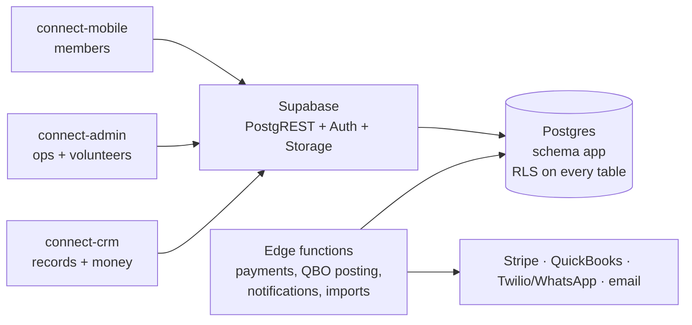

# Connect platform — architecture

Connect is a multi-tenant community platform. The Jain Society of Houston (JSH)
is tenant #1; any center can adopt it through configuration, not development.
Source design: *JSH Platform · Recommendations and Roadmap* (Sep 2026) and the
*JSH App Prototype* canvas. Extracts live in this `docs/` folder.

## Three repos, one backend

| Repo | What it is | Who uses it | Stack |
|---|---|---|---|
| **connect-crm** (this repo) | System of record: households, people, identifiers, memberships, giving, bank reconciliation, QuickBooks, audit, settings, roles. **Owns the database** (`supabase/`). | Treasurer, finance volunteers, membership coordinator, center admin, privacy officer | Next.js (App Router) + Supabase |
| **connect-admin** | Operations console: Pathshala (classes, rosters, attendance, Gyan Path sign-offs), events (checklists, RSVP, live check-in, lunch slots, volunteers), bolis, Satvik Store, content, communications, surveys. Phone-friendly ops routes for event day. | Office staff, event leads, volunteers, Pathshala principal and teachers, store and kitchen leads, communications officer | Next.js (App Router) + Supabase |
| **connect-mobile** | Member app: family, events + RSVP + tickets + lunch, giving + bolis + pledges, Satvik Store, My Jain Way + Gyan Path + Saathi, calendar, guide, alerts, surveys, settings. Role-aware volunteer mode (scanner). | Members, families, guests | Expo (React Native) + expo-router + Supabase |

All three talk to **one Supabase project**. There is no app-specific backend;
business rules that must hold regardless of caller live in Postgres
(RLS + `security definer` functions) or in Supabase Edge Functions.



## Tenancy and security

- Every row carries `center_id`. Isolation is enforced by RLS in the database —
  never only in an app. Tests: `supabase/tests/01_rls_test.sql`.
- Access = **role + scope + relationship** (docs/ROLES.md):
  - `app.has_permission(center, 'module.action')` — center-wide grants only.
  - `app.has_scoped_role(center, scope_id, 'teacher' | 'event_lead' | ...)` — one class / event / zone.
  - Family: `app.in_my_household`, `app.adult_of_household`, `app.can_act_for_person`.
  - Money (pledges, payments, bolis, store checkout, RSVP) is **adults only**; children see events, learning and My Jain Way.
- Everything sensitive is audited automatically (hash-chained, append-only `app.audit_log`).
- Card data never touches the platform: payments go through the provider (Stripe
  Connect, one connected account per center).

## Identifiers (every member has several)

| Identifier | Where | Example |
|---|---|---|
| Connect member number (permanent) | `people.member_number` | `JSH-10421` |
| Connect household number | `households.household_number` | `JSH-H-2041` |
| Org's existing member number | `external_ids` kind `org_member` | `LM-0417` |
| Legacy CRM ids (Neon account / contact) | `external_ids` kind `crm` | `4374` |
| Accounting customer (QuickBooks) | `external_ids` kind `accounting` | `1187` |
| Bank payer name (Zelle / ACH originator) | `external_ids` kind `bank_payer` | `RAHUL SHAH`, `K M MEHTA` |
| Payment-provider customer | `external_ids` kind `payment_provider` | `cus_…` |

- Values are stored as shown by the other system and matched on a normalized form
  (`app.normalize_identifier`: upper-case, alphanumerics, single spaces).
- Real identifiers are unique per center + system; **bank payer names are not**
  (two households may both send as "RAHUL SHAH") — they are matching hints.
- `app.resolve_identifier(center, value)` finds a member or household by any of them (staff only).
- A center may adopt its existing register numbers as Connect numbers at migration
  (insert with `member_number` set); otherwise numbers are issued by trigger and never change.

## Bank reconciliation (Zelle, checks, ACH)

1. Treasurer imports the bank statement (CSV) → `app.bank_transactions`
   (de-duplicated by fingerprint; payer name + confirmation parsed by
   `app.parse_bank_description`, extendable per bank via `bank_accounts.parse_rules`).
2. `app.suggest_bank_matches(txn)` ranks households: known payer name (0.95) →
   member/household number in the memo (0.90) → payer name equals a member's name
   (0.70), +0.04 when an open pledge equals the amount.
3. `app.confirm_bank_match(txn, household, pledges?)` records the payment, allocates
   it (earliest open pledge first unless pledges are named; overpayment rolls on;
   partial keeps the pledge open), queues the QuickBooks post once, and **learns the
   payer name** for next time.

## Money and QuickBooks

QuickBooks Online is the accounting record; Connect is the donor record. Every money
event is queued once in `app.ledger_postings` with an idempotency key and posted by
the `qbo-poster` edge function using the center's approved account mapping
(`app.qbo_account_mappings`). Failures land in the treasurer's exception queue;
closed months post as current-period adjustments. See `FEATURE_TRACEABILITY.md`.

## Conventions for all three apps

- **Supabase client**: `createClient<Database>(url, anonKey, { db: { schema: 'app' } })`.
  Types: `src/lib/database.types.ts`, generated from this repo — copy, don't hand-edit.
- **Env vars** — web: `NEXT_PUBLIC_SUPABASE_URL`, `NEXT_PUBLIC_SUPABASE_ANON_KEY`,
  `NEXT_PUBLIC_CENTER_SLUG` (default center); mobile: `EXPO_PUBLIC_SUPABASE_URL`,
  `EXPO_PUBLIC_SUPABASE_ANON_KEY`. Service-role keys never ship in any app.
- **Business rules go through RPCs**, not client-side re-implementations:
  `find_my_family`, `link_account`, `create_my_household`, `place_boli_entry`,
  `boli_summary`, `check_in`, `log_practice`, `send_anumodana`,
  `create_event_from_template`, `decide_reference`, `my_reference_requests`,
  `resolve_identifier`, `suggest_bank_matches`, `confirm_bank_match`, `public_kpis`.
- **Money is integer cents** everywhere (`*_cents`). Format only at the edge.
- **Errors are always shown to the user in plain English** with a retry where one
  exists; never console-only, never a silent fallback. Log the technical detail.
- **Accessibility and language**: 44px minimum touch targets, large-text mode,
  English / ગુજરાતી / हिन्दी built in; no information by colour alone.
- **Design tokens** (from the prototype): navy `#1B2C5C` (primary), saffron
  `#C9731C` / brown `#8A4608` (giving), green `#1F7A4D` (success), maroon `#7A2E1F`
  (events), purple `#5B4B8A` (Pathshala/feedback), store green `#2F5D50`, ground
  `#FBF7F0`, card `#FFFFFF`, border `#E8E0D2`, ink `#1E1C18`, muted `#5E5A52`.
  Fonts: Fraunces (display), DM Sans (body). Tenant branding overrides from
  `centers.branding`.

## Working on the schema

```bash
# Test the schema on plain Postgres (no Docker needed)
PGURL=postgres://postgres@localhost:5432 supabase/tests/run_local.sh

# Regenerate types after a migration, then copy to connect-admin and connect-mobile
DATABASE_URL=postgres://postgres@localhost:5432/connect_test \
  node supabase/scripts/gen-types.mjs > src/lib/database.types.ts

# Against a real project
supabase link --project-ref <ref> && supabase db push
```

A domain is not "done" until it has a data class, a retention rule, audit events
and backup coverage (Governance tab of the design doc).
