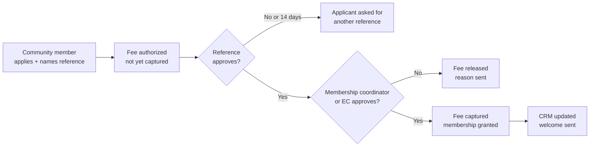

# Feature traceability (source: JSH Platform · Recommendations and Roadmap doc, Sep 2026)

Each feature below is traced through six aspects: who manages it and where, the admin functions, what is stored and where it lives, connections, member touchpoints, and reports. Every record carries a center ID.

---

## Core data model and system of record

The CRM stays the record for people, memberships and money where a center has one; the platform owns everything operational and engagement-related.

| Entity | Key fields | System of record | Sync |
|---|---|---|---|
| Center | Name, branding, tradition pack, zones, time zone, feature flags, rules | Platform | None |
| Household (family) | Primary member, address, zone, membership | CRM (platform if none) | Two-way |
| Person | Name, DOB, gender, relationship, profession, contacts, CRM ID, platform ID | CRM for core fields; platform for app fields | Two-way core, platform-only preferences |
| Membership | Type (life, yearly), start, status, fees paid, voting eligibility | CRM | CRM to platform; eligibility computed |
| Pledge | Amount, purpose, campaign, source (RSVP, boli, sponsorship, labh), status, dates | CRM | Platform creates, CRM confirms |
| Payment | Amount, method, processor reference, pledge links, receipt | Payment provider, then CRM | Provider webhook to platform to CRM |
| Recurring gift | Cause, amount, frequency, method, status | CRM or provider | Two-way |
| Event, RSVP, attendance, lunch slot | Attendees, flags, confirmation, check-in time, slot | Platform | Attendance summary to CRM |
| Boli | Item, floor, cutoff, entries, winner | Platform | Winner becomes a CRM pledge |
| Store order | Items, gift packs, pickup, payment, tax | Platform | Sales totals to accounting |
| Special day | Person, type, date or tithi, reminder | Platform | None |
| Practice log, points, streak, Gyan Path progress | Person, item, date, points, stars | Platform | None |
| Content | Sutras, audio, levels, guide pages, videos | Platform content library | None |
| Message, question, request | Sender, recipient role, status, thread | Platform | Optional CRM activity |
| Consent and preference | Channels, topics, directory, expertise, child consent | Platform | Opt-outs to CRM |
| Audit event | Actor, action, record, before/after, time | Platform (append-only) | None |

---

## Identity, families and memberships

One person, one permanent ID, linked to one or more households and verified against the CRM.

| Aspect | Detail |
|---|---|
| Managed by | Membership coordinator in the admin portal; members self-serve profile edits |
| Admin functions | Approve new families and memberships; merge duplicates; move a person between households (marriage, adult child); set life or yearly membership; record fees; approve life-membership applications (EC review); override voting eligibility with a reason |
| Stored | Person, household, relationship, membership, eligibility snapshot; CRM ID beside platform ID |
| Connections | CRM adapter syncs people and memberships; eligibility rules engine (life membership over 180 days, prior-year pledges paid); identity service issues family-linked sessions |
| Automations | Child turning 18 starts the coming-of-age flow; renewal reminders; eligibility recalculated nightly and on every payment |
| Member touchpoints | Sign-in, Family tab, member card QR, voting eligibility banner |
| Reports | Membership report, eligibility list for elections, duplicates queue |

---

## Membership tiers and reference approval

Anyone can open a community account; yearly and life membership need a reference from a verified member at the same level or higher, who must approve before the center grants it.

| Tier | How you get it | What it unlocks | Valid references for this tier |
|---|---|---|---|
| Community member | Sign up with email or phone; no approval | Events, RSVP, giving, store, learning, guide, calendar | None needed |
| Yearly member | Apply, pay fee, reference approves, center approves | Pathshala enrollment, member pricing, member-only areas, directory | Verified yearly or life member |
| Life member | Apply, pay fee, reference approves, EC approves | All yearly privileges, voting after the waiting period, spouse included | Verified life member only |

Approval flow:

The reference vouches; the center still makes the final decision.

| Aspect | Detail |
|---|---|
| Applicant flow | Choose tier; find the reference by name and zone among verified members (only name and zone shown), or send them a link; add a note on how they know each other; pay the fee (authorized, captured only on approval) |
| Reference flow | Notification and in-app card: applicant's name, household, requested tier and note; Approve, Decline (private reason), or "I don't know this person"; reminder after 3 days; request expires after 14 days |
| Eligibility rules | Reference must be verified, active and in good standing, at the same tier or higher, and outside the applicant's household; each reference can have a limited number of pending sponsorships (e.g. 5 a year, set per center) |
| Final approval | Yearly: membership coordinator. Life: membership coordinator review, then EC approval (per the center's bylaws); both steps can be two-person approvals |
| Stored | Application (tier, applicant, household, reference, note, fee authorization, status and timestamps), reference decision and reason (private to admins), final approver, CRM membership link |
| Connections | Payment provider (authorize then capture or release); CRM membership created on grant; QuickBooks posts the fee only when captured; notifications to applicant, reference and approvers |
| Upgrades | Yearly to life uses the same flow with a life-member reference; renewals of yearly membership need no new reference |
| Admin tools | Applications queue with status and age; reassign or waive a reference with a recorded reason; sponsorship history per reference; flag unusual patterns |
| Reports | Applications by tier and status, time to approval, declines by reason, references per member |

Open questions for the EC: whether life membership also requires a minimum period as a yearly member, and whether one reference is enough or life membership needs two.

---

## Onboarding, profiles and preferences

Onboarding matches a new login to an existing CRM household before asking for anything, then collects only what the center has switched on.

| Aspect | Detail |
|---|---|
| Managed by | Membership coordinator (review queue); center admin chooses which fields are required, optional or hidden |
| Admin functions | Configure onboarding fields and wording; review "not my family" and new-household requests; verify new members (sets the "verified" flag used by new-member contact) |
| Stored | Per person: DOB, gender, profession, employer, phones, emails, contact channels, best time, language, interests, notification topics, new-member contact and expertise settings; consent records with timestamp and who gave them |
| Connections | Core fields to CRM; employer to matching-gift lookup; preferences to notification service |
| Rules | Adults edit their own profile; primary adults edit children's profiles; children cannot change contact or consent settings |
| Member touchpoints | Onboarding flow, Family tab, per-person Profile, Settings |
| Reports | Onboarding completion, pending verifications, profile completeness |

---

## Events, RSVP, check-in and lunch slots

The event is the most operational feature: it runs across the admin portal before, the ops app during, and reports after.

| Aspect | Detail |
|---|---|
| Managed by | Event lead (per event) in the admin portal; volunteers in the ops app on the day; kitchen lead on the kitchen display |
| Admin functions | Create event: flyer, venue, capacity, audience (members, guests), RSVP window, attendee flags, donation commitment options ($3/$5/$7 per person, $10/$25/$50 or open lump sum); lunch settings: start time, slot length, seats per slot, priority rules; confirmation reminder timing; assign volunteers to stations; close RSVPs; export lists |
| Stored | Event, RSVP per person with flags, commitment pledge link, confirmation status and time, check-in time and station, lunch slot, served flag, walk-ins |
| Connections | RSVP commitment creates a CRM pledge; check-in publishes an event that runs slot allocation (families with a child under 12 together at start; seniors at start; others by arrival then RSVP order); notifications for 24-hour confirmation, lunch reminders 5 minutes before, and guest SMS or WhatsApp; attendance summary to CRM |
| Member touchpoints | Events tab, RSVP, tickets and Wallet pass, confirmation pop-up, lunch card, Home event-day card |
| Ops touchpoints | Scanner, kiosk, walk-in registration, food and gift stations, slot queue, now-serving display |
| Reports | Event operations dashboard, no-shows, served counts vs. RSVP, commitment totals |

---

## Giving: pledges, payments, recurring gifts, special-day labh

Every commitment in the app becomes one pledge record; every payment settles one or more pledges; the CRM and accounting always agree with the app.

| Aspect | Detail |
|---|---|
| Managed by | Treasurer and finance volunteers in the admin portal; campaign owners create opportunities |
| Admin functions | Create campaigns and opportunities (sponsorship tiers, fixed pujan lists, construction amounts, open amounts); publish or close; set who is notified; record offline payments (check, ACH, stock); approve refunds and write-offs; send pledge reminders; issue year-end statements; configure labh options for special days |
| Stored | Pledge (source: RSVP, boli, sponsorship, pujan, labh, construction, recurring), pledged by, family, amount, dedication text, status, dates; payment and receipt; recurring schedule |
| Connections | Payment provider (connected account per center) to CRM pledge payment to QuickBooks; receipts from CRM; opportunity alerts through notifications targeted by interests and history |
| Rules | Adults only; all adults see family pledges (view-only option per family); tax year follows payment date; refunds need a second approver |
| Member touchpoints | Give tab, My Donations by year with statements, RSVP commitment, special-day labh, recurring giving |
| Reports | Giving dashboard, pledge aging, campaign progress, recurring gift health, sync exceptions |

---

## Bolis and sponsorships

Digital bolis run unattended until cutoff; in-person bolis are recorded by a volunteer in the hall, and both end as pledges.

| Aspect | Detail |
|---|---|
| Managed by | Religious coordinator creates bolis; boli caller and recorder run in-person bolis on the ops app; treasurer sees results |
| Admin functions | Create boli: item, event, type (digital or in-person), floor, step amount, cutoff, anti-sniping extension, explainer text and video; publish; pause; close early; enter in-person winner and amount; resolve ties; mark donor name display preference |
| Stored | Boli, every pledge entry with time and person, current highest, winner, final pledge link, explainer content |
| Connections | Winning entry creates a CRM pledge; outbid and closing-soon notifications; live amounts to hall display; explainer videos from content management |
| Rules | Adults only; entries must beat the highest by the step; no withdrawal after cutoff; results visible to members only after close |
| Member touchpoints | Bolis list, pledge screen, outbid alerts, My Donations |
| Reports | Boli results, unpaid bolis, floor vs. final amounts |

---

## Satvik Store

The store is sales, not giving: separate ledger, sales tax, and a kitchen workflow driven by the order cutoff.

| Aspect | Detail |
|---|---|
| Managed by | Store lead in the admin portal; kitchen volunteers on the kitchen display; pickup volunteers on the ops app |
| Admin functions | Menu items, prices, photos, pack sizes, categories (mithai, namkeen, meals); gift-pack price; order cutoff and pickup slots; per-slot capacity; pause an item; refunds and cancellations (up to 24 hours before pickup) |
| Stored | Item catalog, orders with lines, gift flags and messages, pickup slot, payment, tax, status (placed, preparing, ready, picked up) |
| Connections | Payment provider; sales income and tax to accounting (never CRM donations); order ready notification; kitchen summary at cutoff |
| Member touchpoints | Store, cart, order confirmation, pickup reminder |
| Reports | Sales by item and slot, gift-pack uptake, tax collected, waste (prepared vs. picked up) |

---

## Calendar and special days

The calendar is layered feeds; special days are private family dates that drive reminders and labh prompts.

| Aspect | Detail |
|---|---|
| Managed by | Religious coordinator (Jain calendar and panchang source), Pathshala principal (Pathshala layer), event leads (events layer, automatic), platform team (school district feeds per region) |
| Admin functions | Choose panchang source and tradition; add parva days and festivals; publish Pathshala terms and no-class days; enable school districts for the center; set default layers |
| Stored | Calendar layers and entries; tithi table per year; per-member layer selection; special days (person, type, calendar date or tithi, reminder lead time) |
| Connections | Panchang service converts tithi to date each year; school calendars from published feeds; events module feeds its layer; phone calendar subscription links; special days trigger labh prompts 2 weeks ahead through notifications |
| Rules | Special days visible only to the household; punyatithi reminders optional and never shown on Home unless the family allows it |
| Member touchpoints | Calendar, Today at JSH tithi and timings, special days, labh prompt |
| Reports | Layer subscriptions; labh prompts sent vs. taken (totals only) |

---

## My Jain Way, Gyan Path and Saathi

One points ledger and one streak serve practices, learning and family support; individual practice data is private by default.

| Aspect | Detail |
|---|---|
| Managed by | Religious coordinator (practice catalog, categories, points); Pathshala principal and content editors (Gyan Path goals and levels); teachers (sign-offs) |
| Admin functions | Practice catalog with category, default time and points; streak rules and rest days; points caps (e.g. 5 anumodanas a day); Gyan Path goals by tradition: chapters, levels, lesson steps, quizzes, audio, treasure rewards, final teacher sign-off; "behind" threshold for Saathi alerts |
| Stored | Practice selections and completions, points ledger (earned for practice, level, anumodana, support), streaks, Gyan Path progress and stars, recordings (retention limit), sign-offs, anumodana and support messages |
| Connections | Percentile standings computed nightly per category; family celebration and "needs support" notifications (anumodana senders first, then family); teacher app for sign-offs; speech checks later |
| Rules | Standings private to the person; parents see children's progress; nothing about "behind" leaves the family; members can opt out of Saathi |
| Member touchpoints | Jain Way tab (Today, Learn, Saathi, Library), Gyan Path, family notifications |
| Reports | Aggregate participation and learning progress for EC and principal; no individual rankings |

---

## Content: library, pachchakhan, photos, Niva

Religious content is shared across centers by tradition; each center adds its own pages, photos and Niva knowledge, all reviewed before publishing.

| Aspect | Detail |
|---|---|
| Managed by | Platform content team (shared tradition packs); center content editors (local pages, guide, photos); religious coordinator approves religious text; media team runs live darshan |
| Admin functions | Draft, review, approve, publish and retire content; translations (English, Gujarati, Hindi); pachchakhan entries with timing rules; photo albums with moderation queue for member uploads; live darshan stream settings; Niva knowledge sources and blocked topics |
| Stored | Content items with version, tradition, language, status and approver; media files; albums and photos with uploader and approval; Niva sources and conversation logs (short retention, no training on personal data) |
| Connections | Streaming provider for darshan; media storage and CDN; Niva retrieves only approved content for the member's center and cites sources |
| Rules | Nothing religious publishes without an approver; photos of children need approval before showing |
| Member touchpoints | Library, pachchakhan, guide, photo albums, Niva |
| Reports | Content usage, moderation queue, Niva unanswered questions (to improve content) |

---

## Communications: notifications, WhatsApp, zone leads, questions

All outbound messages go through one service that respects each person's channels, topics and quiet hours; all inbound messages land in shared role inboxes.

| Aspect | Detail |
|---|---|
| Managed by | Office (announcements, templates); zone leads (their zone inbox); team inboxes by topic (membership, events, Pathshala, donations, temple) |
| Admin functions | Compose announcements targeted by zone, interests, membership or event; schedule; templates in three languages; WhatsApp group join queue (approve and add); route, assign, reply to and close questions and messages; response-time targets |
| Stored | Messages with audience, channel, schedule and delivery status; opt-outs; inbox threads with assignee and status; WhatsApp join requests |
| Connections | Push (Apple, Google), SMS and WhatsApp provider, email; system events (RSVP confirmation, lunch, labh, outbid, celebrations) use the same service |
| Rules | Replies come from the role, never a volunteer's personal number; member contact details shared only when the member replies |
| Member touchpoints | Notifications, Ask a question, Message zone lead, WhatsApp groups |
| Reports | Delivery and opt-out rates, inbox response times, unanswered questions by zone |

---

## Newsletters and email campaigns

Admins build branded newsletters once and send them to any segment by email, with the same content in the app and as a push teaser.

| Aspect | Detail |
|---|---|
| Managed by | Communications officer (all audiences); zone leads, Pathshala principal and event leads (their own audience only); content editors draft |
| Admin functions | Drag-and-drop editor with center-branded templates (monthly newsletter, event announcement, appeal, Pathshala update); audience builder; English, Gujarati and Hindi versions; preview and test send; schedule; resend to non-openers; archive |
| Audience builder | All members; life or yearly members; zones; Pathshala parents by level; event RSVPs or attendees; donors to a campaign; interests; language; households not yet on the app; adults only by default; saved segments update automatically |
| Stored | Campaigns, versions, segments, recipients at send time, delivery, opens, clicks, unsubscribes per topic, approvals |
| Connections | Email provider on the center's own sending domain (sender verification records set up at onboarding); push teaser and in-app archive through the notification service; opt-outs synced to the CRM |
| Rules | Every email carries the center's address and a topic-level unsubscribe; sends to all members need a second approver; children never receive marketing email; appeals respect giving-contact preferences |
| Member touchpoints | Email inbox, in-app Newsletters archive, notification topic settings |
| Reports | Opens and clicks by segment, unsubscribes, links clicked, conversions (RSVPs, gifts) from each campaign |

---

## New to JSH guide, directory and expertise

The guide is center-configured reference content; the directory and expertise listings are opt-in and visible only to verified members.

| Aspect | Detail |
|---|---|
| Managed by | Office (guide pages, timings, links, administration team roster); membership coordinator (zones and ZIP mapping, zone leads); volunteer coordinator (volunteer groups) |
| Admin functions | Edit guide sections and first-steps checklist; maintain zones, ZIP codes and leads; update EC and trustee roster after elections; volunteer groups and coordinators; review expertise listings (optional) |
| Stored | Guide content, zone map, role roster (roles link to people, so contact follows the role), volunteer interests, directory and expertise opt-ins with tags and headline |
| Connections | Volunteer interests to the volunteer platform; new-member contact limited to members verified within the last 12 months; messages via the communications service |
| Rules | Directory shows only opted-in families; expertise visibility per listing (all verified or new members only); guide open to guests |
| Member touchpoints | New to JSH guide, zone finder, directory, expertise, volunteer interest |
| Reports | New-family checklist completion, zone assignments, volunteer interest by group |

---

## Settings, privacy and account lifecycle

The app account is separate from the CRM record: members can pause or delete the app account while the center keeps records it is required to keep.

| Aspect | Detail |
|---|---|
| Managed by | Members in Settings; privacy officer (center) for data requests; platform team for policy templates |
| Admin functions | Publish privacy policy and terms per center (from platform templates); process data export and deletion requests with deadlines; view account status; reactivate on request |
| Stored | Account status (active, deactivated, deletion pending, deleted), device sessions, security settings, legal acceptances with version, data request log |
| Connections | Deletion removes login, preferences and practice history; CRM membership and donation records stay; export bundles profile, RSVPs and giving; sign-out everywhere revokes sessions |
| Rules | Deletion completes within 30 days; children's accounts deleted by a parent; audit entries kept |
| Member touchpoints | Settings: account, notifications, preferences, privacy, payments, support, account status |
| Reports | Data requests by status and age; deactivations and deletions |
