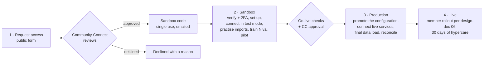

# Community Connect: organization onboarding plan

> **Status: approved for building on 2026-09-24.** The owner asked to build the whole onboarding process; the recommendations in §10 are being used as the defaults unless the owner changes them. Payments: Stripe or PayPal, chosen per organization.
>
> Written 2026-09-24. Sources:
> - the owner's brief;
> - the design doc (`design-doc/01`, `06`, `07`, `08`);
> - a read of the current schema (127 tables, migrations through 0141) and of the three apps.
>
> Where it changes an earlier plan, it says so. The decisions needed are collected in [§10](#10-decisions-needed).
>
> Relation to other docs: [`design-doc/06`](design-doc/06-center-onboarding-and-rollout.md) covers rolling the app out to **members** once an organization is set up (announcements, help desks, adoption targets). This plan covers everything before that: how an organization gets from "interested" to "live", and what has to be built for it.

## 1. The journey at a glance

| Stage | Who drives | Outcome | Typical length |
|---|---|---|---|
| 1 · Request | Org contact, then the Community Connect (CC) team | A sandbox code | 1–3 days |
| 2 · Sandbox | Org owner and staff, CC onboarding lead | Everything configured and rehearsed with test-mode services | 3–6 weeks; texting, WhatsApp and payment verifications run in the background from day one |
| 3 · Production | Org owner, treasurer, membership coordinator; CC approves | A live organization with real data, reconciled | 1–2 weeks |
| 4 · Live | Org | Members invited, old systems retired | Per design-doc 06, from T–21 to T+30 |

This matches design-doc 06's estimate of about 10–12 weeks from agreement to launch.

**Principles**
1. **The sandbox can never touch real money or real inboxes.**
   - Payments run in the provider's test mode.
   - QuickBooks runs against a sandbox company, or read-only.
   - Email, texts and WhatsApp messages go only to a short list of verified test recipients.
2. **Configuration moves forward; data is loaded fresh.** Promoting a sandbox copies its setup: branding, rules, types, templates and import mappings. It never copies test transactions, and it never copies credentials.
3. **Nothing uploaded is thrown away.** A column we have no field for becomes a custom field on the record, visible in its profile.
4. **Every step is resumable and assignable to a named person.** Both the organization and Community Connect can see where it stands.
5. **Credentials are never readable by anyone.** Changing them needs a fresh second-factor (2FA) check, even for a signed-in admin.
6. **Every import is a traceable, reversible run.** Each row it touches is audited with the run number, the file and the person, and the run can be undone.
7. **Setup follows the module switches.** Switch Satvik Store off and its setup steps disappear.

## 2. Who does what

| Person | Part in onboarding | Role today |
|---|---|---|
| Community Connect platform team | Review requests, issue sandbox codes, verify non-profit status, approve go-live, time-boxed support access | Platform admin (`accounts.is_platform_admin`) |
| CC onboarding lead | Guides the organization, sees its checklist, runs training | Platform admin, support scope |
| **Organization owner** ("super admin") | Redeems the code, completes Step 0, invites the team, accepts the agreements, requests go-live | **New:** an owner designation on top of `center_admin`. It can be transferred but not removed without a transfer. |
| Second administrator | Required before go-live, because the two-person rule (role grants, refunds, write-offs) needs two people | `center_admin` |
| Treasurer | Payments, QuickBooks, bank accounts, statements, giving history | `treasurer` |
| Communications officer | Email domain, texting, WhatsApp, templates | `communications_officer` |
| Membership coordinator | Membership types, member records, data clean-up | Membership roles |
| Privacy officer | Legal documents, consents, data requests | Privacy officer |
| Content editor, religious coordinator | Guide, tradition pack, Niva training | `religious_coordinator`, content roles |
| Store lead, Pathshala principal, event leads | Their own module's setup data | `store_lead`, `pathshala_principal`, event roles |

## 3. Stage 1: request access and the sandbox code

**Request form.** A public page that needs no sign-in, with spam protection and rate limits. It asks for:
- the organization's legal name and type (temple, community center, other non-profit);
- city and state, and roughly how many households;
- the contact's name, email and mobile;
- website;
- which modules they're interested in;
- the systems they use now (Neon, Bloomerang, Little Green Light, spreadsheets, …);
- how they heard about Community Connect.

**CC review** (Platform › Requests). The team approves, declines (the contact gets the reason) or asks for more information. Approval issues a **sandbox code**:
- It can be used once and only by the contact's email address.
- It expires in 14 days, can be re-issued and can be revoked.
- Every issue, redemption and revocation is audited.
- It looks like `CC-SBX-7K4M-Q2PD` (no look-alike characters) and arrives by email with a link.

**Redeeming the code** (`/start`):
1. Enter the code, then sign in with a code sent to that email. The email is now verified.
2. Verify a mobile number with a code sent by text. The phone is now verified.
3. Set up an authenticator app and save the recovery codes. 2FA is now on.
4. Accept the Community Connect sandbox terms.
5. The sandbox organization is created (`<slug>-sandbox`, environment `sandbox`) with the contact as its **owner**, and the Setup checklist opens.

**Sandbox restrictions.** Community Connect will set the final values later. Each is built as an *entitlement* row, so it can change without code.

| Entitlement | Suggested sandbox value | Production |
|---|---|---|
| People / households saved | 2,000 / 800. A full file can still be *checked* without saving it. | Per plan |
| Email, text and WhatsApp recipients | Up to 10 verified test recipients | Everyone who opted in |
| Push notifications | Registered test phones only | All phones |
| Payments | Provider test mode only | Live |
| QuickBooks | Intuit sandbox company, or the real company read-only (no posting) | Live posting |
| Public community dashboard | Off | On |
| Niva questions per month | 300 | Per plan |
| File storage | 2 GB | Per plan |
| Watermark | "Sandbox · test data" in the portal, the app and every email | None |
| Expiry | 90 days after the last activity, with warnings at 60 and 80 days | None |
| Member app | Reached only with the sandbox's join code | Listed as a community |

## 4. Stage 2: the Setup checklist (in the sandbox)

The organization gets a **Setup** module: an ordered checklist. Each step shows:
- a status: not started · in progress · waiting on a provider · needs CC review · done · skipped because its module is off;
- an owner and a due date;
- plain-English help, and what "done" means.

Community Connect sees the same checklist for every organization in Platform › Onboarding.

| # | Step | Owner | CC review |
|---|---|---|---|
| 0 | **Organization foundation:** owner security, legal identity and non-profit proof, profile and brand kit, leaders, modules, team, rules, agreements | Owner | Non-profit proof |
| 1 | **Connect services:** credential vault, payments, email, texting, WhatsApp, push, QuickBooks, bank accounts, file storage, other providers | Treasurer, communications officer | No (automatic checks) |
| 2 | **Templates and documents:** message templates, statements and receipts built from an uploaded sample, member legal documents | Communications officer, treasurer, privacy officer | No |
| 3 | **Setup data:** every "type" and list the modules use; the chart of accounts is pulled from QuickBooks | Module owners | No |
| 4 | **Records:** households, people, memberships, staff, store items, classes, … | Membership coordinator, module owners | No |
| 5 | **History and transactions:** pledges, payments, recurring gifts, past statements, … | Treasurer | No |
| 6 | **Train Niva** | Content editor, religious coordinator | No |
| 7 | **Test, train staff, pilot** | Owner, CC onboarding lead | No |
| 8 | **Request go-live** | Owner | Yes |

Steps 1, 2 and 6 run alongside Steps 3–5. Provider verifications (texting registration, Meta, the payment provider) start on day one because they take longest.

### Step 0: Organization foundation (owner)

**0.1 Owner and staff account security**
- **Email and phone** are both verified with one-time codes. Email codes exist today. Phone codes need a texting provider (Step 1.4); until then the sandbox uses a Community Connect sender.
- **2FA** uses an authenticator app (TOTP), with recovery codes. Passkeys can come later.
  - Supabase Auth supports TOTP. A session's assurance level (`aal2` once 2FA is done) travels in its token, so the **database itself** can refuse a session without 2FA on sensitive tables and functions, not just the screens.
- **2FA is mandatory for every staff role.** Members keep code-only sign-in.
- **Step-up:** a fresh 2FA check, within the last 5 minutes, is needed before:
  - viewing or changing credentials;
  - exports;
  - role grants;
  - refunds and write-offs;
  - the month lock;
  - module switches;
  - deleting data;
  - promoting the sandbox.

  The portal already shows step-up windows; nothing enforces them yet.
- **Lost phone:** the second admin resets it, or Community Connect does after verifying the person's identity. Either way it is audited.

**0.2 Legal identity and non-profit proof**
- **Legal identity:**
  - legal name and "doing business as" name;
  - EIN and entity type;
  - state of incorporation and registered address;
  - fiscal-year start;
  - the authorized signer (name and title, printed on statements);
  - sales-tax registration, if the store sells taxable items.
- **Non-profit evidence,** uploaded to a private document store:
  - an IRS determination letter, **or** proof of inclusion under a group exemption;
  - plus a signed **W-9**.

  Houses of worship are tax-exempt without applying and may not have a letter. Accept a board or attorney letter instead, reviewed by Community Connect.
- **Automatic check:** the EIN is looked up in the IRS Tax Exempt Organization Search bulk data (Pub. 78 and the Exempt Organizations Business Master File, refreshed monthly). It matches on EIN and name and flags revoked exemptions. Community Connect sees the result next to the documents.
- **Result:** the organization is marked "Verified non-profit", audited with who verified it and when. This is required for production, not for the sandbox.

**0.3 Profile and brand kit**
- **Profile:**
  - display name and short name (the short name appears in "{short name} points" and similar);
  - slug, mission, about text, website, social links;
  - public email and phone, each verified with a code;
  - office hours;
  - address with a **map pin** (its latitude and longitude drive the daily timings: sunrise, navkarsi, chauvihar);
  - time zone and currency;
  - languages offered (English, ગુજરાતી, हिन्दी, …);
  - tradition pack (this exists today).
- **Brand kit.** Logos are **uploaded, not linked**:
  - a horizontal logo;
  - a square mark (used for the app icon, favicon and member card);
  - light and dark variants;
  - an email header.

  Brand colors get an automatic readability (contrast) check. A preview shows the portal, the member app, an email and a statement with the brand applied.
- **Key leaders:**
  - each has a name, a title (President, Secretary, Treasurer, EC member, Trustee, …), term start and end, a photo, and whether they are shown publicly;
  - each is linked to the person's record once people are imported;
  - the list feeds the guide's Administration roster (`role_roster`) and the statement signer.
- **Today vs gap:**
  - `centers` has name, short name, slug, tradition, time zone, country, state, currency and a free-form `branding` field (logo link, mark link, monogram, address, website, links).
  - Legal identity, verification, leaders, the map pin, the fiscal year and uploaded logo files are gaps.

**0.4 Modules.** Choose which of the 18 modules to use. Settings › Modules exists. This is asked early because it hides the steps for modules that are off.

**0.5 Team.**
- Invite staff by email or mobile with their roles. They accept, sign in and set up 2FA.
- A second administrator is required before go-live.
- Today roles can only be granted to people who already have a login, so invitations are a gap.

**0.6 Rules and policies.**
- The existing Settings screens (Rules, Onboarding fields, Notifications, Security) are walked through with the defaults explained.
- Decisions with no safe default are highlighted: membership fees, references, child login age, voting.

**0.7 Agreements.**
- The organization accepts the Community Connect terms, the data-processing agreement (Community Connect processes the data; the organization owns it) and the children's-data addendum.
- Production also needs the order form or plan.
- Each acceptance is stored with who, which version, when, and from what IP address.
- Member consents exist today; organization-level agreements are a gap.

### Step 1: Connect services

Each service shows its status, test or live mode, who connected it and when, the last check, and the next expiry. In the sandbox, everything runs in test mode.

**1.1 Credential vault (the foundation for every connection)**
- **Where secrets live:** API keys, sign-in tokens from providers and webhook secrets are stored encrypted in a vault (Supabase Vault, or a cloud key-management service), never in ordinary tables. `integration_connections.secret_ref` was designed to point at a vault entry; nothing writes it yet.
- **Who can decrypt:** only the server-side jobs that use a secret. No screen, export, log or backup ever shows one. The portal shows a fingerprint only: the last 4 characters, the permissions granted, who connected it, and when it expires.
- **Changing a secret:** replacing, rotating or disconnecting is done by the owner or the service's owner, **with a step-up 2FA check** and a reason, and it is audited. Community Connect staff cannot read an organization's secrets.
- **Access log:** every decryption is recorded (which job, which connection, when).
- **Upkeep:** tokens refresh automatically. The owner is alerted before a connection expires and whenever one fails.
- **Environments:** credentials are never copied from the sandbox to production; each connects its own.
- *We read your note on credentials as "they can't be changed or viewed, even by a signed-in admin, without a fresh 2FA check". Tell us if you meant something else.*

**1.2 Card and bank payments** (already decided: one connected payment account per organization, so money never passes through a shared account)
- **Choose the online processor: Stripe or PayPal** (owner decision 2026-09-24). An organization can connect either, or both, with one set as the default at checkout. Both need the organization's own account:
  - **Stripe:** the organization connects its own Stripe account through Stripe Connect. Stripe verifies the organization, its EIN and its bank; this can take several days, so it starts on day one. Apply for Stripe's non-profit pricing.
  - **PayPal:** the organization connects its own PayPal Business account through PayPal's partner sign-up ("Connect with PayPal"), which records its merchant ID and account email. If that isn't available yet, the organization enters its PayPal Business email, which is verified by a code before it is used.
- **Online methods** (depend on the processor):
  - card, ACH bank debit, Apple Pay and Google Pay through Stripe; PayPal, Venmo and cards through PayPal;
  - set the statement descriptor;
  - choose whether donors may cover the fee (that rule exists).
- **Money flow:** provider events arrive in `webhook_events` (exists) and become payments. Payouts arrive in `payouts` (exists) and feed bank reconciliation, which already recognizes payout lines.
- **Offline methods, each with instructions for members:**
  - check (payee name, mailing address);
  - cash (bhandar);
  - Zelle (email or phone);
  - ACH and wire details;
  - stock (broker details);
  - donor-advised funds and matching gifts (legal name and EIN).

  Today the method list is fixed in the database, with no per-organization "accepted, with instructions" setting. That is a gap.
- **Test:** a $1 charge and refund, in test mode in the sandbox and in live mode at go-live.
- **Offline only:** an organization may go live with offline payments only and add card payments later.

**1.3 Email**
- **Sending service:** choose one (decision [O7](#10-decisions-needed)).
- **Domain:** add the sending domain, for example `mail.jsh.org`. The portal shows the DNS records (SPF, DKIM, DMARC, return path) with copy buttons, and re-checks until they verify.
- **Senders:** set up sender addresses (office, receipts, newsletters), the reply-to address, and the postal-address and unsubscribe footer.
- **Bounces and complaints** suppress the address automatically.
- **Sign-in codes: this is the blocker.** Supabase's built-in email only reaches Supabase team members, so no real member can sign in until this is fixed. Supabase's email setting is one per project, shared by every organization, so each organization's branded sign-in email goes through an Auth "send email" hook that uses that organization's sender and template.
- **Sandbox:** email goes only to verified test recipients, with a "Sandbox" banner on every message.

**1.4 Texting (SMS)**
- **Provider:** Twilio is suggested.
- **US registration:** US texting needs A2P 10DLC brand and campaign registration, using the legal name and EIN from Step 0.2, the use cases, sample messages, and how people opt in. Toll-free verification is the alternative. Approval takes days to weeks, so it starts early (already decided).
- **Consent:** opt-ins are stored with time and source (`channel_optins` exists). STOP and HELP are handled, and quiet hours apply (that rule exists).
- **Phone sign-in codes** go through an Auth "send SMS" hook.
- **Length:** Gujarati and Hindi texts use Unicode, which fits 70 characters per message segment instead of 160. The template editor counts segments.

**1.5 WhatsApp Business**
- What it needs:
  - Meta business verification;
  - a WhatsApp Business account and number (not in use in the regular WhatsApp app);
  - display-name approval;
  - message templates submitted to Meta for approval;
  - member opt-in.
- It runs through Meta's Cloud API, or through the texting provider as a Meta partner.
- Already decided: community messages go over WhatsApp; texts are for codes and time-critical reminders.
- Today only the manual group-join queue exists.

**1.6 Push notifications**
- **Shared app:** the Community Connect app holds the Apple and Google push credentials, so organizations configure nothing technical. They set:
  - notification topics (exist);
  - quiet hours (the rule exists);
  - a test push to their own phone.
- **Branded app:** an app of an organization's own, on its Apple and Google developer accounts and its own build, is a later, separate track.

**1.7 QuickBooks Online.** QuickBooks is the accounting record, and the platform posts every money event exactly once.
1. **Connect.** The treasurer signs in to Intuit and authorizes one company. The tokens go to the vault and the company ID is recorded.
2. **Pull the chart of accounts and lists** (never uploaded by hand):
   - accounts;
   - classes and locations;
   - items (for the store and sales receipts);
   - tax codes and rates;
   - payment methods;
   - optionally customers, to link donors to their QuickBooks customer IDs.

   They are kept in read-only copies, refreshed daily and on demand. If an account used in a mapping is renamed or made inactive, a warning is raised.
3. **Choose:**
   - cash or accrual basis (JSH: cash);
   - posting per transaction or as a daily summary;
   - the **QuickBooks go-live date**. Only money events on or after it post.
4. **Map:**
   - income accounts per campaign type;
   - store sales and gift packing;
   - sales tax payable, merchant fees and payment clearing;
   - the bank account and pledges receivable;
   - funds to classes.

   `qbo_account_mappings` and `funds.qbo_class_id` exist. The treasurer approves the mapping.
5. **Test post.** Post one of each type (to the sandbox company, or approved in a test period) and approve the result. **Before a live test post (owner decision 2026-09-25 #10):** it creates four real $1.00 entries in the real QuickBooks company — a sales receipt, a refund receipt, a deposit and a journal entry, each marked "Community Connect test post". The treasurer voids them in QuickBooks afterwards: search for "Community Connect test post", open each entry and choose More › Void (a deposit or journal entry that has no Void is deleted with More › Delete). The Setup checklist step, the QuickBooks setup screen and the confirmation all say this before it runs, and the message after it is queued says it again. Automatic voiding is backlog B9.
6. **In the sandbox,** connect an Intuit sandbox company, or the real company **read-only**. Read-only lets the real chart of accounts be mapped without posting; the approved mapping carries over at promotion.

Today: the mapping rows, the posting queue (`ledger_postings`) and the exceptions screen exist. The connection, the pull, the copies of the lists and the poster itself do not.

**1.8 Bank accounts**
- For each account: its name, its last 4 digits, the QuickBooks bank account it maps to, and the statement format. Chase CSV and a generic CSV with per-account rules exist today.
- Upload a sample statement to detect its format.
- Direct bank feeds (for example Plaid) come later.

**1.9 File storage.** Nothing is set up today; this was item 7 on the earlier list of open decisions.

Community Connect creates the storage areas for every organization automatically. The organization chooses only the settings marked ✱.

| Area | Holds | Who can read | Kept for |
|---|---|---|---|
| Branding (public) | Logos, leader photos | Anyone | Until replaced |
| Content | Guide media, flyers, library audio | The organization's members | Until removed |
| Photos | Event albums, member uploads (moderated) | Members; children's photos per consent ✱ | Until removed; removed items 30 days |
| Store | Item photos | Members | Until replaced |
| Statements | Receipts and year-end statements | The household's adults and finance roles, through short-lived links | 7 years |
| Recordings | Gyan Path recitations | The child, their parents, their teachers ✱ | 90 days ✱ |
| Imports | Uploaded source files | People who may import that data | 90 days ✱ |
| Organization documents | W-9, determination letter, agreements | Owner and Community Connect verification staff | Life of the account |
| Exports | Generated exports | The person who asked | 7 days |

Each area also gets:
- size and file-type limits;
- image resizing;
- malware scanning of uploads;
- a storage quota per plan;
- access logging for the sensitive areas.

**1.10 Other providers.** These are listed in Settings › Integrations today but none is built:
- a panchang source for tithi days per tradition and location (the religious coordinator chooses);
- a background-check provider (the EC chooses);
- a live connection to the old CRM, needed only if it keeps running in parallel. File imports come first.

### Step 2: Templates and documents

**2.1 Communications › Templates** (a new tab in Communications)
- **One library** of templates for email, text, push, WhatsApp and in-app messages, in each language.
- **Email editor:** drag and drop, using a plugin (decision [O8](#10-decisions-needed)).
  - Recommended: **EmailBuilder.js**. It is MIT-licensed, built in React like the portal, stores the design as JSON (easy to version) and renders email-safe HTML.
  - Alternatives: GrapesJS with its newsletter/MJML plugins (open source), or Unlayer (commercial).
  - The brand kit is applied automatically: logo, colors, and a footer with the postal address and unsubscribe link.
- **Merge fields** come from a typed list per kind of template. An RSVP confirmation, for example, offers `{{person.first_name}}`, `{{event.name}}`, `{{event.starts_at}}` and `{{tickets.list}}`. An unknown field is refused on save, and every value is escaped when the message is sent.
- **Working on a template:**
  - preview it against a real record;
  - **send a test to yourself**;
  - **version history**;
  - **approval** (`comms.approve`; large sends follow the newsletter rules);
  - a plain-text version is generated automatically.
- **Other channels:**
  - *Push:* title and body with length counters, a picker for which screen opens, and a phone preview.
  - *Text:* a segment counter that understands Unicode, and the required opt-out wording.
  - *WhatsApp:* category, variables and buttons, submitted to Meta with its approval tracked.
- **Community Connect base library:** the system messages every organization needs, matching the triggers in Settings › Notifications:
  - sign-in code and welcome;
  - RSVP confirmation, tickets, lunch reminder and the 24-hour confirmation;
  - boli outbid;
  - pledge and payment receipts, recurring-gift receipt and failure notice, statement ready;
  - store order ready;
  - membership approved and reference request;
  - waiver reminder and feedback request;
  - a newsletter shell.

  Each organization customizes its own copy. When Community Connect improves a base template, the organization sees the difference.
- **Today vs gap:** `message_templates` exists (key, channel, language, subject, body, version). There is no editor, no merge-field list, no approval and no sender.

**2.2 Statements and receipts from an uploaded sample**
1. **Upload** one or more past statements or receipts (PDF, image or Word), blank or filled in. The portal offers to black out real donor details first.
2. **Pull out the template (AI, once per template).** Claude reads the page from the PDF or image and returns a structured template:
   - page size and margins;
   - where the logo and header sit;
   - the fixed letter text and the tax wording;
   - the fields it found: donor name and address, household number, tax year, the gift table's columns (date, amount, fund, method, receipt number), totals, EIN, signer and signature;
   - anything it wasn't sure about.
3. **Choose how it renders:**
   - **rebuild** it as an HTML/CSS template in the same editor as emails (the default: clean, accessible, easy to change); or
   - **overlay** real data on the original PDF used as a background, for an identical look.
4. **Review** it side by side with a real household's data, and edit the wording and fields. A compliance check flags any missing element of the IRS written acknowledgment:
   - the organization's name and the amount;
   - a description of non-cash gifts;
   - a statement of whether goods or services were given, or that only intangible religious benefits were given (relevant to bolis, pujans and labh);
   - the good-faith estimate of their value;
   - the quid pro quo disclosure for payments over $75.

   The final wording is confirmed with the accountant; it is an open question in DECISIONS.md.
5. **The treasurer approves**, and it becomes a versioned template. Today `receipt_templates` holds only a signer and a note.
6. **Generating statements does not use AI.** A renderer fills the approved template with data, using a headless browser or a PDF library in a background worker. That keeps year-end runs for thousands of households fast, cheap and exactly repeatable.
   - The year-end batch shows its progress.
   - Files are kept in the Statements area (the `statements` table exists).
   - They are delivered by email, in the app, and as a print-and-mail file for households that asked for paper (`physical_mail_opt_in` exists).
   - A reissue keeps the earlier version.

Kinds: per-gift receipt, year-end tax statement, pledge statement or invoice, membership dues receipt, and acknowledgment of a non-cash gift (stock, in-kind).

**2.3 Member legal documents.** Terms of use, privacy policy, photo policy, and volunteer and youth waivers. Each starts from a Community Connect template and is edited and published as a new version (`legal_documents` exists).

### Steps 3–5: loading the organization's data

Data loads in three tiers, in order, because each tier points at the one before it. A pledge needs a household and a campaign; a household member needs a person and a household.

| Tier | What it is | Examples | How it gets in |
|---|---|---|---|
| **3 · Setup data** (metadata) | The types, lists and catalogs the modules use | Membership types, funds, campaigns, store categories, event templates, Pathshala levels, zones, accepted payment methods | Upload, the setup screens, or the Community Connect library (tradition pack, known donor-advised funds). **The chart of accounts and QuickBooks lists are pulled from QuickBooks.** |
| **4 · Records** (the data for the metadata) | The people and things those types describe | Households, people, relationships, contact details and consents, current memberships, staff, store items with stock, classes and enrollments | Upload, or typed in |
| **5 · History and transactions** | What happened | Pledges, payments and allocations, recurring gifts, past statements, membership history, boli results, attendance | Upload |

Everything in every tier can be created by upload **and** edited on screen afterwards. [Appendix A](#appendix-a--data-catalog-by-tier) lists every data type by module, with its tables and notes; [Appendix B](#appendix-b--load-order) gives the order.

**The import tool** (new, one tool for every data type)
1. **Template.** Download a CSV or Excel template for the data type, with a column dictionary and examples. Or upload your own export and save the mapping for next time (for example "Neon export").
2. **Map columns.**
   - Columns are matched by name first.
   - AI then suggests matches for the rest from the headers and a few *masked* sample values (for example `1987-••-••` instead of a real birth date).
   - A person confirms every match.
   - A column with no match defaults to **"Keep as a custom field"**, so nothing is silently dropped.
3. **Transform:**
   - split names;
   - put phone numbers in international format;
   - read dates and convert money to cents;
   - translate the organization's words to ours ("Life Member" becomes the life tier);
   - keep leading zeros on legacy IDs (an existing rule).
4. **Check every row.** Errors block a row; warnings don't. Each is in plain English with its row number. Download the problem rows, fix them and upload again.
5. **Match and remove duplicates.**
   - Legacy IDs first, then email or mobile.
   - **Never on a name alone** (an existing rule).
   - Likely duplicates go to the merge queue (exists); they are not merged automatically.
6. **Preview** how many rows will be created, updated, skipped, or need a decision, with examples of each.
7. **Import** in batches, in the background, with progress shown. It is safe to run again: the same source ID updates the row instead of duplicating it. That also allows **top-up imports** while the old system is still in use.
8. **Reconcile.** Row counts and money totals are compared with the file (for example total pledged, and total paid per year), and the person who owns that data signs off.
9. **Undo** a run within 30 days. Rows it created are removed, and rows it changed are put back from the audit log's before-values.
10. **Traceable.**
    - `import_runs` (exists) grows to hold the source, a fingerprint of the file, the mapping, counts, the reconciliation and any undo.
    - Every row change is audited with app `import`, the run's screen, the reason "Import #N · file name", and one request ID for the whole run.

**Rules that matter**
- **Email consent.** Only an explicit opt-in in the file, with its date and source, counts. No opt-in means not opted in (owner decision in migration 0026). Opt-outs from the old system are always imported.
- **Children.** The date of birth decides who is a minor. An under-13 account can't sign in until a parent consents (COPPA; the child login age rule exists).
- **Money history never posts to QuickBooks; it is already in the books.**
  - Today, every offline payment that is inserted queues a QuickBooks posting (trigger `payments_offline_posting`).
  - Imported payments must be marked as history and skipped.
  - Nothing dated before the QuickBooks go-live date ever posts.
- **Numbers.** Legacy pledge, receipt and member numbers are kept as external IDs. An organization may adopt its existing member numbers as its Community Connect numbers (supported).
- **Allocations.** Which payment paid which pledge is imported as it was, not decided again. Balances must match the old system to the cent.
- **Recurring card gifts can't move in a file,** because the card details stay with the old processor. Either members re-enter their card once (the app prompts them), or the old processor moves the saved cards to Stripe through its secure transfer process, which the organization requests.
- **Security.**
  - Uploaded files sit in the private Imports area and are deleted after 90 days.
  - Only people who can manage a data type can import it.
  - Community Connect never asks for files by email.

**Extra columns become custom fields** (new)
- **What is kept:** any column without a matching field, for each kind of record (person, household, membership, pledge, payment, store item, event, class, …). Example: an upload with "Senior status = Yes" creates a **Senior status** yes/no field on people and shows it on each person's profile.
- **The field's definition,** per organization and kind of record:
  - label;
  - type, guessed from the values (text, number, date, yes/no, choice list, money, email, phone, link);
  - sensitivity: staff-only by default until someone reviews it;
  - where it shows: portal profile, the member's own view, the directory;
  - whether it can be searched and filtered;
  - where it came from: an import run, or added by hand;
  - whether it is active or archived.
- **Storage:** values live in one `custom` JSON column on each table, checked against the definition and indexed for filtering. The existing audit trail covers them automatically.
- **Where it shows:**
  - a "More details" section on every profile and record drawer, editable there;
  - list columns, segment filters and exports;
  - History, labeled with the field's name.
- **Later:** a custom field can be turned into a real field (for example, "Senior status" replaced by a rule on date of birth), with its data moved across.

### Step 6: Train Niva (a process step)
1. **Sources.**
   - Pick the approved content Niva may use: guide sections, timings, published events, membership rules, store policies, bylaws, the Pathshala handbook, the tradition pack.
   - Upload documents (PDF, Word).
   - Every source has an owner and a review date.
2. **Guardrails.**
   - Topics Niva must not answer, and where they go instead: doctrinal questions to Pathshala teachers, account and money questions to the office inbox.
   - Languages (English, Gujarati, Hindi), tone, and what Niva says when it doesn't know.
3. **Question bank.**
   - Community Connect seeds common questions, and staff add their own.
   - Niva drafts an answer to each, with its sources. Staff approve, correct or reject it.
   - Approved answers become part of Niva's knowledge.
4. **Test.** Run an evaluation over the question bank. Suggested pass mark: at least 90% answered correctly with a source, and every out-of-scope question declined or routed.
5. **Go live.**
   - Switch the Niva module on.
   - Unanswered questions (already saved today) land in a review queue, and answering one can add it to the knowledge.
   - Published events and timings refresh automatically.

**Technical approach.** Niva uses the Claude API, called server-side only, never from the apps.
- **Model:** `claude-opus-5` by default. It is available under zero data retention.
- **Knowledge:** an organization's approved knowledge is small, so Niva starts by getting the whole approved set of content in every request.
  - Prompt caching makes reusing it cheap.
  - Citations are turned on, so every answer points to its source.
  - Search is added only if an organization's content outgrows this: Postgres full-text search first, embeddings later. Anthropic has no embeddings model, so embeddings would need a second provider.
- **Safety and privacy:**
  - refusals and fallbacks are handled;
  - only the member's first name and language go into the prompt;
  - question logs are kept 30 days (governance doc).
- **Cost:** each organization gets a monthly usage cap and a cost view. Whether to use a cheaper model for high volume is an owner decision, made after measuring on the question bank.

### Step 7: Test, train and pilot
- **Sandbox health check.** The automated end-to-end journeys we already run (399 checks across giving, events, people and learning), packaged to run against the organization's sandbox and show pass or fail per module.
- **Training and rehearsal:**
  - staff training for each role (short videos and sandbox exercises);
  - the check-in rehearsal;
  - the pilot with champion families (design-doc 06, steps 7–9).

### Step 8: Request go-live

Readiness checks, automatic where possible:

| # | Check | How it's proven |
|---|---|---|
| 1 | Non-profit status verified | Community Connect review done (Step 0.2) |
| 2 | Agreements accepted | Records exist (Step 0.7) |
| 3 | An owner and a second admin, both with 2FA | Automatic |
| 4 | Email domain verified, and sign-in codes reach any address | Automatic test |
| 5 | Texting registered, or phone sign-in switched off | Provider status |
| 6 | Payments connected in live mode with a $1 charge and refund, or "offline only" chosen | Automatic |
| 7 | If QuickBooks is used: connected, mapping and test post approved, go-live date set | Approvals recorded |
| 8 | Statement and receipt templates approved | Approvals recorded |
| 9 | Setup data complete for every module that is on | Automatic |
| 10 | Records and history imported into production and reconciled; duplicates reviewed; contact coverage above target (for example 90% of households with a working email or mobile) | Sign-offs, plus the data-quality view |
| 11 | Member legal documents published | Automatic |
| 12 | Niva passed its evaluation, or Niva is switched off | Automatic |
| 13 | Staff trained, health check green, pilot done | Owner confirms |

Community Connect approves, and the organization goes live.

## 5. Stage 3: promotion to production
- **"Promote sandbox" copies the configuration:**
  - profile, brand kit, legal identity and verification;
  - modules and rules;
  - roles and staff (re-invited; each person keeps their 2FA);
  - setup data, templates and legal documents;
  - Niva's knowledge and question bank;
  - custom field definitions and **saved import mappings**.
- **It does not copy** test people, test transactions or any credentials.
- **Every service reconnects in live mode:** payments, email, texting, WhatsApp and QuickBooks posting.
- **Final data load:**
  - a fresh export from the old system, imported with the saved mappings;
  - top-up imports while the old system is still in use;
  - reconciliation sign-off.
- **After go-live** the sandbox stays for training and testing. It can be refreshed from production's configuration, never from production's personal data.

## 6. Community Connect's side (platform console)

| Screen | Purpose |
|---|---|
| Requests | Review access requests; approve, decline, or ask for more information |
| Sandbox codes | Issue, re-issue and revoke; see redemptions |
| Onboarding pipeline | Every organization's stage, checklist progress, blockers, days in the current stage, owner contact |
| Verification | Non-profit documents next to the IRS lookup result; verify or send back |
| Go-live approvals | Readiness checks with their evidence; approve |
| Entitlements and plans | Sandbox limits and plan limits per organization |
| Support access | Time-boxed access granted by the organization's owner, fully audited (`on_behalf_of`) |
| Billing | Plans and invoices for Community Connect's own subscription. Not built; decision [O14](#10-decisions-needed). |

Today, Platform has:
- the Centers list;
- a 6-step "New center" wizard run by Community Connect staff (branding, tradition, payments basis, import source, number of roles, take live);
- the statuses onboarding, active, suspended and exited.

## 7. More than one organization in the apps
- **Today both apps are built for a single organization** (`NEXT_PUBLIC_CENTER_SLUG` / `EXPO_PUBLIC_CENTER_SLUG`, default `jsh`). A second organization, or even a sandbox, needs:
  - **Portal:** the organization is chosen from the web address (for example `jsh.communityconnect.app`, `jsh-sandbox.communityconnect.app`, or the organization's own domain). People who work with more than one organization get a switcher.
  - **Member app:** a "find your community" step (search, a QR code on a poster, or a join code; sandbox testers use the sandbox's code). The app then themes itself from the brand kit. One shared app is already decided.
- **The database is already separated** per organization: row-level security on `center_id`.

## 8. Security across onboarding
- **2FA:** required for staff, and checked by the database (`aal2`) on sensitive tables and functions. Step-up for sensitive actions, recovery codes, and an audited reset path.
- **Credentials:** only in the vault, with step-up to change them and an access log. Never copied between environments.
- **Sandbox isolation:** a separate organization, test-mode providers, recipient allow-lists, and the watermark.
- **Private files:** organization documents and statements sit in private storage, reached through short-lived links, with every view logged.
- **Branded sign-in:** sign-in emails and texts go through Auth hooks, because the Supabase project is shared by every organization.
- **Sub-processors:** listed in each organization's privacy notice — Supabase, Stripe, the email and texting providers, Intuit, and Anthropic (Niva, template extraction, mapping suggestions).
- **Audit:** everything onboarding writes is audited like the rest of the platform (module, app, screen, reason, request ID).

## 9. Gap list

Priority:
- **P0**: needed before any organization other than JSH can go live.
- **P1**: needed for a good self-service onboarding.
- **P2**: later.

| # | Gap | Today | Priority |
|---|---|---|---|
| G1 | Access requests and the Community Connect review queue | None | P0 |
| G2 | Sandbox codes: issue, redeem, expire, revoke | None | P0 |
| G3 | Sandbox environment: flag, entitlements, watermark, recipient allow-lists, expiry | The prototype shows a "Training sandbox" row; status has only onboarding, active, suspended, exited | P0 |
| G4 | More than one organization in the apps: the portal picks the organization from the address; the member app gets "find your community" | Both apps fixed to one organization when built | P0 |
| G5 | Self-service Setup checklist for the organization (steps, owners, status, help) | A 6-step wizard for Community Connect staff only, with few fields | P0 |
| G6 | Phone verification, 2FA with recovery codes, required for staff and enforced by the database | Sign-in with an email code only | P0 |
| G7 | Step-up checks enforced (credentials, exports, grants, refunds, month lock, module switches, promotion) | The windows are shown but nothing is enforced | P0 |
| G8 | Legal identity and non-profit verification (EIN, W-9, determination letter, IRS lookup, CC review) | None | P0 |
| G9 | Structured profile and brand kit (mission, website, leaders, contact, map pin, fiscal year, languages, uploaded logo variants) | A free-form branding field; the logo is a link | P0 |
| G10 | Staff invitations for people without a login; owner designation; second admin required | Roles only for people who already have a login | P0 |
| G11 | Organization agreements (terms, data-processing agreement, children's addendum) with acceptance records | Member consents only | P0 |
| G12 | Credential vault, secret-access log, rotation, expiry alerts | A `secret_ref` column only | P0 |
| G13 | Email: sending service, domain verification, senders, bounces, unsubscribe, branded sign-in emails (Auth hook) | Supabase's built-in mail, which only reaches its own team | P0 |
| G14 | Message sender service (queue to providers, preferences, quiet hours, delivery tracking) | A `messages` queue that nothing sends from | P0 |
| G15 | File storage areas, access rules, limits, scanning, retention | No storage set up | P0 |
| G16 | Import tool for every data type (templates, mapping with AI suggestions, checks, matching, preview, reconcile, undo, top-ups) | `import_runs` table; only the bank-statement and in-person boli importers | P0 |
| G17 | Custom fields from extra columns (definitions, values, and the profile, list, segment and export screens) | None | P0 |
| G18 | Historical payments must never post to QuickBooks | Every inserted offline payment queues a posting | P0 |
| G19 | QuickBooks: connect; pull the chart of accounts and lists; mapping wizard; test post; go-live date; the poster | Mappings, the posting queue and the exceptions screen only | P0 for organizations using QuickBooks |
| G20 | Payments: processor choice (Stripe or PayPal), connecting the organization's account, webhooks, payouts, test and live modes, accepted methods and instructions per organization | An honest "being set up" notice; a fixed method list | P0, or launch offline-only |
| G21 | Promotion from sandbox to production (copy configuration, reconnect services, saved mappings) | None | P0 |
| G22 | Community Connect console: pipeline, verification, go-live approval, support access with consent, entitlements | Centers list, wizard, take live | P0 |
| G23 | Communications › Templates: editor plugin, merge-field list, preview, test send, versions, approvals, languages, push/text/WhatsApp, Community Connect base library | A `message_templates` table only | P1 |
| G24 | Statements and receipts from an uploaded sample (AI extraction, editor, compliance check), renderer, year-end batch, delivery | A minimal `receipt_templates`; a `statements` table; nothing renders | P1; P0 before the first January after go-live |
| G25 | Texting: provider, 10DLC or toll-free registration, phone sign-in (Auth hook), STOP handling | None | P1; P0 if members need phone-only sign-in |
| G26 | Push sender and test push | Phones register; nothing sends | P1 |
| G27 | Niva training workflow and answering service | Questions saved as unanswered | P1 |
| G28 | Configurable word lists: membership tiers (fixed as community, yearly, life), relationships, payment methods, traditions | Fixed lists in the database | P1 |
| G29 | Data-quality view during onboarding (contact coverage, duplicates, minors without birth dates, missing consents) | Merge candidates only | P1 |
| G30 | Recurring card gifts from the old processor (prompt to re-enter the card, or card migration) | None | P1 |
| G31 | Panchang/tithi source, and daily timings from the map pin | A `tithi_days` table with no source | P1 |
| G32 | Sandbox health check (the end-to-end journeys, packaged) | Journeys run locally (399 checks) | P1 |
| G33 | Help and training content for each step | None | P1 |
| G34 | Community Connect billing and plans | None | P1 |
| G35 | WhatsApp Business connection and template approval | The manual join queue | P2 |
| G36 | Venues and multiple sites per organization | Venue is free text | P2 |
| G37 | Background-check provider | None | P2 |
| G38 | Live connections to old CRMs for a long parallel run | None; file imports cover migration | P2 |
| G39 | Branded apps for organizations with their own app-store accounts | One shared app decided | P2 |
| G40 | Prototype screens for the organization's Setup experience. None exist; the onboarding prototype is for members. | None | P0 (design before building) |

## 10. Decisions needed

| # | Decision | Recommendation |
|---|---|---|
| O1 | Sandbox model | A separate sandbox organization, then promotion. Not "flip one organization to live", which would leave test data in production. |
| O2 | What promotion copies | Configuration and saved mappings. Never test data, never credentials. |
| O3 | Sandbox limits | As in [§3](#3-stage-1-request-access-and-the-sandbox-code); Community Connect can change any value at any time |
| O4 | Non-profit proof accepted | Determination letter or group exemption, plus a W-9. Houses of worship: a board or attorney letter, reviewed by Community Connect. Organizations that aren't 501(c)(3): case by case. |
| O5 | 2FA methods | Authenticator app required for staff, with a texted code as backup; passkeys later; members unchanged |
| O6 | Your note on credentials | Read as "no change or view without a fresh 2FA check" |
| O7 | Providers | Payments: **Stripe or PayPal, chosen by each organization** (owner decision 2026-09-24). Email: Resend or Postmark. Texting and WhatsApp: Twilio. Vault: Supabase Vault. Files: Supabase Storage. Statements: HTML templates rendered to PDF by a headless browser. |
| O8 | Email editor plugin | EmailBuilder.js (MIT); fallback GrapesJS with MJML |
| O9 | Custom fields | Keep every extra column by default; staff-only until reviewed; members see their own only when a field is marked for it |
| O10 | How much history to import | Giving: 7 years (tax and audit retention). Memberships: all. Attendance and learning: optional. |
| O11 | Portal web addresses | `<slug>.communityconnect.app` per organization, with the organization's own domain later |
| O12 | Niva | `claude-opus-5`; the whole approved content with citations first; a monthly cap per organization; logs kept 30 days |
| O13 | Going live with offline payments only | Allowed |
| O14 | Community Connect billing | Sandbox free; production needs a plan; price by number of households (to be decided) |
| O15 | Who at Community Connect verifies non-profits and approves go-live | Platform admins; two different people for a go-live approval |

The owner decisions already open in DECISIONS.md, and the permission, storage and money questions raised during the parity work, still stand.

## 11. Delivery plan (after approval)

| Milestone | Scope | Gaps | Depends on |
|---|---|---|---|
| **M0 · Decide and design** | Your answers to §10; the Setup screens drawn in the prototype's visual style for your review | G40 | — |
| **M1 · Foundations** | More than one organization in the apps; sandbox environment and entitlements; 2FA and step-up enforced in the database; credential vault; storage areas; profile, legal identity and leaders; invitations and owner; agreements | G3, G4, G6, G7, G9–G12, G15 | M0 |
| **M2 · Request → sandbox → Setup** | Access requests, sandbox codes, the Setup checklist, non-profit verification, the Community Connect pipeline console | G1, G2, G5, G8, G22 | M1 |
| **M3 · Data loading** | Import tool for every data type, custom fields, historical-money flag, data-quality view, configurable word lists | G16–G18, G28, G29 | M1; runs alongside M4 |
| **M4 · Services** | Email, sign-in hook and sender service; texting and its hook; push sender; payments (Stripe Connect, test and live); QuickBooks connect, pull, mapping and poster; recurring-gift migration | G13, G14, G19, G20, G25, G26, G30 | M1; runs alongside M3 |
| **M5 · Templates** | Communications › Templates with the editor plugin; statements from a sample, renderer and year-end batch | G23, G24 | M4 (the sender) |
| **M6 · Go-live** | Niva training and answering; promotion; readiness checks; sandbox health check; panchang source; help content | G21, G27, G31–G33 | M2–M5 |
| **Later** | Billing, WhatsApp Business, venues, background checks, old-CRM connections, branded apps | G34–G39 | — |

Each milestone ships the way the parity waves did:
- parallel streams, each with its own real local backend;
- automated end-to-end journeys;
- a PR, then merge and deploy.

**JSH goes through the same Setup checklist as the first customer.** It is already live, so its checklist starts mostly done and shows what's missing: verification, vault, email domain, QuickBooks connection, statements, and so on.

---

## Appendix A — Data catalog by tier

"Required" means required for go-live when the module is on. Sources:
- **Upload:** the import tool.
- **Screen:** entered on screen.
- **QuickBooks:** pulled from QuickBooks.
- **Library:** the Community Connect library.
- **Generated:** created by the system.

### A1. Setup data (Step 3)

| Module | Data | Tables today | Source | Required | Notes |
|---|---|---|---|---|---|
| Organization | Profile, legal identity, brand kit, leaders | `centers` (+ new profile, identity, leaders, documents) | Screen | Yes | Step 0 |
| Organization | Modules | `center_modules` | Screen | Yes | Exists |
| Organization | Rules and policies | `centers.rules` | Screen | Yes | Exists (SETTINGS_RULES.md) |
| Organization | Numbering (member, household, pledge, order, receipt prefixes) | `number_sequences` | Screen | Yes | e.g. `JSH-10001`; can adopt existing numbers |
| Organization | Identifier systems (legacy CRM, register IDs, accounting) | `external_ids` (kinds) | Screen | Yes | Declares "Neon", "NamoCRM", … |
| Organization | Custom field definitions | New | Generated from uploads, Screen | — | See Steps 3–5 |
| People | Zones and ZIP codes, zone leads | `zones` | Upload, Screen | If used | |
| Comms | Inboxes (office, membership, finance, …) | `inboxes` | Library defaults, Screen | Yes | |
| Comms | Notification topics and default preferences | `notification_topics`, rules | Library | Yes | |
| Comms | Message templates | `message_templates` (+ new) | Library, Screen | Yes | Step 2.1 |
| Comms | WhatsApp groups | `whatsapp_groups` | Upload, Screen | If used | |
| Content | Member legal documents | `legal_documents` | Library, Screen | Yes | Step 2.3 |
| Content | Guide sections, administration roster | `guide_sections`, `role_roster` | Library, Screen | Yes | |
| Content | Photo albums | `photo_albums` | Screen | No | |
| Accounting | Chart of accounts, classes, locations, items, tax codes, payment methods, customers | New mirror tables | **QuickBooks** | If QuickBooks | Read-only; never uploaded |
| Accounting | Account mapping, basis, posting detail, QuickBooks go-live date | `qbo_account_mappings`, `integration_connections.settings` | Screen | If QuickBooks | Treasurer approves |
| Accounting | Accounting periods | `accounting_periods` | Generated from the fiscal year | Yes | |
| Giving | Bank accounts and statement formats | `bank_accounts` | Screen | Yes | |
| Giving | Known donor-advised funds and matching-gift platforms | `known_originators` | Library | — | Platform list |
| Giving | Accepted payment methods and member instructions | New | Screen | Yes | Step 1.2 |
| Giving | Funds (restricted or not, QuickBooks class) | `funds` | Upload, Screen | Yes | |
| Giving | Campaigns (fund, goal, dates, income account) | `campaigns` | Upload, Screen | Yes | |
| Giving | Opportunities and sponsorship menus (tiers, pujans, amounts) | `opportunities` | Upload, Screen (builder exists) | No | |
| Giving | Labh options | `labh_options` | Upload, Screen | No | |
| Giving | Receipt and statement templates | `receipt_templates` (+ new) | Step 2.2 | Yes | |
| Membership | Membership types (tier, fee, period, reference and EC rules, voting wait) | `membership_types` | Upload, Screen | Yes | Tier list is fixed today (G28) |
| Store | Categories, pickup windows, gift-pack price, cancellation rule, tax settings | `store_categories`, `pickup_windows`, rules | Upload, Screen | Yes | |
| Events | Event templates and checklists | `event_templates`, `event_template_items` | Library, Upload, Screen | No | |
| Events | Venues | Free text on events | Screen | — | G36 |
| Calendar | Calendar layers | `calendar_layers` | Screen | No | |
| Calendar | Tithi days, daily timings | `tithi_days`, `daily_timings` | Generated (panchang source, map pin) | Yes | G31 |
| Pathshala | Tracks, levels, terms (dates, registration windows), fees | `pathshala_tracks`, `pathshala_levels`, `pathshala_terms` | Library, Upload, Screen | Yes | Fees per child billed as pledges (decided) |
| Pathshala | Teacher positions | `teacher_positions` | Screen | No | |
| Gyan Path | Goals, levels, steps (tradition pack) | `gyan_goals`, `gyan_levels`, `gyan_steps` | Library, Screen | Yes | |
| My Jain Way | Practices catalog, points and streak rules | `practices`, rules | Library, Screen | Yes | |
| Volunteers | Volunteer groups (background-check requirement) | `volunteer_groups` | Upload, Screen | No | |
| Surveys | Saved segments | `saved_segments` | Screen | No | |
| Reports | Public dashboard figures | `public_kpi_settings` | Screen | No | |
| Niva | Sources, guardrails, question bank | New | Step 6 | If Niva on | |

### A2. Records (Step 4)

| Module | Data | Tables today | Match on | Required | Notes |
|---|---|---|---|---|---|
| People | Households: name, address, zone, directory and mail preferences, legacy household ID | `households`, `external_ids` | Legacy household ID | Yes | |
| People | People: names, birth date, gender, email(s), mobile, language, profession, employer, deceased flag, legacy person ID | `people`, `person_emails`, `external_ids` | Legacy person ID, then email or mobile | Yes | Sign-in matches on email and mobile, so contact quality matters |
| People | Household members and relationships (primary, spouse, child, parent, …) | `household_members` | Person + household | Yes | Relationship list is fixed today (G28) |
| People | Consents and channel opt-ins (with date and source), directory, photo and mail preferences | `consents`, `channel_optins`, `households`, `people` | Person | Yes | Only explicit opt-ins count |
| People | Special days: birthdays, anniversaries, punyatithi | `special_days` | Person | No | |
| People | Bank payer names learned in the old system | `external_ids` (bank payer) | — | No | Hints only, never keys |
| Accounting | QuickBooks customer IDs | `external_ids` (accounting) | Person or household | If QuickBooks | |
| Membership | Current memberships (type, start, end, status) | `memberships` | Household + type | Yes | |
| Organization | Staff and their roles | Invitations (new), `role_grants` | Email | Yes | |
| Pathshala | Classes, teachers, current enrollments | `pathshala_classes`, `pathshala_teachers`, `pathshala_enrollments` | Class + child | If Pathshala | |
| Volunteers | Interests, background checks (with expiry) | `volunteer_interests`, `background_checks` | Person | If Volunteers | |
| Store | Items: SKU, name, description, price, taxable, stock on hand, photos (ZIP by file name), QuickBooks item | `store_items`, `inventory_movements` (opening balance) | SKU | If Store | |
| Payments | Payment-provider customer IDs (for migrated recurring gifts) | `external_ids` (payment provider) | — | No | |
| Any | Extra columns | `custom` column (new) | — | — | Custom fields |

### A3. History and transactions (Step 5)

| Module | Data | Tables today | Required | Notes |
|---|---|---|---|---|
| Giving | Pledges: open and closed, amount, paid so far, campaign or fund, dates, legacy pledge number | `pledges` | Yes | Balances reconciled to the cent |
| Giving | Payments: date, amount, method, check number, receipt number, provider references; and which pledge each paid | `payments`, `payment_allocations` | Yes (7 years suggested) | **Never posted to QuickBooks** (G18) |
| Giving | Recurring gifts (active schedules) | `recurring_gifts` | Yes | Card re-entry or migration (G30) |
| Giving | Past receipts and year-end statements (PDF archive) | `statements` + Statements area | No | Members can see past years |
| Membership | Past memberships | `memberships` (ended) | Recommended | Voting eligibility can depend on history |
| Bolis | Past boli results | `bolis`, `boli_entries` | No | |
| Events | Past events and attendance | `events`, `attendees` | No | |
| Pathshala | Past terms, attendance, progress reports | `pathshala_*` | No | |
| Store | Past orders | `store_orders`, `store_order_lines` | No | |
| Comms | Opt-outs (always); open inbox threads (optional) | `channel_optins`, `threads` | Opt-outs yes | |
| Gyan Path, My Jain Way | Progress and points | `gyan_progress`, `points_ledger` | No | Usually none exist |

## Appendix B — Load order

The import tool enforces this order from the database's own foreign keys. Within each tier, top to bottom:

1. **Setup data:**
   - modules and rules;
   - identifier systems and numbering;
   - zones, inboxes, bank accounts, funds, membership types, store categories, calendar layers, Pathshala tracks and terms, practices and Gyan Path goals;
   - then campaigns, event templates, volunteer groups, Pathshala levels and Gyan Path levels;
   - then Gyan Path steps;
   - then opportunities, labh options, pickup windows, Pathshala classes.
2. **Records:**
   - people and households;
   - then household members, identifiers and consents;
   - then special days, memberships, staff invitations, enrollments and teachers;
   - then store items and their opening stock.
3. **History:**
   - pledges;
   - then payments;
   - then allocations;
   - then recurring gifts and past statements;
   - then boli results, attendance and store orders.
