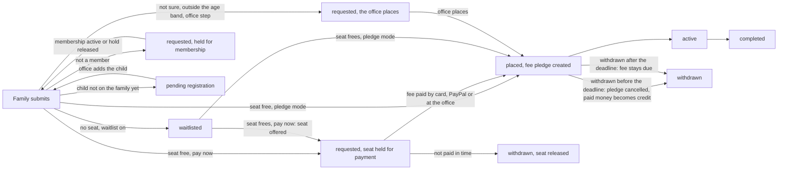

# Pathshala registration, fees and the parent's view: plan (version 2)

**Status: version 2, ACCEPTED by the owner on 2026-10-06 (all ten questions in §9 answered with the recommended answer; the owner approves each of the six money or access pull requests before it merges). Nothing in it is built yet except finding F1** (`0565_pathshala_enrollment_insert.sql`, test 56). Version 1 was accepted on 2026-10-01 (the owner took every recommended default, P1–P14) and its build was parked as BACKLOG B41. On 2026-10-06 the owner asked to complete the term, registration, fee and enrollment process (below), so this version turns the accepted plan into that. Changes from version 1 are marked **(v2)**; §4.1 says which accepted decisions change, §4.2 adds P15–P32, and the very end (§9) lists the ten questions that most need the owner's answer. Every claim about today's code names the file it came from: `NNNN` means `supabase/migrations/NNNN_*.sql` in connect-crm, other paths are connect-crm unless marked connect-mobile. Read at connect-crm `0c7e185` (migrations to 0587, tests to 72) and connect-mobile `f0da311` (v1.8.0).

**The owner's request (2026-10-06)**

> Let's complete the learning management system for Jain including Term/Registration/Fees/Enrollment process correct. 1. Each class/level/learning level can have different fees: Toddler can have $45, Class 1 and above $130, adults $50 and so on. 2. Allow the admin to set up whether all registrations must pay at the time of registration OR allow the registration to complete and add the amount as a pending payment / pledge. […] 5. In the Pathshala module, let a parent review progress for their kids: they select a child and it shows where they are, how they have been doing in the class, and their attendance as well.
>
> Also allow a parent to register their kids through the mobile app.

The same request's homework reminders, virus scanning of uploads and organization categories are planned elsewhere (migrations 0588, 0589, 0594); §7 says where they touch this plan.

**Rules already decided (this plan does not reopen them)**

| Rule | Source |
|---|---|
| Term calendar and registration windows; membership required; fees per child billed as pledges; placement by level; class waitlists | DECISIONS "Decisions made by JSH", Pathshala row |
| Money is integer cents; business rules live in database functions, not in the apps | `ARCHITECTURE.md` |
| Money screens are adults only; children never see pledges or payments | `ARCHITECTURE.md` "Tenancy and security"; RLS `pledges_household` (`0010`:205-206) |
| No refunds from the member app; money already paid is held as **credit** for the treasurer, never applied to pledges automatically | B23; `0543` header |
| Refunds and write-offs need two different people | DECISIONS #6-#8; write-off trigger (`0016`), `approve_as_second` |
| Payment allocation: the payer's chosen pledges first, else the earliest open pledge; a partial payment keeps the pledge open | DECISIONS "Payment allocation"; `app.allocate_payment` (`0104`:41-74) |
| QuickBooks posting is cash basis; it posts payments, not pledges | DECISIONS 2026-09-25 second batch; `0233`, `0521` |
| A household is never picked or confirmed by name alone: show `app.household_card` | `CLAUDE.md`, `ARCHITECTURE.md` |
| **(v2)** The Pathshala decisions P1–P14 (accepted 2026-10-01); §4.1 says which the owner's new request changes | DECISIONS "Pathshala registration (plan accepted 2026-10-01)" |
| **(v2, replaces v1's row)** Card, Apple Pay, Google Pay and PayPal payments go through the provider's hosted page and count only when the provider's webhook confirms them; they are built end to end but have only ever run against mock providers, and proving them in the providers' real test modes (B28 PR 1) waits for the owner's Stripe and PayPal test apps. Zelle is reported by the member and counts only when the treasurer matches the bank line | `PAYMENTS_PLAN.md` status line and §0; `0212`:145-203; `0582`, `0583` |
| **(v2)** A sandbox takes payments in the providers' test mode only; JSH is a sandbox | `app.create_checkout` (`0211`:778-782); `0503_jsh_sandbox.sql` |
| **(v2)** A learner's record (homework, Gyan Path) is read by the learner and the adults of their household; teachers reach it only through a placed or active enrollment; a child acts only for themselves | `0587`; `LEARNING_ASSIGNMENTS_PLAN.md` §7 |
| **(v2)** No one-to-one adult-to-minor messaging; parent communication goes through class announcements and the parent inbox | DECISIONS "Decisions made by JSH", Pathshala row; `0006` header |

---

## 0. Summary

1. **Every level gets its own fee, set explicitly each term.** The owner's example (Toddler $45, Jainism 1–7 $130, the adult classes $50) is one fee per level on a new Fees screen. Registration cannot open while a level that has a class has no fee: version 1's silent fallback to the term's single fee is removed.
2. **Each term chooses how families pay.** **Pledge** (the default): registering adds the fee to the family's pledges and they pay any time before it is due. **Pay now**: the fee is paid online while registering; the seat is held (48 hours by default) while the payment completes and is released automatically if it does not. Pay now waits for two things outside the code: real card and PayPal testing (B28 PR 1, which needs the owner's Stripe and PayPal test apps) and the treasurer and accountant's answer on fee receipts, so that fees are never receipted as donations (P13). Pledge mode waits for neither, so it ships first.
3. **A learner with a seat gets it at registration** (version 1: the office placed every child). The office still places "not sure" requests and unusual cases, can move anyone, and a pledge-mode term can keep the office step.
4. **Adults can be learners** (the adult classes), the registering parent included. Adults pay their class fee outside the sibling discount and the family cap; children under 18 on the term's cut-off date, toddlers included, count for both.
5. **Parents get a page for each learner:** where (term, class and level, day and time, next class, room, the teacher's first name), how (every published report, Gyan Path, homework, points), attendance (one definition everywhere) and the class announcements. One new database function serves it; the access changes it needs are listed for the owner (§2.13).
6. **Registering in the member app becomes a guided flow** for several learners at once: who is joining, a suggested level for each, the fee line by line, the waiver, then pay now or "added to your pledges".
7. **Eleven pull requests in four waves**, using the reserved numbers (migrations 0590–0593 and 0595, tests 75–78 and 80). Database, portal and app are built at the same time against one written contract (§2.17), as homework was. Six need the owner's sign-off before merge (money or access rules).

### 0.1 What version 2 changes

| Topic | Version 1 (accepted 2026-10-01) | Version 2 | Why |
|---|---|---|---|
| Fee per level | A fee per level per term, falling back to the term's single fee | **An explicit fee for every offered level** (a level with a class this term); opening registration refuses while one is missing | The owner's item 1; a silent default breaks the house rules |
| Levels | No screen edits them; ages unused | **Pathshala › Levels**; age bands suggest levels and keep adult classes for adults | Toddler, Class 1 and above and the adult classes must be told apart |
| Who can be registered | Children (the app leaves adults out) | **Children and adults**, the registering parent included; adults outside the sibling discount and the cap | The owner's "adults $50" |
| When the family is billed | When the office places the child (P7) | **Per-term payment mode:** pledge (billed when the seat is given, usually at registration) or pay now (paid while registering) | The owner's item 2 |
| Seats | The office places every child (P12) | **A seat is given at registration** when the chosen level has room | Pay now needs the seat decided at registration; "allow the registration to complete" |
| Waitlist | The office clicks "Place next" | **Served automatically:** placed and billed (pledge) or offered with a pay-by time (pay now) | Fair order without waiting for an office click |
| Paying at registration | Not until B28 is live | **Built now, switched on per term** after B28 PR 1 and P13 | The owner's item 2; B28's real state |
| The parent's view | One line per child in 3L › Learn | **A page per learner**: where, how, attendance, announcements, fee (adults only) | The owner's item 5 |
| Notes | One `notes` column shared by the family and the office | **The family's note, plus staff-only office notes** | Every household member, children included, reads the office's note today |
| Attendance | Not addressed (two formulas in three places today) | **One definition** | The same child shows two different numbers on one card today |
| App registration | One child per request, no fee, no waiver | **A guided flow for several learners**, waiver, fee review, pay now or pledge | The owner's "register through the mobile app" |
| Numbers | "Next free numbers at build time" | **Reserved:** 0590, 0591, 0592, 0593, 0595; tests 75, 76, 77, 78, 80 | Assigned 2026-10-06 |

### 0.2 What stays exactly as accepted

P1 (priced per learner by level; now one pledge per enrollment), P2's sibling order (now among children only), P3's cap (children's lines only), P4's late window and late fee, P5 (withdrawal before the deadline turns paid money into credit, never a refund from the app), P6's membership hold, P8's two-person fee assistance, P9's fee lock when registration opens, P10 (one enrollment per learner per track), P11's suggestion order, P13's answer, P14's waiver. Finding F1 stays fixed (0565). QuickBooks still posts payments, cash basis. The household card rule still holds on every staff picker.

---

## 1. What exists today (re-checked 2026-10-06)

### 1.1 The map

| Layer | What it does today | Where |
|---|---|---|
| Terms | Name, dates, registration opens and closes, `membership_required`, `fee_per_child_cents`, `fee_per_family_cap_cents`, `sibling_discount_pct`, no-class dates, status `draft / registration / active / closed`. No campaign or fund, no payment, hold, late or withdrawal columns. The term form sets the status directly | `0006`:7-23; `saveTerm` in `src/app/(app)/pathshala/actions.ts`:21-52 |
| Tracks and levels | Tracks (Jainism, Gujarati, Hindi) and levels with `sort_order`, `min_age`, `max_age`, `gyan_path_level_id`; anyone, even signed out, reads them. Seed levels: Toddler (order 0), Jainism 1–7, Adult class (Dads), Adult class (Moms), all in the Jainism track, then Gujarati 1–4 and Hindi 1–4. **No portal screen creates or edits a level**: Setup › Lists edits tracks only | `0006`:25-44; `0010`:385-388; `supabase/seed.sql`:164-176; `src/app/(app)/setup/lists/page.tsx`:227 |
| Classes | Per term and level: room, `capacity` (empty means no limit), day (`meets_on`, default Sunday), start and end time, "Waitlist when full" (saved, never read). Members read classes and their teacher rows | `0006`:46-60; `0010`:389-392; `classes/class-form.tsx`:73, `actions.ts`:57-84 |
| Enrollments | One per child per term (`unique (term_id, student_person_id)`): requested level, class, status `requested / waitlisted / placed / active / withdrawn / completed`, `fee_pledge_id`, `waiver_consent_id`, `registered_by/at`, `placed_at`, one `notes` | `0006`:75-93 |
| Class days (sessions) | One row per class day: `held_on`, `topic`, the rotating QR token. **Teachers of the class and staff only**: parents cannot read class dates or topics | `0006`:95-105; `0010`:402-404 |
| Attendance | Per class day and child: present / late / absent / excused, the teacher's note. The whole household reads it, children included | `0006`:107-118; `0010`:406-407; `markAttendance` in `actions.ts`:345-377 |
| Progress reports | Free-text period ("Fall 2026", "Mid-term"), attendance counts with excused days left out, teacher comments, recommended next level (teachers set it; nothing reads it). The household reads published reports | `0006`:121-137; `0010`:413-414; `classes/[id]/reports/page.tsx`:81, 141; `actions.ts`:457-499 |
| Class announcements | Per class, or for the whole term. The household reads published ones; the portal says "Published to families." **The member app has no screen for them and nothing sends a push** | `0006`:139-149; `0010`:421-427; `actions.ts`:600-631 |
| Who reads people | A member reads only the people of their own households, so a parent can read a class's teacher rows but not the teachers' names | `0010`:111-128, 391 |
| Enrollment requests | An adult may insert a `requested` enrollment for a current member of that household, in an open term and a level of the same community, with no class, placement, fee pledge or waiver, registered by the caller now (tightened in 0565). Test 56 shows the mother may register herself | `0565`; `supabase/tests/56_pathshala_enrollment_insert_test.sql`:146-149 |
| Pledges | Amount above zero; status `open / partially_paid / paid / written_off / cancelled`; source `pathshala_fee` exists; adults may insert their own open pledges with that source. A pledge becomes `paid` when its allocations reach its amount: the allocation trigger recomputes it | `0003`:68-99, 277-284; `0104`:357-375; `0010`:207-210 |
| Online payments | `app.create_checkout`: an adult of the family, open pledges of that family, refused when the community takes offline payments only, forced to test mode in a sandbox. `app.payment_checkouts`: statuses `created / pending / paid / failed / cancelled / expired`, no expiry column, contexts `rsvp, rsvp_later, pledges, opportunity, labh, store, other, portal, processor_test` (no Pathshala). Recorded only from the provider's webhook, allocated to the checkout's pledges first | `0211`:80-103, 741-798; `0212`:145-203 |
| Offline payments and Zelle | The treasurer records checks, cash and Zelle (`record_offline_payment`); a member's "I sent it" Zelle report credits nobody until a treasurer matches the bank line | `0104`:378-403; `0582` header; `0583` |
| The member Pay sheet | `startPayment` with an optional labelled alternative ("Save as a pledge instead"); card and PayPal through the provider's page; polls up to 10 minutes; the request type has no Pathshala context | connect-mobile `src/features/pay/controller.ts`:25-45, 120-127; `online-wait.ts`:17 |
| Credit | `app.household_credit`; `app.rsvp_credit_releases` (an RSVP is required); `cancel_my_rsvp` cancels a pledge, releases what was paid and writes one credit row; the treasurer's `resolve_rsvp_credit` | `0543` |
| Module | Pathshala depends on People only (not Giving); all Pathshala tables are module tables | `docs/MODULES.md`; `0101` |
| Portal: Pathshala | Terms, Classes, Enrollments (tabs by status; Place with a capacity check on placed + active; Waitlist; Withdraw; notes; "Enroll a student"), Homework, sign-offs, announcements. Place and Enroll write the table directly | `src/app/(app)/pathshala/*`; `actions.ts`:190-312 |
| Portal: Home | One Pathshala task: sign-offs waiting, children waitlisted (every term), expiring checks. Nothing counts requests waiting to be placed. `src/app/(app)/pathshala/home.tsx` is dead code (nothing imports it) | `src/lib/data/home-tasks.ts`:588-619 |
| Member app: request | An adult picks a term, one learner (only members whose household role is child or who are under 18: parents, spouses and other adults are left out), any level of any track or "Not sure · let the office decide", a note; a direct insert | connect-mobile `src/app/(app)/pathshala-enroll.tsx`:37, 122-143; `src/lib/api/gyan.ts`:280-323 |
| Member app: status | 3L › Learn › Pathshala: the **requested** level's name (not the placed class's), the day and start time (no room, no end time), the last attendance mark dated by **when it was saved, as a UTC date**, "attended n of total", and only the newest report | connect-mobile `src/features/three-l/learn.tsx`:107-209; `src/lib/api/gyan.ts`:245-278 |
| Member app: one household | The app works with the household the member is primary in, else the first; multi-household switching is a later feature | connect-mobile `src/lib/api/member.ts`:90-92 |
| Member app: homework and family | The Family tab lists each member with Profile, QR and a homework line; `app.my_gyan_homework` covers the caller and, for an adult, every member of all their households | connect-mobile `src/app/(app)/(tabs)/family.tsx`:45-47, 173-176; `0587`:1018-1057 |
| Worker | Sweeps declare `kind` and `every` and are scheduled by the worker through `app.worker_schedule`; a delayed job is `app.enqueue_job(…, p_run_after)` | `worker/src/handlers/payments.reports_sweep.ts`; `worker/src/server.ts`:160-169; `0171`:91, 193 |
| Messaging | `app.enqueue_message` (sandbox: verified test recipients only); templates seeded per migration; a push carries `type` and `deep_link` to the app's route registry | `0421`:61; `0587`:1822; `worker/src/messaging.ts`:41-62; connect-mobile `src/lib/notification-routes.ts` |
| Waiver | Legal document kind `pathshala_waiver`, required by the setup checklist when Pathshala is on; the member app never shows or records it | `0001`:205; `0181`:516-519 |
| Roles | The Pathshala principal holds `pathshala.view`, `pathshala.manage`, `pathshala.teach` and no giving permission | `supabase/seed.sql`:30 |
| Demo data | Fee pledges per child (15000, then 13500 for a sibling), campaign and fund "pathshala" | `0312`:824-854 |
| Money plumbing | QuickBooks lines by campaign and fund; the year-end statement counts every payment; a receipt preview | `0233`:119-151; `0522`:30-71; `src/lib/giving.ts` |

### 1.2 The owner's asks against today

| Ask | Today | Gap |
|---|---|---|
| Each level its own fee (item 1) | One `fee_per_child_cents` per term (`0006`:16); version 1 planned a fee per level with that as the fallback | No fee table, no Levels screen, nothing tells a toddler or an adult class apart (F15) |
| The admin chooses pay at registration or a pledge (item 2) | Nothing bills anyone; version 1 decided "no paying at registration until B28" (P7) | No payment mode, no seat hold, no Pathshala checkout context (F17), nothing that turns a payment into a registration |
| A parent reviews each child (item 5) | One line per child in 3L › Learn (§1.1) | No teacher name, room, end time or next class; no report history or recommended level; Gyan Path, homework and points live elsewhere; no announcements (F8); attendance dated wrongly (F10) and counted two ways (F9); one household only |
| Parents register in the app | A bare request: one child at a time, children only (F14), the fee as text, nothing billed (F18) | Several learners at once, fees line by line, the waiver, pay now or pledge, status afterwards |
| (v1) Sibling discount, family cap, deadlines, late fee, withdrawal, membership, children not yet on the family, consent, notifications, receipts, QuickBooks, committee reports | Stored or labelled, applied nowhere (v1 §1.2) | Carried into §2 |

### 1.3 Findings worth fixing on the way

| # | Finding | Evidence | Fixed in |
|---|---|---|---|
| F1 | A parent could enroll any person under their household and set the fee pledge, waiver, registrant and time | `0010`:396-397 | **Fixed in 0565** (2026-10-01). PR 11 drops the policy once the app registers through the function |
| F2 | Fee amounts cannot live on the enrollment row: children of the household read it | `0010`:394-395 | PR 1 (a separate fee table) |
| F3 | Members can create `pathshala_fee` pledges of any amount, and a member pledge to a campaign of kind `pathshala` is recorded as `pathshala_fee`; fee reports must key on the enrollment link, not the source | `0010`:207-210; connect-mobile `src/lib/api/giving.ts`:120-127 | PR 11 |
| F4 | The portal's Enrollments page shows a household by `display_name` only, and when the names cannot be read it logs to the console and shows none | `enrollments/page.tsx`:46-50, 142 | PR 5 (household card, the error shown) |
| F5 | Term fees can be edited after families registered, with no record of what each family was quoted | `saveTerm`, `actions.ts`:21-52 | PR 1 (lock and quotes) |
| F6 | "Complete enrollment" on a pending request opens the request form again, which only says "already enrolled" | connect-mobile `learn.tsx`:142-147 | PR 4 |
| F7 | One enrollment per child per term: a child cannot take Jainism and Gujarati in the same term | `0006`:90 | PR 2 (P10) |
| **F8 (v2)** | The portal says an announcement is "Published to families.", but the member app has no screen for class announcements and nothing pushes them: families never see them | `actions.ts`:629; no `class_announcements` read in connect-mobile `src` | PRs 7, 8 |
| **F9 (v2)** | **Attendance is counted two ways in three places.** The term statistics count excused days against the child ((present + late) ÷ every mark) and the app does the same per child; the portal's class and term rates and the progress-report counts leave excused days out. The app shows both on one card: "attended 7 of 9" next to the report's "7 of 8" | `0104`:1097-1100; connect-mobile `src/lib/learning.ts`:557-561; `src/lib/logic/attendance.ts`:19, 46-55, 106-122; connect-mobile `learn.tsx`:164-182 | PR 7 (one definition, P29) |
| **F10 (v2)** | The app dates a class day by when the mark was saved, cut to a UTC date, because parents cannot read class days: a mark saved in a Houston evening (after 7 pm in summer, 6 pm in winter) shows the next day | connect-mobile `src/lib/api/gyan.ts`:273-274; `0010`:402-404 | PRs 7, 8 |
| **F11 (v2)** | The app shows the level the parent asked for, not the level of the class the child is in | connect-mobile `src/lib/api/gyan.ts`:250, 271 | PR 8 |
| **F12 (v2)** | One `notes` column is both the family's request note and the office's note: the office's "Save note" overwrites the family's words, and every household member, children included, reads the office's note | connect-mobile `gyan.ts`:319; `saveEnrollmentNote`, `actions.ts`:305-312; `0010`:394-395 | PR 7 (P28) |
| **F13 (v2)** | A child with a login reads their brothers' and sisters' enrollments, attendance (with the teacher's notes) and reports, while homework keeps a child to their own | `0010`:394-395, 406-407, 413-414; `0587` | PR 7 (P27) |
| **F14 (v2)** | The app's picker leaves adults out, although the database allows an adult learner and the seed has two adult classes | connect-mobile `pathshala-enroll.tsx`:37; test 56:146-149; `supabase/seed.sql`:172 | PR 4 |
| **F15 (v2)** | Level ages can be filled only by the bulk import or the demo pack, the seed leaves them empty, and nothing reads them; "Waitlist when full" is saved and never read; the teacher's recommended next level is saved and never read; `gyan_path_level_id` is never set or read | `src/lib/import/registry.ts`:692-693; `0312`:186-189; `supabase/seed.sql`:167-176; `actions.ts`:73, 489 | PRs 1, 2, 7 |
| **F16 (v2)** | The bulk import can create placed or active enrollments with no fee, and the portal's Place and "Enroll a student" write the table directly | `src/lib/import/registry.ts`:1111-1140; `actions.ts`:200-276 | PR 5 (through the functions); the Fees report shows any enrollment without a fee row as "not billed"; PR 11 (import warning) |
| **F17 (v2)** | No checkout context for Pathshala exists in any of the four places that list contexts: the table check, `create_checkout`, the portal's intent route (which silently turns an unknown context into "other") and the member app's request type | `0211`:87, 760; `src/lib/payments/view.ts`:109, 135; connect-mobile `src/features/pay/controller.ts`:36 | PR 2 (database), PR 3 (portal), PR 4 (app) |
| **F18 (v2)** | Three screens promise billing that no code does: the term form ("Billed per child as a pledge"), the classes subtitle ("fees billed per child as pledges") and the app ("billed to your family as a pledge once your child is placed") | `terms/term-form.tsx`:44; `pathshala/page.tsx`:25; connect-mobile `src/i18n/en.ts`:2038 | PRs 3, 4 |
| **F19 (v2)** | The year-end statement counts every payment as a gift, fee payments included; there is no receipt sender, and the receipt preview says "No goods or services were provided other than intangible religious benefits" | `0522`:43-54; `src/lib/giving.ts`:459 | PR 10 (P13) |
| **F20 (v2)** | The Pathshala Home task counts waitlisted children of every term and nothing counts requests waiting to be placed; `pathshala/home.tsx` is dead code | `src/lib/data/home-tasks.ts`:588-619 | PR 5; PR 11 deletes `home.tsx` |

---

## 2. Design

### 2.1 Levels and age bands (v2)

- A **level** is a step within a track (seed: Toddler, Jainism 1–7, Adult class (Dads), Adult class (Moms) in Jainism; Gujarati 1–4; Hindi 1–4). It keeps its track, key, name and order, and gets a usable **age band**: a minimum and/or a maximum age in whole years, measured on the term's age cut-off date (P11; default the first day of term).
- An **adult class** is a level whose minimum age is 18 or more; a **children's level** is one whose maximum age is under 18; a level with no band is open to anyone. No new "audience" field: the band says it.
- A new `active` flag retires a level (not offered, history kept). A level with classes or enrollments is never deleted.
- **Pathshala › Levels** (new portal screen, `pathshala.manage`): per track, the levels in order with name, key, age band and active; add, edit, reorder, retire. Writes go through `app.save_pathshala_level` with plain-English refusals ("The minimum age (12) is above the maximum age (10)."). Tracks stay in Setup › Lists.
- **How the band is used (P24):** the app lists the levels that fit the learner's age first ("For Dev, age 9") and "Other levels" below. Adult classes are offered only to adults and children's levels only to children. A child may be registered in a children's level outside their band, but that registration waits for the office to confirm it (no automatic seat, nothing billed until confirmed).
- The seed's ages are empty (F15). The migration sets no ages; the Levels screen shows "No age band" and the Fees screen warns (does not refuse) before opening registration.

### 2.2 An explicit fee for every offered level (v2)

- A level is **offered** in a term when it has at least one class in that term. **Every offered level needs its fee for the term** (`app.pathshala_level_fees`); $0 is entered as "Free".
- **Opening registration refuses while one is missing:** "Set the fee for Gujarati 3 and Hindi 1 before opening registration." Version 1 fell back to the term's `fee_per_child_cents`; version 2 keeps that field only to pre-fill the Fees screen.
- A class added after opening for a level with no fee: the level is not offered ("Gujarati 4 has a class but no fee for 2026-27 yet, so families cannot choose it") and the principal gets a Home task.
- A fee is $0 or at least $0.50 (the smallest online payment, `0211`:758).
- A change after opening needs the treasurer and a reason (P9) and applies to new registrations only; quotes and pledges already made never change.
- **The owner's example is the whole fee setup:** select Toddler → $45; select Jainism 1 to 7 → $130 ("Copy to the 7 selected levels"); select the two adult classes → $50; Gujarati and Hindi per P22.
- The term form can no longer move a term out of Draft by itself (a trigger refuses it unless the fees are locked); the Fees screen's **Open registration** does it after its checks (a term with no classes yet locks with no fees to set). Terms already out of Draft when 0590 is deployed are not touched.

### 2.3 Who counts as a child (v2)

| Learner | Counts as | Sibling discount (P2) | Family cap (P3) | Late fee (P4) |
|---|---|---|---|---|
| Under 18 on the term's age cut-off date (toddlers included) | Child | Yes: the first child pays full, each other child gets the term's % | Yes | Yes |
| No birth date, recorded as a child of a household and the primary or spouse of none (the 0587 rule, `app.person_is_minor`, applied on the cut-off date) | Child | Yes | Yes | Yes |
| Everyone else: 18 or older, or no birth date and not recorded as a child | **Adult learner** | No, and never "the first child" | No: outside the cap | Yes |

- **Who may register whom:** an adult of the household registers any current member of it, adults included (themselves, a spouse, a grandparent). A child registers nobody (unchanged).
- A learner with no birth date is asked for one in the app ("used only to suggest a level and to work out the sibling discount"); the office sees "No birth date" in its queue.

### 2.4 The pricing rule (one function)

`app.pathshala_quote(term, household, lines)` is the only place a fee is calculated. It is `stable`, writes nothing and returns one line per enrollment plus the totals. The preview, the registration, the Fees screen's "Try a family", the billing and a re-quote all call it, so the amount shown before submitting is the amount billed.

For each line (one learner in one track):

1. **Level fee:** the term's fee for that level (§2.2). No fee: refused, never guessed.
2. **Sibling discount** (P2, among children only, §2.3): children are ranked, those already registered this term (not withdrawn) first in the order they registered, then this submission's children by their highest level fee, then by age (oldest first). The first child pays full; every other child gets `sibling_discount_pct` off **each** of their lines (a child taking Jainism and Gujarati pays two level fees at that child's rate, P10), rounded to the cent.
3. **Family cap** (P3): when the children's running total after discounts would pass `fee_per_family_cap_cents`, the line that crosses it is reduced so the children's total equals the cap, and later children's lines are $0. Adult learners' lines are outside the cap.
4. **Late fee** (P4): in the late window, the term's `late_fee_cents` per learner (adults included), outside the discount and the cap.
5. **Fee assistance** (P8): an approved amount comes off, never below $0.

**Never re-priced.** A line is locked when the family submits; later registrations, withdrawals and fee changes never change it, so nobody is billed more after the fact. **(v2)** The one exception is the office moving a learner to a level with another price (§2.6, P26): only that learner's line is re-priced, at the rank they already had.

**Worked example with the owner's prices** (Toddler $45, Jainism 1–7 $130, adult classes $50; sibling discount 10%; a family cap of $275 and a late fee of $25 are shown only to make them visible: the owner sets both)

| Learner | Age on the cut-off | Level | Level fee | Sibling | Cap | Late | Total |
|---|---|---|---|---|---|---|---|
| Riya | 12 | Jainism 5 | $130.00 | none (first child: same fee as Dev, older) | none | none | $130.00 |
| Dev | 9 | Jainism 2 | $130.00 | −$13.00 | none | none | $117.00 |
| Anya | 4 | Toddler | $45.00 | −$4.50 | −$12.50 | none | $28.00 |
| Mira (their mother) | 44 | Adult class (Moms) | $50.00 | adult: none | adult: outside | none | $50.00 |
| **Family** | | | | | | | **$325.00** |

The children's lines after discounts come to $287.50, so Anya's is reduced by $12.50 to meet the $275.00 cap; Mira's $50.00 sits outside it. With no cap, Anya pays $40.50 and the family $337.50. In the late window each of the four lines gets +$25.00 (family $425.00). If Riya registers in August and Dev in September, Dev still gets the 10% because Riya is already registered. In a pledge-mode term the family sees four pledges ($130.00, $117.00, $28.00, $50.00); in a pay-now term it makes one payment of $325.00.

### 2.5 Seats, the waitlist and the office's part (v2)

- **Seats of a level** are the sum of the capacities of its classes in the term; a class with no capacity has no limit (`0006`:53). **Taken** means placed and active enrollments in those classes plus live seat holds at that level (§2.7). Seats are counted under a lock per term and level, so two families can never get the last seat.
- **A seat at registration (P12, changed):** when the chosen level has a free seat, the learner gets it at once. In a pledge-mode term they are **placed** in the class of that level with the most free seats (ties: by class name) and billed. In a pay-now term the seat is **held** until the fee is paid, then they are placed. The office can move a learner between classes of the same level at any time, with no money change.
- **No seat:** when any class of the level has "Waitlist when full" on (`0006`:58, read at last), the learner joins the level's waitlist, in the order they joined. Otherwise the level shows **Full** and the app says: "Jainism 3 is full and has no waitlist. Ask the Pathshala office."
- **The office still decides** (status requested, no seat, nothing billed) for: "not sure of the level" (pledge-mode terms only, P25); a children's level outside the child's age band (P24); a term that keeps the office step (seat rule "office", pledge mode only: today's practice and version 1's P12); a child the office must first add to the family (a pending registration). A membership hold waits for the membership (P6).
- **Promotion (P19):** when a seat frees (a withdrawal, a released hold, a capacity raised, a class added), the earliest waitlisted learner of that level is served. Pledge mode: placed and billed, with a notice that says how to withdraw at no charge before the deadline. Pay now: a **seat offer**, held for payment for the term's hold window; if it is not paid, the learner leaves the waitlist (the family can join again, at the end) and the seat is offered to the next. In an office-step term the office uses **Place next** (one click, as version 1).

### 2.6 The payment mode, case by case (v2)

Each term has a **payment mode**: **Pledge** (the default) or **Pay now** (P15). Who sets it and when it locks: P16.

| Situation | Pledge mode (default) | Pay-now mode |
|---|---|---|
| The chosen level has a seat | Placed at once; one fee pledge per enrollment, due on the first class day or 14 days after the seat was given, whichever is later (P7 changed). "Added to your pledges · Pay now (optional)" | Seat held for the hold window (default 48 hours); the fee pledges are created due today and the Pay sheet opens for the family's total; placed when they are paid (§2.8); released automatically if not (§2.7) |
| No seat: waitlisted | No pledge; "No charge unless a seat opens" | The same; nothing to pay |
| A seat frees for a waitlisted learner (P19) | Placed and billed automatically; the notice says how to withdraw at no charge | A seat offer: held for payment for the hold window; unpaid, the learner leaves the waitlist and the seat goes to the next |
| Not a member (P6) | No seat, no pledge, until the hold lifts (by itself when the household's membership becomes active, or the office releases it); then treated as registering at that moment | The same; once lifted, the seat is held for payment (or the learner is waitlisted) |
| "Not sure of the level" (P25) | Allowed (the track is chosen); requested; billed when the office places | Not offered: the app keeps the suggested level and says the teacher can move the child (then P26) |
| A children's level outside the band (P24), or a term that keeps the office step | Requested; the office confirms or places, then billed | Requested; when the office confirms the level, a seat offer is made (held for payment). A term with the office step is always pledge mode |
| Another adult learner must agree to the waiver (P14) | No seat yet (not reserved) until they agree in their own app; then treated as registering at that moment | The same; then the seat is held for payment |
| A child not yet on the family | Pending until the office adds the child; then treated as registering at the original time | The same; then the seat is held for payment |
| Fee assistance asked (P8) | The seat is given; billing waits for the decision, then the decided amount is billed | The seat is held without payment until the decision; then the hold window starts for the decided amount |
| A $0 line (a free level, full assistance, or the cap) | Placed; no pledge ("No fee") | Confirmed together with the family's paying lines (§2.7); placed at once when the family has nothing to pay |
| The office moves the learner to a level with another price (P26) | Before any payment: the pledge is re-quoted (up or down) and the family told. After payment: a higher fee adds a top-up pledge for the difference; a lower fee turns the overpaid part into credit for the treasurer | The same; a seat held for payment cannot be moved until the hold ends |
| Withdrawn before a seat (requested, waitlisted, held for membership) | Nothing to cancel | The same |
| A seat held for payment is withdrawn | — | The hold ends, its pledges are cancelled, anything paid at the office becomes credit |
| Withdrawn after placement, before the withdrawal deadline (P5) | The pledge is cancelled; anything paid becomes credit for the treasurer (B23) | The same |
| Withdrawn after the deadline | The fee stays due; anything paid stays paid | The same |
| Registered in the late window (P4) | The late fee is on the pledge | The late fee is in the payment |
| Pledges & donations (Giving) is off | Registration works; quotes are kept and marked "not billed: Pledges & donations is off" (as membership fees, `0130`:189-198) | Pay now cannot be chosen; an open pay-now term refuses new registrations with a plain message |
| The office registers a walk-in | As a family's registration (office channel) | The seat is held for payment at the office (the treasurer or a finance volunteer records it); or, with a reason, billed as a pledge instead |

### 2.7 Pay now in detail (v2)

**The hold**

- A seat held for payment lasts the term's **hold window** (default 48 hours, 1 to 168, P17). A reminder goes 6 hours before it ends.
- A hold stays **live** while its window runs **or** while a payment page for it is still open at the provider (a checkout `created` or `pending` that is less than 24 hours old: Stripe's hosted page expires after 24 hours by default, and `src/lib/payments/server.ts` does not shorten it). A parent who is paying never loses the seat mid-payment. Live holds count as taken seats.
- When a hold is no longer live, the sweep (worker job `pathshala.holds_sweep`, every 15 minutes, the `payments.reports_sweep` pattern) releases it: the hold's fee pledges are cancelled (anything paid toward them at the office becomes credit, as `cancel_my_rsvp` does, `0543`:76-88), the seat is offered to the waitlist (§2.5), and the family is told: "We released Riya's seat in Jainism 5 because the fee was not paid by Thu 6:00 pm. Register again if a seat is still free." The enrollment becomes `withdrawn` with the reason; registering again reuses it.
- A family registering several learners pays once for all of them. Lines that cost $0 (a free level, or a child the cap brings to $0) are held with the family's paying lines and confirmed when those are paid, so a free seat never outlives the payment it depends on.

**What completes a pay-now registration**

| Way to pay | Counts as paid when | Notes |
|---|---|---|
| Card, Apple Pay or Google Pay (Stripe's hosted page) | The provider's webhook records the payment (`0212`:145-203) | Apple Pay and Google Pay appear on Stripe's page by themselves (`PAYMENTS_PLAN.md` §2.10, approach A) |
| PayPal (and Venmo or cards inside PayPal) | The webhook's capture is recorded | The same path |
| Pay at the office: Zelle, check or cash (only when the term allows it, P18) | The treasurer records the payment against the fee pledges (`record_offline_payment`, `0104`:378-403; or the bank match for a Zelle line, `0583`) | The seat is held for the office window (default 7 days) |
| A member's Zelle "I sent it" report | **Never by itself** (`0582` header) | It keeps the seat held until the treasurer matches or rejects it, or it is marked "not seen at the bank" (its window, 10 days by default, `0582`) |

- The app waits for the provider as it does today (it polls for up to 10 minutes, connect-mobile `online-wait.ts`:17) and, when it takes longer, says so honestly: "Your payment is still being confirmed. Riya's seat stays held; we will let you know."
- **"Pay at the office instead"** is the Pay sheet's labelled alternative (connect-mobile `controller.ts`:38-42), shown only when the term allows it. It moves the holds to the office window and shows the community's Zelle, check and cash instructions (`app.member_payment_methods`, `0581`).
- **Money that arrives after a release** is never lost and never applied automatically. An online payment for a released hold (its `pathshala` checkout names the cancelled fee pledges) finds no open pledge to take it (`allocate_payment` allocates only to open pledges, `0104`:54-60), so it is household credit; the database writes a credit row and a Home task for the principal and the treasurer: "Payment arrived after Riya's seat was released: give the seat back if one is free, or handle the credit." At the office, the Registrations screen shows the fee pledge as cancelled ("seat released") before anyone records a payment against it.
- **What the money is called.** The checkout's label is "Pathshala fee 2026-27 · Riya, Dev" (the label becomes the line on Stripe's page, `src/lib/payments/server.ts`:144), its context is `pathshala` (F17), and the app's success screen says "Fee paid", not the donation thank-you.

**When pay now can be chosen (P20).** Only when all three hold. They are checked when the mode is saved and again when registration opens, and shown in plain words while they do not:

1. Pledges & donations (Giving) is on (every payment function asserts it, for example `0211`:748);
2. the community takes online payments: `app.member_payment_methods` lists a card or PayPal entry (connected, not "offline only", live in production or test in a sandbox; `0581` header);
3. fee receipts are ready (P13, migration 0595). Until 0595 ships the database answers: "Pay at registration waits for fee receipts (P13)."

If online payment stops working while a pay-now term is open, new registrations are refused ("Online payment is not available right now, so registration cannot be completed. Try again later or ask the Pathshala office.") and the principal gets a Home task; holds already made keep their window.

**The B28 dependency, plainly.** Card and PayPal payments have only ever run against mock providers (`PAYMENTS_PLAN.md` §0, finding G1). Proving them in the providers' real test modes is B28 PR 1, and it waits for the owner's Stripe and PayPal test apps (`PAYMENTS_PLAN.md` §4, S1–S6). Until then pay now can be built and tested against the mocks, but not rehearsed on the JSH sandbox (which always charges in test mode, `0211`:778), and real money also needs the community's own live provider accounts (S4, S7) and a live organization. **So pledge mode ships first, and pay now is switched on per term once those are done** (§5).

### 2.8 The paid-fee hook (v2)

One trigger completes a held registration, whatever the payment channel: `after update of status on app.pledges`, when a `pathshala_fee` pledge becomes `paid`. Every channel ends in a payment allocation, and the allocation trigger recomputes the pledge (`0003`:277-284, `0104`:357-375): an online payment (`0212`:194), an office payment (`0104`:401), a matched bank line (`0583`), or the treasurer applying credit with the existing tools.

`app._pathshala_fee_paid(pledge)`:

1. finds the enrollment (`pledges.source_ref_id`) and its fee row;
2. when the enrollment's seat is held for payment (a registration or a seat offer): places the learner in the level's class with the most free seats (the held seat), clears the hold, marks the fee row paid and tells the family ("Riya is registered for Jainism 5: Sundays 10:00–11:30, Room C"); when this was the registration's last unpaid line, it also places the registration's $0 lines;
3. otherwise (a pledge-mode fee paid later, a top-up) marks the fee row paid and does nothing else.

It never creates or moves money, never bills, and runs once (a second update finds nothing held). If the Pathshala module was switched off meanwhile it still places the learner (the family has paid) and sends no message. A part payment does nothing until the pledge is paid in full.

### 2.9 Life cycle



### 2.10 Data changes

| Object | Change | Migration | Why |
|---|---|---|---|
| `app.pathshala_levels` | `active boolean not null default true`; checks: ages 0–120 and `min_age <= max_age`; written through `save_pathshala_level` | 0590 | The Levels screen; bands used (§2.1) |
| `app.pathshala_level_fees` (new) | `id, center_id, term_id, level_id, fee_cents` (0, or 50 and up), `set_by, set_at`; `unique (term_id, level_id)` | 0590 | An explicit fee per offered level (§2.2). No non-member price (P6), so v1's `non_member_fee_cents` is dropped |
| `app.pathshala_terms` (columns) | `payment_mode` (`pledge` default, or `pay_now`); `hold_hours` (48; 1–168); `office_payment_allowed` (false); `office_hold_days` (7; 1–21); `seat_rule` (`automatic` default, or `office`; `office` only with `pledge`); `campaign_id`, `fund_id`; `late_registration_closes_at`, `late_fee_cents` (0); `withdrawal_credit_until` (date; default the first class day + 14 days); `age_cutoff_on` (date; default `starts_on`); `fees_locked_at`, `fees_locked_by` | 0590 | The rules each term needs, now enforceable. `seat_rule` replaces v1's `auto_place` |
| `app.pathshala_enrollment_fees` (new) | One row per enrollment: `registration_id`, `level_id`, `learner_kind` (`child` or `adult`), `family_rank`, `base_fee_cents, sibling_discount_cents, cap_reduction_cents, late_fee_cents, assistance_cents, total_cents` (each ≥ 0, the total equal to the parts), `rule_snapshot jsonb` (percent, cap and late fee at quote time), `quoted_at`, `status` (`quoted, billed, paid, no_fee, cancelled, not_billed_giving_off`), `pledge_id unique`, `billed_at`, `requotes jsonb` (each move: old and new level and line, who, when); assistance as v1 (`assistance_requested`, `assistance_note`, proposed and approved by different people). A top-up pledge is found by `pledges.source_ref_id` = the enrollment | 0590 (table), 0591 (writes) | The locked quote, kept off the row children read (F2) |
| `app.pathshala_enrollments` (columns) | `registration_id` (one family submission); `track_id` (backfilled from the class's level, else the requested level, else the community's Jainism track; then `unique (term_id, student_person_id, track_id)` replaces `unique (term_id, student_person_id)`, P10); `hold_reason` (`membership, payment, office_payment, assistance, waiver`); `hold_expires_at`, `hold_reminded_at`; `offered_at` (a seat offered from the waitlist); `waitlisted_at`; `suggested_level_id`, `suggestion_reason`; `channel` (`app, office, import, demo`); `withdrawn_at`, `withdrawn_by`, `withdrawal_reason`. **The six statuses stay** (installed apps and the portal read them): a held learner is `requested` with a `hold_reason` | 0591 | Holds and offers without a new status |
| `app.pathshala_pending_registrations` (new) | A child the parent added who has no person row yet: `term_id, household_id, change_request_id, track_id, requested_level_id, note, quote snapshot, registered_at, registered_by, status` (`pending, converted, cancelled`) | 0591 | Approving the add-member request (`app.decide_household_change_request`, `0524`:167) converts it, keeping the original time; rejecting it cancels it and tells the parent (v1) |
| `app.payment_checkouts.context` | Accepts `pathshala` (the table check, `0211`:87, and `create_checkout`'s list, `0211`:760) | 0591 | Fee payments are labelled and reported as fees (F17) |
| `app.rsvp_credit_releases` | `rsvp_id` nullable, new `enrollment_id`, a check that exactly one is set | 0591 (the hold sweep already writes credit rows; withdrawals use it from 0592) | One credit queue for RSVP and Pathshala (v1); `resolve_rsvp_credit` serves both |
| `app.pathshala_office_notes` (new) | `enrollment_id` (primary key), `note`, `updated_by`, `updated_at`; read by `pathshala.view` and `pathshala.manage`, written through a function; the note is masked in the audit log | 0593 | Office notes off the row the family reads (P28) |
| `app.pathshala_enrollments.notes` | The column stays; it is now only the family's note ("Note from the family") | 0593 (comment) | P28 |
| RLS of enrollments, attendance and progress reports | Read by those who can act for the student, by the homework rule (`app.gyan_can_act_for`, `0587`:250-257: the learner, or an adult of any household the learner is in, where a child with no birth date is still a child) instead of every member of the enrollment's household | 0593 | A4 and A7 in §2.13 (P27, P32) |
| `app.message_templates` | The templates in §2.14, per community | 0591–0593 | Messages |
| `app.module_tables`, `app.demo_keep_tables` | The new tables under module `pathshala`; level fees are configuration (kept by a demo clear), the rest are cleared | 0590–0593 | The module switch, demo clears |

### 2.11 Database functions

All are `security definer` with `set search_path = app, public, extensions`; they call `app.assert_module_enabled(center, 'pathshala')` (and `'giving'` wherever money is touched), re-check rights, set a plain audit reason ("Shah family registered 4 learners for Pathshala 2026-27, pledge mode, $325.00") and raise plain-English errors the apps show as they are, with the error codes the payments and homework functions use (`22023` a rule, `42501` not allowed, `P0002` not found).

| Function | Migration | Who | What |
|---|---|---|---|
| `save_pathshala_level(p_center, p_level jsonb, p_reason)` | 0590 | `pathshala.manage` | Create or edit a level (name, key, order, ages, active); plain-English checks; a used level is retired, never deleted |
| `set_pathshala_level_fees(p_term, p_fees jsonb, p_reason)` | 0590 | `pathshala.manage` while the term is a draft; `giving.manage` with a reason after it opens (P9) | Sets fee rows; a change after opening applies to new registrations only |
| `set_pathshala_term_rules(p_term, p_rules jsonb, p_reason)` | 0590 | The same as fees | Payment mode, hold and office windows, office payment, seat rule, sibling %, cap, late window and fee, withdrawal deadline, age cut-off; refuses pay now with the readiness sentence (§2.7) |
| `open_pathshala_registration(p_term, p_reason)` | 0590 | `pathshala.manage` | Checks every offered level has a fee and, for pay now, readiness; with Giving on, creates or reuses the campaign "Pathshala fees *term*" (kind `pathshala`, status `closed`, so it is never offered as a giving opportunity) linked to the Pathshala fund (found by key, as `0513` does; if there is none the screen asks the treasurer to pick one); locks fees and rules; sets status `registration` |
| `pathshala_quote(p_term, p_household, p_lines jsonb)` | 0590 | An adult of the household; the office (`pathshala.manage`). Not the committee: a family's quote shows the sibling rank and the cap, which is what its siblings already registered | §2.4; writes nothing |
| `pathshala_registration_options(p_term, p_household)` | 0590 | An adult of the household | Everything the app's flow needs (§2.17) |
| `preview_pathshala_registration(p_term, p_household, p_learners jsonb)` | 0590 | An adult of the household; `pathshala.manage` | The quote plus each line's outcome (seat, waitlist, membership hold, office, pending child); writes nothing |
| `pathshala_fee_example(p_term, p_lines jsonb)` | 0590 | `pathshala.view` | "Try a family" on the Fees screen |
| `pathshala_seats(p_term)` | 0590 | Members (counts only); staff. `fee_cents` only for adults and staff, null for a child's own login (P30) | Per level: seats, taken, held, free, waitlist length, waitlist on |
| `pathshala_pay_now_ready(p_center)` | 0590 (closed), 0595 (opened) | `pathshala.view` | Null when pay now may be chosen, else the sentence |
| `register_pathshala_children(p_term, p_household, p_learners jsonb, p_expected_total_cents, p_expected_outcomes jsonb, p_waiver_document, p_client_key)` | 0591 (the late window from 0592) | An adult of the household; `pathshala.manage` (office channel) | Re-prices and refuses a changed total ("The fee changed since you looked; please review the new total.") or a changed outcome ("The last seat in Jainism 3 was just taken. Riya can join the waitlist instead: please review again."); checks the window, membership, waiver, that each learner is a current member of the household, duplicates; under the per-level lock gives seats, waitlists or holds; writes enrollments, fee rows, consents, pending registrations and pledges; queues the messages; idempotent on `p_client_key`. `p_learners`: `[{person_id, track_id, level_id or null, note, assistance_requested}]` or `[{new_child: {first_name, last_name, date_of_birth, relationship}, track_id, level_id, note}]` |
| `choose_pathshala_office_payment(p_registration)` | 0591 | An adult of the household | Moves the registration's payment holds to the office window, when the term allows it |
| `place_pathshala_enrollment(p_enrollment, p_class, p_over_capacity, p_reason)` | 0591 | `pathshala.manage` | Replaces the direct update in `placeEnrollment`; places or moves within the same level; bills in pledge mode; makes a seat offer in pay now |
| `place_next_from_waitlist(p_level)` | 0591 | `pathshala.manage` | One click, for office-step terms |
| `release_pathshala_hold(p_enrollment, p_reason)` and `extend_pathshala_hold(p_enrollment, p_until, p_reason)` | 0591 | `pathshala.manage` | Lifts a membership hold (membership renewed at the desk); extends a payment hold, at most to the office window |
| `pathshala_registration_queue(p_term, p_view)` | 0591 | `pathshala.view`; fee columns for `pathshala.manage` and `giving.view` | The office's queue with `app.household_card`, fee status, holds and waitlist positions |
| `pathshala_task_counts(p_center)` | 0591 | Staff | The Home tasks (§2.14) |
| `_pathshala_bill`, `_pathshala_fill_seats`, `_pathshala_fee_paid` (trigger), the membership trigger and the change-request trigger | 0591 | Internal | §2.5–2.8. Billing: one pledge per enrollment (household, pledged by the registering adult, the term's campaign and fund, source `pathshala_fee`, `source_ref_id` = the enrollment, amount = the locked line, due date per §2.6); never twice; $0 gives `no_fee`; Giving off gives `not_billed_giving_off` with a note |
| `worker_pathshala_holds_sweep()` | 0591 | The worker role only | Reminders, releases, seat offers, late-payment tasks; returns counts |
| `withdraw_pathshala_enrollment(p_enrollment, p_reason, p_apply)` | 0592 | An adult of the household; `pathshala.manage` | P5; `p_apply = false` returns what would happen, so the app can say it first |
| `move_pathshala_enrollment(p_enrollment, p_class, p_reason, p_apply)` | 0592 | `pathshala.manage` | Another level: re-quote, a top-up pledge or credit (P26); shows the outcome first |
| `propose_pathshala_assistance(p_enrollment, p_cents, p_note)` and `approve_pathshala_assistance(p_enrollment)` | 0592 | The principal proposes; a different person with `giving.approve` approves, with a fresh 2FA check and a reason (P8) | Lowers the line before billing; after billing only the existing two-person write-off |
| `pathshala_fee_report(p_term)` | 0592 | `pathshala.view` (totals); `pathshala.manage` or `giving.view` (per family) | §2.16 |
| `my_pathshala_overview(p_center, p_person)` | 0593 | A signed-in member | The learner's page (§2.13, §2.17) |
| `save_pathshala_office_note(p_enrollment, p_note)` | 0593 | `pathshala.manage` | Office notes (P28) |
| `pathshala_attendance_summary(p_enrollment)` | 0593 | Internal and the overview | The one definition (P29); `pathshala_term_stats` (`0104`:1072-1104) is changed to use it |
| Fee receipts and the year-end statement | 0595 | — | §2.15 (P13); opens `pathshala_pay_now_ready` |

### 2.12 Access rules, audit, module

- **New tables:** no direct writes from any app. Reads: level fees by members when the term is not a draft (like terms, `0010`:383) and by staff; enrollment fees and pending registrations by the household's adults (`app.adult_of_household`), `pathshala.manage` and `giving.view`/`giving.manage`, never by children, teachers or the committee (the committee sees totals, §2.16); office notes by `pathshala.view`/`pathshala.manage`. Each gets the restrictive `module_switch` policy and an `app.module_tables` row.
- **Enrollments:** the 0565 insert rule stays until PR 11. Staff keep their write policy for imports and corrections, but the portal stops writing enrollments directly (PR 5), and the Fees report lists any enrollment without a fee row as "not billed (imported, demo or entered by hand)" so a bypass is visible (F16).
- **Children:** §2.13, A4.
- **Audit:** an `audit_<table>` trigger on each new table; every function sets a reason; the assistance note and office notes are masked in the audit trail (`app.audit_mask`).
- **Module switches:** Pathshala off: every function refuses (the paid-fee hook still places a learner who has paid). Giving off: §2.6.
- **Data class and retention:** fee rows and pledges are financial records (kept 7 years, then anonymized, per the deletion decision); assistance and office notes are sensitive.

### 2.13 The parent's page for each learner (v2)

**What it shows**

| Section | Shows | From |
|---|---|---|
| Who | A picker of the household's members who have an enrollment: children first, then adult learners; the household's name and number when the parent is an adult of more than one household. A child with a login sees only themselves | enrollments, household members |
| Where | The term; the status ("Registered", "Seat held until Thu 6:00 pm", "Waitlist: number 3", "Waiting for membership", "The office is choosing the level"); the **class's** level (F11); day, start and end time, room; the next class day (no-class dates skipped; before the term starts, the first class day); the teachers' first names and role (teacher, assistant, substitute) | enrollment, class, term, teacher rows, people's first names |
| How | Every published report, newest first: period, teacher comments, attendance, the teacher's recommended next level. Gyan Path: each goal the learner has started (levels done of the total, the current level, sign-offs approved, waiting or sent back, last activity). Homework: to do, waiting for a parent, with the teacher, sent back, accepted, the next due item. Points this term and in all | progress reports; `gyan_progress`, `gyan_signoffs`; `gyan_submissions` with `app.gyan_assignment_applies` (`0587`); `points_ledger` |
| Attendance | The one definition (P29): the percentage, the counts (present, late, absent, excused) and the last 8 class days with the status, the day's topic and the teacher's note | class days (`held_on`, `topic`), attendance |
| Announcements | Published announcements of the learner's class and of the whole term, newest first | `class_announcements` |
| Fee (adults only, P30) | Each line's total and status (billed, paid, part paid, held until …, no fee, not billed), the pledge numbers, what is open, **Pay**, the withdrawal rule and what withdrawing now would do | fee rows, pledges |

**One function serves it:** `app.my_pathshala_overview(p_center, p_person default null)`, `stable`, `security definer`. It lists the caller (when enrolled) and, when the caller is an adult, every current member of all their households who has an enrollment in a term that is not a draft (the `my_gyan_homework` rule, `0587`:1027-1031); for the chosen person (the first, when none is given) it returns the current term's enrollments and the last closed term's, each with the sections above (the shape is in §2.17). It returns only what a household adult or the learner may see: no last names or contacts of teachers, no QR tokens, no other learner's rows. With Gyan Path switched off, the Gyan Path, homework and points parts are null with the reason; with Pathshala off, the function refuses.

**Access changes it needs (the owner's OK, P27, P28, P30, P32)**

| # | What changes | Today | After |
|---|---|---|---|
| A1 | The teacher's first name and role, for the learner's own class | Not readable: a parent reads only people of their own households (`0010`:111-128), though the teacher rows are readable (`0010`:391) | Through the overview only, for a placed or active enrollment. No last name, no contact: the no one-to-one messaging rule stands |
| A2 | Class dates and topics of the learner's own class | Teachers and staff only (`0010`:402-404) | Through the overview only, for a placed or active enrollment; never the QR token or who opened the day |
| A3 | Announcements | Already readable by the household (`0010`:421-427): **no rule change**; the app simply had no screen | Shown on the page; a push to the household's adults when one is published (P31) |
| A4 | A child with a login reading a brother's or sister's Pathshala record | Readable: enrollments, attendance with the teacher's note, published reports (`0010`:394-395, 406-407, 413-414) | **Tightened:** a child reads only their own; adults read everyone's in their households (the homework rule, `0587`) |
| A5 | Fees | The household's adults | Unchanged: adults only; the overview leaves the fee section out for a child (P30) |
| A6 | The office's notes | The single `notes` column, read by every household member (`0010`:394-395) | Office notes move to a staff-only table; the family's own note stays visible to them and the office (P28) |
| A7 | A learner who is in two households (for example parents living apart) | Only the adults of the household the enrollment is filed under | Every adult of any household the learner is in sees where, how, attendance and announcements (`app.gyan_can_act_for`, as homework does); **fees stay with the household that is billed** (P32) |

**The attendance definition (P29).** Attended = present + late; the percentage is attended ÷ (attended + absent); excused days and days with no mark are left out. One function computes it for the overview, the portal's class and term rates, the progress report's counts (already this rule, `src/lib/logic/attendance.ts`:106-122) and `pathshala_term_stats` (changed to match). Example: 7 present or late, 1 absent, 1 excused gives **88% (7 of 8; 1 excused)**. Today the same child shows "attended 7 of 9" and the report's "7 of 8" on one card (F9). Class days are the class's own dates (`held_on`), never the time a mark was saved (F10).

**The next class day** is worked out in the function from the term's dates, the class's day (`meets_on`), the term's no-class dates and the class's times, in the community's time zone: "Next class: Sun Oct 11, 10:00–11:30 · Room C". The portal already has the same rule in TypeScript (`classDaysInTerm` and `nextClassDay`, `src/lib/logic/attendance.ts`:84-104); the database and the member app have none.

**The notes split (P28).** From 0593, office notes go to `app.pathshala_office_notes` (staff only) and the enrollment's `notes` holds only the family's own note. A staff-only `office_notes` column on the enrollment would not work: row-level security hides rows, not columns, and the member app reads enrollments with `select('*')` (connect-mobile `src/lib/api/gyan.ts`:246), so a column the family may not read would break it. Notes written before 0593 stay exactly where they are and stay visible to the family as today; the Registrations screen marks them "visible to the family" with a one-click **Move to office notes**. Nothing is hidden or lost by the migration.

### 2.14 Notifications

Sent with `app.enqueue_message` (purpose `notification`; push topic `pathshala`; email only where the person has opted in; the sandbox reaches verified test recipients only), from templates each community can edit in Communications, seeded per migration as `0587` does. Pushes carry `type: "pathshala"` and a `deep_link` (both already forwarded by the worker, `worker/src/messaging.ts`:41-62); the app registers the `pathshala` route (connect-mobile `src/lib/notification-routes.ts`). Messages go to adults, never to a child: fee and payment messages to the adults of the household that is billed; announcements, reports and placement news to every adult of any household the learner is in (A7). An adult learner is a household adult and gets them too.

| Template key | When | To | Opens |
|---|---|---|---|
| `pathshala_registration_received` | After a family submits | The registering adult: each learner, level, outcome, the lines and what happens next | The first learner's page |
| `pathshala_registered` | A seat is confirmed (pledge mode at once; pay now when paid) | Household adults: class, day, time, room; in pledge mode the pledge numbers, amounts and due date | The learner's page |
| `pathshala_payment_due` | A pay-now seat is held, or a seat is offered from the waitlist | Household adults: the amount and the time it is held until | The learner's page, Pay |
| `pathshala_hold_reminder` | 6 hours before a hold ends | Household adults | The learner's page, Pay |
| `pathshala_hold_released` | A hold ended unpaid | Household adults | Registration |
| `pathshala_waitlisted` | A learner joins a waitlist | Household adults: the position; no charge unless a seat opens | The learner's page |
| `pathshala_placed` | The office placed a learner, or the waitlist placed one (pledge mode) | Household adults: the class and the fee; how to withdraw at no charge | The learner's page |
| `pathshala_level_changed` | The office moved a learner to another level | Household adults: the new level and the fee change (a top-up pledge or credit) | The learner's page |
| `pathshala_membership_hold` and `pathshala_hold_lifted` | A membership hold is set or lifted | Household adults: how to become a member | Membership, or the learner's page |
| `pathshala_child_added` and `pathshala_child_not_added` | A pending child is added to the family, or the request is declined | The registering adult | The learner's page, or Registration |
| `pathshala_withdrawn` | A learner is withdrawn | Household adults: what happened to the fee and any credit (covers B23 item 3 for Pathshala) | The learner's page |
| `pathshala_fee_reminder` | N days before an unpaid fee is due (the open "pledge reminders" decision sets N) | Household adults | The learner's page, Pay |
| `pathshala_announcement` | An announcement is published (a worker job in batches, the `homework.publish_notify` pattern) | The household adults of learners placed or active in that class, or in the term | The learner's page |
| `pathshala_report_published` | A progress report is published | The learner's household adults | The learner's page |

**Office Home tasks:** "N Pathshala registrations to place" (not sure, outside the band, office step, membership lifted), "N seats held for payment (M end within 6 hours)", "N held for membership", "N fee assistance requests to approve" (`giving.approve`), "N payments arrived after a seat was released", "N offered levels with a class but no fee", and the existing **Credit** task, now including Pathshala withdrawals. The waitlist count is limited to open terms (F20).

### 2.15 Money: pledges, campaign, QuickBooks, receipts

- **Pledges.** One per enrollment (P1, P10), numbered like every pledge (`JSH-PL-…`), source `pathshala_fee`, `source_ref_id` = the enrollment, with the term's campaign and fund; visible to the household's adults. They follow the standing allocation rule (the payer's chosen pledges first, else the earliest open one; a fee pledge is usually the family's newest, so an unchosen payment goes to older pledges first). Paying from a Pathshala screen opens the Pay sheet with context `pathshala` and those pledges chosen.
- **Campaign and fund** (v1): opening registration creates or reuses "Pathshala fees *term*" (kind `pathshala`, status `closed`), linked to the Pathshala fund; every fee pledge carries both.
- **QuickBooks** (v1): no new posting type. A fee payment posts through the existing SalesReceipt lines: income account = the campaign's own account, else the approved `income.pathshala` mapping (`0232`:29), else General donations; class = the Pathshala fund's QuickBooks class (`0233`:132-146). The mapping screen warns when `income.pathshala` is not mapped: "Pathshala fees will post to General donations."
- **Withdrawal or a level change after posting** (v1, B23 item 1): released allocations are not re-posted; the credit task tells the treasurer to review the reclass.
- **Receipts and statements (P13, launch blocker for pay now).** Until the treasurer and accountant decide: a fee payment's receipt leaves out "No goods or services were provided other than intangible religious benefits", and the year-end statement lists fee payments (the part of each payment allocated to `pathshala_fee` pledges) separately, outside the tax-deductible total. Today it counts every payment (`0522`:43-54, F19). Built in 0595.
- **Words.** Pathshala screens, the payment page, the success screen and messages say "Pathshala fee", never "donation" or "gift". The app's drawer item "My Donations" also lists fee pledges (labelled "Pathshala fee", connect-mobile `src/components/drawer.tsx`:152, `src/i18n/en.ts`:382); whether it becomes "Donations and fees" is part of P13's wording.
- **F3 and imports.** Member-created `pathshala_fee` pledges are closed off in PR 11. Imported enrollments are history and never billed; the import page warns when importing into a term open for registration: "Imported enrollments are not billed. Register families through Pathshala › Registrations to bill them." (F16)

### 2.16 Reports for the Pathshala committee

`pathshala_fee_report(term)` and a **Fees** view under Pathshala (CSV export recorded with `app.record_export`):

| By level | By family (staff with `pathshala.manage` or `giving.view` only) |
|---|---|
| Registered, placed, held for payment, waitlisted, held for membership, withdrawn; children and adult learners | Household card, learners, levels, lines, pledge numbers |
| Fees quoted and billed, sibling discounts, cap reductions, late fees, assistance, top-ups | Paid, open, credit, holds released |
| Collected online and at the office, outstanding, credit released, not billed | Membership and waiver state |

The committee (`pathshala.view`) sees totals by level, not what each family pays.

### 2.17 The contract for building in parallel (v2)

Database, portal and app are built at the same time against these shapes, as homework was (`LEARNING_ASSIGNMENTS_PLAN.md` §5). Money is integer cents; dates are ISO in the community's time zone; every refusal is a plain sentence the apps show as it is. While a function is missing on the server, the app treats it as "not available yet" and keeps today's screens (the `{kind: 'missing'}` pattern, connect-mobile `src/lib/api/homework.ts`:26-27, 67-77).

`pathshala_registration_options(p_term, p_household)`:

```json
{
  "term": {
    "id": "…", "name": "2026-27", "starts_on": "2026-09-06", "ends_on": "2027-05-30",
    "window": { "state": "open", "opens_at": null, "closes_at": "2026-09-01T23:59:00-05:00",
                "late_until": null, "late_fee_cents": 0 },
    "payment_mode": "pledge", "hold_hours": 48,
    "office_payment": { "allowed": false, "hold_days": 7 },
    "seat_rule": "automatic", "withdrawal_credit_until": "2026-09-20", "age_cutoff_on": "2026-09-06",
    "membership_required": true,
    "waiver": { "document_id": "…", "title": "Pathshala waiver", "version": "2026.1" }
  },
  "household": { "id": "…", "name": "Shah household", "number": "JSH-H-2041", "membership": "active" },
  "households": [ { "id": "…", "name": "Shah household", "number": "JSH-H-2041" } ],
  "learners": [ {
    "person_id": "…", "first_name": "Dev", "age_on_cutoff": 9, "counts_as_child": true, "needs_birth_date": false,
    "enrollments": [ { "track_id": "…", "level_id": "…", "status": "requested", "hold_reason": null, "hold_expires_at": null } ],
    "suggested": [ { "track_id": "…", "level_id": "…", "reason": "teacher" } ]
  } ],
  "tracks": [ { "id": "…", "key": "jainism", "name": "Jainism", "levels": [
    { "id": "…", "name": "Jainism 2", "min_age": 8, "max_age": 10, "fee_cents": 13000, "seats": "open" } ] } ],
  "can_register": true, "cannot_reason": null
}
```

`window.state` is `open`, `late`, `closed` or `not_yet`; `payment_mode` is `pledge` or `pay_now`; `seats` is `open`, `waitlist` or `full`; `suggested.reason` is `teacher`, `previous` or `age`.

`preview_pathshala_registration` and `register_pathshala_children` return:

```json
{
  "registration_id": "…",
  "lines": [ {
    "person_id": "…", "track_id": "…", "level_id": "…", "learner_kind": "child", "family_rank": 2,
    "outcome": "seat", "base_fee_cents": 13000, "sibling_discount_cents": 1300, "cap_reduction_cents": 0,
    "late_fee_cents": 0, "assistance_cents": 0, "total_cents": 11700,
    "enrollment_id": "…", "pledge": { "id": "…", "number": "JSH-PL-20114", "due_on": "2026-09-20" }
  } ],
  "children_total_cents": 27500, "adults_total_cents": 5000, "total_cents": 32500,
  "pay": null,
  "pending": []
}
```

`outcome` is `seat`, `waitlist`, `membership_hold`, `office` or `pending_child`; the preview has no `enrollment_id` or `pledge`. In a pay-now term `pledge.due_on` is today and `pay` is `{"amount_cents": 32500, "pledge_ids": ["…"], "for_label": "Pathshala fee 2026-27 · Riya, Dev, Anya, Mira", "hold_until": "…", "office_payment_allowed": false}`.

`withdraw_pathshala_enrollment(…, p_apply)` returns `{"outcome": "pledge_cancelled", "cancelled_cents": 11700, "credit_cents": 0, "due_cents": 0, "sentence": "The $117.00 fee pledge is cancelled; nothing was paid."}` (`outcome` is `nothing_billed`, `hold_released`, `pledge_cancelled`, `credit` or `fee_stays_due`).

`my_pathshala_overview(p_center, p_person)`:

```json
{
  "people": [ { "person_id": "…", "name": "Riya Shah", "is_child": true,
                "households": [ { "id": "…", "name": "Shah household", "number": "JSH-H-2041" } ] } ],
  "person_id": "…",
  "enrollments": [ {
    "enrollment_id": "…", "term": { "id": "…", "name": "2026-27", "starts_on": "2026-09-06", "ends_on": "2027-05-30" },
    "track": "Jainism", "status": "placed",
    "status_detail": { "hold_reason": null, "hold_until": null, "waitlist_position": null, "requested_level": "Jainism 5" },
    "where": { "class": "Jainism 5 · Room C", "level": "Jainism 5", "room": "C", "day": "sunday",
               "starts": "10:00", "ends": "11:30", "next_class_on": "2026-10-11",
               "teachers": [ { "first_name": "Neha", "role": "teacher" } ] },
    "how": {
      "reports": [ { "period": "Mid-term", "published_at": "…", "teacher_comments": "…", "attended": 7, "counted": 8,
                     "recommended_next_level": "Jainism 6" } ],
      "gyan": [ { "goal": "Learn Navkar", "levels_done": 5, "levels_total": 9, "current_level": "Verse 6",
                  "signoffs": { "approved": 2, "waiting": 1, "sent_back": 0 }, "last_activity_on": "2026-10-03" } ],
      "homework": { "to_do": 1, "needs_parent": 0, "with_teacher": 2, "sent_back": 0, "accepted": 5,
                    "next_due": { "title": "Navkar recording", "due_on": "2026-10-12" } },
      "points": { "term": 120, "total": 480 }
    },
    "attendance": { "present": 5, "late": 2, "absent": 1, "excused": 1, "rate_pct": 88,
                    "recent": [ { "on": "2026-10-04", "status": "present", "topic": "Navkar meaning", "note": null } ] },
    "announcements": [ { "id": "…", "title": "No class on Nov 29", "body_md": "…", "published_at": "…", "scope": "term" } ],
    "fee": { "total_cents": 13000, "status": "billed", "open_cents": 13000,
             "pledges": [ { "id": "…", "number": "JSH-PL-20113", "amount_cents": 13000, "paid_cents": 0,
                            "status": "open", "due_on": "2026-09-20" } ],
             "can_pay": true, "withdraw": { "deadline": "2026-09-20", "outcome_now": "pledge_cancelled" } }
  } ]
}
```

`fee` is null for a child caller and for a household that is not billed; `how.gyan`, `how.homework` and `how.points` are null with Gyan Path off.

---

## 3. Flows

### 3.1 Member app (connect-mobile): registering

Entry points: 3L › Learn › Pathshala "Register for Pathshala", Guide › Registrations (the Pathshala row), the "registration is open" push. The route stays `pathshala-enroll` (with `?term=`), so existing links and the module map keep working. JavaScript only, so it ships over the air.

| # | Screen | Pledge-mode term | Pay-now term |
|---|---|---|---|
| 0 | **Before you start** | Adults only (a child sees "Ask a parent or guardian in your family to register you"). Which household, when the adult is an adult of more than one ("Register under: Shah household · JSH-H-2041", P32). The term, when there is more than one. The window: open; late ("Late registration until Sep 14: $25 late fee per learner"); closed, or opens on a date (stop here). Membership: member; application in progress; not a member (explains the hold; **Apply for membership**). "The fee is added to your family's pledges. Pay any time before it is due." | The same, but: "You pay when you register: card, PayPal, Apple Pay or Google Pay. Seats are held for 48 hours while you pay." (and "or at the office within 7 days" when the term allows it) |
| 1 | **Who is joining** | Everyone in the household with their age on the cut-off date: children first, then adults ("Adult learner: pays the adult class fee, no sibling discount"), the registering adult included ("Me"). Those already registered show their status. **Add a child who isn't listed** (first, last, birth date, relationship: files `request_add_family_member` and a pending registration, "The office adds Anya to your family first"). A missing birth date is asked for | The same |
| 2 | **Level for each learner** | One card per learner: the track (Jainism; "Also take Gujarati" or "Hindi", P10); the suggested level preselected with its reason ("Recommended by her teacher last term", "Next after Jainism 4", "Usual level for age 9"); the levels for the learner's age first, then "Other levels" (outside the band: "The office will confirm this level"); each with its fee and **Seats open / Waitlist / Full**; **Not sure, let the office decide** | The same without "Not sure": "Not sure? Keep the suggested level: the teacher can move your child in the first weeks, and any price difference is settled then." |
| 3 | **Review the fee** | One line per learner: level fee, sibling discount, cap, late fee, total; the family total. What happens to each line: "Seat available", "Waitlist: no charge unless a seat opens", "Waiting for membership: no charge yet", "The office will choose Dev's level: charged then", "The office adds Anya to your family first". "When you register, $325.00 is added to your pledges (one per learner), due Sep 20." The withdrawal rule in one sentence. **Ask about fee assistance** (private: only the principal and the treasurer see it) | "Pay $325.00 now to register. Seats are held for 48 hours while you pay." Lines that wait say "Nothing to pay now" |
| 4 | **Waiver** | The community's published Pathshala waiver (P14): **I agree** for each child and for the registering adult; another adult learner (a spouse) is asked to agree in their own app before their seat is given | The same |
| 5 | **Pay** | — | **Register and pay $325.00** opens the Pay sheet (context `pathshala`, "Pathshala fee 2026-27 · Riya, Dev, Anya, Mira"); a countdown "Seats held until Thu 6:00 pm"; **Pay at the office instead** when the term allows it; a cancelled or failed payment leaves the seats held, with **Pay now** to try again |
| 6 | **Done** | Per learner: Registered (class, day, time, room), Waitlisted (position), Waiting for membership, Waiting for the office, Waiting for the office to add the child. "Added to your pledges: 4 pledges, $325.00, due Sep 20 · **Pay now** (optional)". An email or push copy | Registered (paid), or "Seat held until Thu 6:00 pm · **Pay now**", Waitlisted, and so on |
| 7 | **Afterwards** | The learner's page (§3.2) and 3L › Learn: status, class, schedule; for adults only "Fee $117.00 · due Sep 20 · **Pay**" or "Paid"; **Withdraw**, which first says exactly what will happen ("The $117.00 pledge is cancelled; the $117.00 you paid is held as credit for the treasurer") | The same, plus a Home strip for held seats and seat offers ("Pay to keep Riya's seat · 5 h left") |

Errors follow the house rule: "Could not register Riya: registration closed on Sep 14", with **Try again** where it helps; a changed total or a seat just taken sends the parent back to step 3 with the new lines. English first; Gujarati and Hindi fall back to English until reviewed translations exist.

### 3.2 Member app (connect-mobile): a learner's Pathshala page

- **Route** `pathshala` with `?person=<id>` (the homework screens' pattern); **entry points:** a **Pathshala** pill per enrolled member on the Family tab, beside Profile and QR (connect-mobile `(tabs)/family.tsx`:173-176); each row of 3L › Learn › Pathshala; the pushes of §2.14.
- **Top:** the learner picker as chips (the `pathshala-enroll.tsx`:122-127 pattern); a child sees no picker.
- **Cards, in order:** Where (class, level, day and time, room, next class, teacher's first name, status line with a countdown when a seat is held); Attendance (the percentage, counts, the last 8 class days with status and topic); How (the newest report open, older ones folded; "Teacher recommends Jainism 6 next term"; Gyan Path per goal; homework counts with a link to the homework list; points); Announcements (newest first, the term-wide ones marked "All of Pathshala"); Fee (adults only: total, status, pledges, **Pay**, **Withdraw**).
- **Errors:** "Could not load Riya's Pathshala page. Try again." with a retry; when the server does not have the function yet, the page falls back to today's 3L › Learn list.

### 3.3 Portal (connect-crm)

| Area | Who | What changes |
|---|---|---|
| Pathshala › **Levels** (new) | Principal | Levels per track: name, key, order, age band, active; add, edit, reorder, retire (§2.1) |
| Pathshala › Terms › term › **Fees** | Principal while a draft; treasurer after opening | The offered levels grouped by track: fee (required), seats; **Copy to selected levels**. Term rules: payment mode (Pledge or Pay now, with the readiness sentence when pay now cannot be chosen), hold window, Pay at the office and its window, seat rule (Automatic, or Office confirms: pledge mode only), sibling %, cap, late window and fee, withdrawal deadline, age cut-off. **Try a family.** **Open registration** (lists in plain English what is missing). After opening, a change needs `giving.manage` and a reason, shown as "applies to new registrations only". The old term form loses its fee fields and its "Registration open" choice; its wrong "billed" hint goes (F18) |
| Pathshala › **Registrations** (today's Enrollments) | Principal | Tabs: To place, Seat held for payment, Waitlisted, Held for membership, Placed, Active, Withdrawn, Completed. Columns: learner, age on the cut-off, child or adult, household card (F4), track, level asked or suggested and why, the line, fee status (Not billed, Billed JSH-PL-… $117.00, Part paid, Paid, Held until …, Credit $X), membership, waiver, registered at, waitlist position, office note. Actions: **Place**, **Move** (shows the money outcome first), **Waitlist**, **Release hold**, **Extend hold**, **Record payment** (opens Giving's form with the pledges chosen, for people with `giving.record_offline`), **Withdraw** (outcome first), **Propose fee assistance**, **Office note**, **Move to office notes**. **Register a family** goes through `register_pathshala_children` with a household card picker |
| Pathshala › Classes | Principal | Seats, held, waitlist; **Place next** for office-step terms |
| Pathshala › Classes › attendance sheet | Teachers | Under the note field: "Families can read this note." |
| Pathshala › Announcements | Principal, teachers | "Published to families" now means a push too (P31) |
| Approvals | `giving.approve` | Fee assistance second approval, beside write-offs and refunds |
| Home | Principal, treasurer | §2.14 |
| Pathshala › **Fees** report | Committee (totals), principal and giving staff (by family) | §2.16, CSV |
| Giving › Pledges | Giving staff | Unchanged; fee pledges show the campaign "Pathshala fees *term*" |
| Data › Import | Staff | The warning for terms open for registration (§2.15) |

---

## 4. Decisions

### 4.1 P1–P14 (accepted 2026-10-01) in version 2

| # | Decision | Accepted answer | Version 2 |
|---|---|---|---|
| **P1** | Fee per child or per family | Per child, priced by level per term; one pledge per child | **Clarified:** per learner (adults priced the same way); one pledge per enrollment, so a child in Jainism and Gujarati has two (P10) |
| **P2** | Sibling discount: who pays full | The highest level fee pays full, every other child gets the term's % (ties: older child full); children already registered count first; never re-priced | **Clarified:** among children only (P23); a discounted child's rate applies to each of their tracks |
| **P3** | Family cap | After the sibling discount, per household per term; late fees and assistance outside it; the child that crosses it is reduced, later children $0 | **Clarified:** children's lines only; adult learners are outside the cap (P23) |
| **P4** | Late registration and late fee | An optional late window after registration closes, a flat late fee per child (default $0), outside discount and cap; after the window only the office enrolls (and may waive the late fee with a reason) | **Clarified:** the late fee is per learner, adults included |
| **P5** | Withdrawal | No refunds from the app; before the deadline (default the first class day + 14 days) the fee pledge is cancelled and anything paid becomes credit; after it the fee stays due; a withdrawal never re-prices siblings | Unchanged. A pay-now seat released or withdrawn before payment cancels its pledges (§2.6) |
| **P6** | Membership | Accept but hold (no seat, no bill) until the household has an active yearly or life membership; **Apply for membership**; the principal can release with a reason; no non-member price | Unchanged. **Added:** the hold lifts by itself when the membership becomes active; the learner is then treated as registering at that moment |
| **P7** | Payment timing | A pledge at placement, due on the first class day or 14 days after placement, whichever is later; no paying at registration until B28 is live | **CHANGED (see P15):** each term chooses pledge (default) or pay now. Pledge mode bills when the seat is given (usually at registration), due on the first class day or 14 days after the seat was given, whichever is later. Pay now pays while registering and is switched on only after B28 PR 1 and P13 (P20) |
| **P8** | Fee assistance | A parent asks privately; the principal proposes; a different person with `giving.approve` approves (reason, fresh 2FA) before billing; after billing only the two-person write-off | Unchanged. **Added:** billing waits for the decision (the seat is kept); in pay now the seat is held without payment until the decision |
| **P9** | Who sets and changes fees | The principal while the term is a draft; opening registration locks them; later a change needs `giving.manage` and a reason and applies to new registrations only | Unchanged; the payment mode, windows and seat rule lock with the fees (P16) |
| **P10** | Several tracks per child | One enrollment per child per track; the sibling discount counts children; the cap covers the family total | Unchanged; "not sure" must name the track |
| **P11** | Level suggestion | Last term's teacher recommendation, else the level after last term's, else age on the cut-off date (default the first day of term); the parent may choose another and the office sees both | Unchanged; the ages come from the Levels screen (P24), and the teacher's recommendation is finally read (F15) |
| **P12** | Placement and waitlist | The office places; "Place next" is one click; auto-place a per-term switch, off by default | **CHANGED:** a seat is given at registration when the chosen level has room (pay now needs it). The office places "not sure" and outside-the-band learners, adds a child to the family first when needed, and may move anyone; a pledge-mode term can keep version 1 (seat rule "office"); the waitlist is served automatically (P19) |
| **P13** | Tax treatment and receipt wording of fees | Until the accountant decides: a payment receipt without "no goods or services were provided", and fees listed separately, outside the tax-deductible total, on the year-end statement | Unchanged answer; **now a launch blocker for pay now** (P20) |
| **P14** | Waiver | Required at registration when the community has published one; one consent per child, re-signed each year | **Clarified:** one consent per learner; the registering adult agrees for the children and themselves; another adult learner agrees in their own app |

### 4.2 New decisions (P15–P32)

| # | Question for the owner | Recommended default | If the owner chooses otherwise |
|---|---|---|---|
| **P15** | For each term, should families pay when they register, or register now and pay later? | **Each term chooses. Pledge (the default):** a learner who gets a seat adds one fee pledge per enrollment; the family pays any time before it is due. **Pay now:** the fee is paid online while registering; the seat is held while the payment completes and registration is confirmed only when paid. Office walk-ins in a pay-now term are held for payment at the office, or billed as a pledge with a reason | Pay now for every term: impossible until B28 PR 1 and P13, so registration could not open in the app until then. Pledge only: the second half of the owner's item 2 is not built |
| **P16** | Who may choose a term's payment mode, and can it change after registration opens? | **The principal chooses while the term is a draft; it locks when registration opens, with the fees (P9). After that only the treasurer (`giving.manage`), with a reason, and the change applies only to registrations made afterwards.** Pay now cannot be chosen while P20's conditions are not met; the setting stays visible, with the reason | Free changes at any time: families registering a day apart are treated differently with no record of why. Treasurer only: the principal must ask for every term |
| **P17** | In a pay-now term, how long is a seat held while the family pays online? | **48 hours (a term can set 1 to 168), a reminder 6 hours before, never released while a payment page is still open (at most 24 hours more), then released automatically with a notice.** Money that arrives after a release becomes credit for the treasurer with a Home task: never lost, never applied automatically | 1 hour: a phone call in the middle of paying loses the seat. A week: popular classes stay blocked by families who never pay |
| **P18** | In a pay-now term, may a family pay at the office (Zelle, check, cash) instead of online? | **Off by default; a per-term switch. When on, the seat is held 7 days (1 to 21) until the treasurer records the payment. A Zelle "I sent it" report never counts as paid, but keeps the seat held until the treasurer matches or rejects it, or it is marked not seen at the bank (10 days)** | Always on: pay now becomes "pay within a week" for anyone. Never: families without a card or PayPal cannot register in pay-now terms except through the office |
| **P19** | When a seat opens, what happens for the next learner on the waitlist? | **Pledge mode: placed and billed automatically, and the family is told how to withdraw at no charge before the deadline. Pay now: the seat is offered and held for the hold window (48 hours); if it is not paid, the learner leaves the waitlist (the family can join again, at the end) and the seat is offered to the next.** Office-step terms keep "Place next" | The office always clicks: seats stay empty until someone looks. The learner stays first after a lapsed offer: one family can block a seat again and again |
| **P20** | Can paying at registration go live before cards are tested for real and fee receipts are decided? | **No. Pay now can be chosen for a term only when (1) card or PayPal payments work in the providers' real test mode (B28 PR 1, which waits for the owner's Stripe and PayPal test apps), and live mode for real money, and (2) fee receipts follow P13 (0595). Pledge mode ships first. Fees are called "Pathshala fee" everywhere, never a donation** | Earlier: families could be charged through code that has never run against a real provider, and get a donation receipt for a tuition fee |
| **P21** | Must every level that has a class this term have its own fee before registration opens? | **Yes. A level with a class is offered, and opening registration is refused while any offered level has no fee ($0 is entered as Free). The term's single fee no longer fills in silently (v1 did); it only pre-fills the screen. A class added later for a level with no fee is not offered until its fee is set** | A fallback to the term's fee: a new level silently costs whatever the old field says, and nobody sees it until a family is billed |
| **P22** | Toddler $45, Jainism 1–7 $130, the two adult classes $50: what do Gujarati 1–4 and Hindi 1–4 cost? | **Their own fee on the Fees screen each term, pre-filled with $130 (the "Class 1 and above" price) for the principal to confirm or change. A child taking Jainism and Gujarati pays both level fees (P10); the sibling discount and the cap still apply per child** | Free with a Jainism class: needs a "second track" rule that is not planned. Always the same as Jainism: they could not be priced differently later without a change |
| **P23** | Who counts for the sibling discount and the family cap? | **Children under 18 on the term's age cut-off date, toddlers included. Adult learners (the adult classes, a parent registering themself) pay their class fee and any late fee, with no sibling discount, outside the family cap, and never count as "the first child"** | Count adults as siblings: a parent joining the adult class would turn a child into the discounted one. Leave toddlers out: their fee is never discounted, but an older child may lose the discount instead |
| **P24** | Should a level's age band be a rule or a suggestion? | **A suggestion for children's levels: the app lists the levels for the learner's age first and allows another children's level, which then waits for the office to confirm (no automatic seat, nothing billed until confirmed). A rule for adult classes (minimum 18: adults only) and children's levels (maximum under 18: children only)** | Strict for every level: a 6-year-old ready for Jainism 2 can only be registered by the office. No bands: a child can be put in the adult class by mistake, and the toddler class priced for adults |
| **P25** | May a parent register a child without choosing the level? | **In pledge-mode terms only: the parent chooses the track (Jainism, Gujarati, Hindi) and "let the office decide"; no seat and no bill until the office places the child, then billed at that level's fee. In pay-now terms the app keeps the suggested level and says the teacher can move the child (P26)** | Allowed in pay now: the family would have to pay without a price. Not allowed anywhere: parents guess and the office corrects with P26 |
| **P26** | If the office moves a child to a level with a different price, does the fee change? | **Yes, to the new level's price, at the child's original sibling rank, shown to the office before confirming and told to the family. Before any payment the pledge is changed; after payment a higher fee adds a top-up pledge for the difference, and a lower fee turns the overpaid part into credit for the treasurer (never a refund from the app). Other children's fees never change. A seat held for payment cannot be moved until the hold ends** | Keep the quoted fee: a $45 toddler registration moved to Jainism 1 stays $45. The office decides each time: families in the same situation pay differently |
| **P27** | On the child's Pathshala page, may parents see the teacher's first name and the class dates and topics; and should a child with a login see only their own Pathshala record? | **Yes to both** (A1, A2 and A4 in §2.13). First names only, no contact details (the no one-to-one messaging rule stands); dates and topics of the child's own class only; a child no longer sees a brother's or sister's attendance or reports (today they can, F13). Announcements need no rule change (A3) | No teacher names: the page says "Teacher" only. Children keep reading their siblings' records, including teacher comments |
| **P28** | Should the office's notes about a registration be hidden from the family? | **Yes: office notes move to a staff-only place; the family's own note ("Please place with her cousin") stays visible to the family and the office. Notes written before stay visible as today, marked "visible to the family", and the principal can move any of them in one click** | Keep one shared note: the office overwrites the family's words, and every household member, children included, reads the office's note (F12) |
| **P29** | How is a child's attendance percentage counted? | **Present and late count as attended; absent counts against; excused days and days with no mark are left out. One rule for the app, the portal and the reports. 7 attended, 1 absent, 1 excused: 88% (7 of 8)** | Count excused days against the child: a sick child's percentage drops. Count late as half: the reports need a second number |
| **P30** | Does a child with their own login see Pathshala fees? | **No. Fees, pledges and payments are for the household's adults only, as all money is today; a child's page shows where, how, attendance and announcements** | Teenagers see their own fee: a change to the money rule for one module |
| **P31** | Should parents get a push when the class posts an announcement or a report is published? | **Yes, to the household's adults (never to children), with a tap that opens the child's page; quiet hours and opt-outs apply** | No pushes: families see them only when they open the page; today they never see announcements at all (F8) |
| **P32** | A child in two households (for example parents living apart): which family registers, who pays, and who sees the page? | **The adult who registers chooses which of their households it is filed and billed under (shown with the household number). Every adult of any household the child is in sees the child's page; fees stay with the household that is billed** (A7) | Only the billed household sees the page: the other parent sees nothing of the child's class. Both households billed: impossible without splitting pledges |

---

## 5. Phased PR plan

Sizes: S under 300 changed lines, M 300–800, L over 800. Every database PR runs the database tests (`supabase/tests/run_local.sh`; the Database tests check in CI), regenerates `src/lib/database.types.ts` with `supabase/scripts/gen-types.mjs` and copies it to connect-admin and connect-mobile. **Owner sign-off** before merge where marked (CLAUDE.md: money rules, permissions and access rules). Database PRs merge in number order (0590, 0591, 0592, 0593, 0595), so every server's database matches a fresh build; a portal or app PR merges as soon as the migration it needs is deployed.

| # | Repo | PR | Migration, test | Size | Wave | Built against | Owner sign-off |
|---|---|---|---|---|---|---|---|
| 1 | connect-crm | **DB1: levels, fees, payment mode, quote.** `save_pathshala_level`, age bands, `pathshala_level_fees`, the term columns, `pathshala_quote`, options, preview, "Try a family", seats, term rules, `open_pathshala_registration` (the explicit-fee check, the lock, campaign and fund, the trigger on the term's status), the pay-now readiness answer (closed until 0595). No money moves | 0590, test 75 | M | 1 | It is the contract | **Yes:** pricing rules, explicit fees, the child rule, age bands |
| 2 | connect-crm | **DB2: register, hold, place, bill.** `register_pathshala_children` in both modes; automatic seats; seat holds and the sweep (worker job `pathshala.holds_sweep`, every 15 minutes); place, move within a level, place next; billing; waitlist promotion and seat offers; the membership hold and its automatic release; pending children; waiver consents; the paid-fee hook; the `pathshala` checkout context; the shared credit queue (RSVP or Pathshala) and the late-payment task; one enrollment per track (P10); templates; Home task counts; the registrations queue | 0591, test 76 | L | 1 | §2.17 | **Yes:** creates pledges, holds seats, a new checkout context, P12 changed |
| 3 | connect-crm | **Portal A: Levels and Fees.** Pathshala › Levels; Terms › Fees (fees, copy to selected, rules, payment mode with its readiness sentence, windows, seat rule); Try a family; Open registration; the false "billed" wording goes (F18); `CHECKOUT_CONTEXTS` gains `pathshala` (F17) | none | M | 1 | PR 1's contract | No |
| 4 | connect-mobile | **App A, over the air: registering.** §3.1 in both modes; adults; the waiver; the Pay sheet with context `pathshala` and "Pay at the office instead"; status and Pay in 3L › Learn; the Home strip for held seats; keeps today's form until the server has the functions | none | L | 1 | §2.17 | No |
| 5 | connect-crm | **Portal B: Registrations.** The queue with the household card (F4) and fee status, holds, Place, Move within a level, Waitlist, Release and Extend hold, Record payment; Classes "Place next"; office registration through the function (F16); Home tasks (F20) | none | L | 2 | PR 2 | No |
| 6 | connect-crm | **DB3: withdraw, late window, assistance, re-quote.** `withdraw_pathshala_enrollment` through the shared credit queue (from 0591); the late window and the office's waiver of the late fee; two-person assistance; `move_pathshala_enrollment` with re-quote, top-up pledge or credit; the fee report | 0592, test 77 | M | 2 | §2.17 | **Yes:** money rules |
| 7 | connect-crm | **DB4: the learner's page and notes.** `my_pathshala_overview`; office notes; children read only their own record and every adult of the learner's households reads it (A4, A7); one attendance definition (term statistics changed to match); announcement and report pushes | 0593, test 78 | M | 2 | §2.17 | **Yes:** access rules A1–A7 |
| 8 | connect-mobile | **App B, over the air: the learner's page.** §3.2; Withdraw with the outcome first; push routes; the Family tab pill | none | M | 2 | PR 7's contract | No |
| 9 | connect-crm | **Portal C.** Withdraw and Move with their outcomes; assistance in Approvals; office notes and "Move to office notes"; the attendance sheet's note hint; the Fees report and CSV | none | M | 2 | PRs 6, 7 | No |
| 10 | connect-crm | **DB5 and portal: fee receipts and statements (P13).** The year-end statement lists fee payments separately, outside the tax-deductible total; the receipt wording; the QuickBooks warning for an unmapped `income.pathshala`; opens the pay-now readiness answer | 0595, test 80 | M | 3 | P13 answered by the treasurer and accountant | **Yes:** receipt and tax wording |
| 11 | both | **Cleanup.** Drop `enrollments_household_insert` once the app registers through the function; member pledges to a Pathshala campaign become `general` in the app and `pathshala_fee` leaves the member-insertable sources (F3); the import warning; delete the dead `pathshala/home.tsx` | The next free number at build time | S | 4 | PR 4 on testers' phones | **Yes:** access rules |

**Waves**

- **Wave 1 (PRs 1–4, built at the same time against §2.17).** It delivers the owner's item 1 (a fee per level), the pledge half of item 2, and registration in the app. Pay now is built and tested against the mock providers, but cannot be chosen yet.
- **Wave 2 (PRs 5–9, built at the same time).** It delivers item 5 (the parent's page), the office's registrations queue, withdrawals, assistance and level moves.
- **Wave 3 (PR 10),** as soon as the treasurer and accountant answer P13.
- **Pay now goes live per term** when PR 10 is deployed and B28 PR 1 is done (the owner's Stripe and PayPal test apps; the community's live accounts for real money). That is a setting, not a pull request; the first pay-now term is rehearsed end to end on the JSH sandbox in test mode.
- **Wave 4 (PR 11),** once the app version with the new flow is on testers' phones.

**If pay now must wait for B28 PR 1** (the likely case): nothing in waves 1–3 waits for it. Pledge mode, the fee per level, adult learners, app registration and the parent's page all ship; the Fees screen shows pay now with the plain reason it cannot be chosen yet.

---

## 6. Test plan

| Layer | Where | What |
|---|---|---|
| Fees and pricing (database) | `supabase/tests/75_pathshala_fees_test.sql` | Levels: band checks, retire not delete, adult classes and children's levels. Explicit fees: opening refused with the missing levels named; $0 allowed; 1–49 cents refused; a change after opening needs `giving.manage` and a reason and leaves earlier quotes alone; the term form cannot switch to "registration" by itself. Payment mode: pay now refused while Giving is off, while no online method is connected and before 0595 (each with its sentence); locked at opening; seat rule "office" only with pledge. **The owner's example exactly** (§2.4: $130.00, $117.00, $28.00, $50.00 = $325.00; no cap $337.50; late $425.00); P2 ties by age; a second batch gets the discount; two tracks for one child; adults outside discount and cap; a child with no birth date by the 0587 rule; rounding to the cent; the quote writes nothing |
| Registration, seats and holds (database) | `76_pathshala_registration_test.sql` | Pledge mode: a seat gives a placed enrollment and one pledge per enrollment with campaign, fund, source, `source_ref_id`, amount = the line and the due date. Pay now: held, pledges due today, nothing placed. The last seat taken by one family gives the next the waitlist or the "just taken" refusal; a changed total or outcome is refused; the client key is idempotent; before opening and after closing refused; membership hold and its automatic release; a pending child keeps the original time; the waiver per learner; not an adult, or not of the household, refused; module off refused; Giving off gives "not billed". The sweep: an expired hold cancels its pledges, frees the seat, offers it to the waitlist and queues one notice; a hold part-paid at the office becomes a credit row with `enrollment_id` (and an RSVP credit row still works); an open checkout under 24 hours keeps the hold live. The paid-fee hook through every channel (`worker_record_online_payment`, `record_offline_payment`, `confirm_bank_match`, a treasurer's allocation) places exactly once; $0 lines are confirmed with the family's paid lines; a Zelle report keeps an office hold but never confirms it; money after a release becomes a credit row and a task, applied to nothing. Waitlist promotion: placed and billed (pledge), a seat offer (pay now), a lapsed offer leaves the waitlist. One enrollment per track. `create_checkout` accepts `pathshala` |
| Withdrawal, late fee, assistance, moves (database) | `77_pathshala_withdrawal_test.sql` | Version 1's withdrawal cases plus a held seat; withdrawal credit rows and the treasurer's resolve; the late window's fee and the office's waiver; assistance by two different people, billing waiting for the decision; a move: re-quote up and down before payment, a top-up pledge or credit after it, siblings untouched, a held seat cannot move; the fee report's totals and the committee's totals-only view |
| The learner's page and access (database) | `78_pathshala_overview_test.sql` | An adult sees every enrolled member of all their households; a child sees only themselves and no fee; teachers' first names only, for placed or active classes only; class dates and topics of the learner's own class only; announcements of the class and the term; the attendance definition (7, 1, 1 gives 88%); the next class day skips no-class dates; the recommended next level; homework counts follow `gyan_assignment_applies`; Gyan Path off leaves those parts null; a child no longer reads a sibling's rows while adults still do (A4); an adult of the learner's second household reads the page but not the fee (A7); office notes are staff only; old notes untouched |
| Fee receipts and statements (database) | `80_pathshala_fee_receipts_test.sql` | A payment split between a fee pledge and a donation: the statement lists the fee part separately and leaves it out of the tax-deductible total; the receipt wording follows P13; the pay-now readiness answer opens |
| Worker | `worker/test/pathshala.holds_sweep.test.ts` | The handler calls the database function once and logs its counts (as `worker/test/payments.reports_sweep.test.ts` does) |
| Portal | `tests/pathshala-registration.test.ts` | Fee formatting, the readiness sentences, status labels, every refusal's message; no pricing in the browser |
| Portal end to end | Extend `e2e/flows/w-learning.cjs` and `o-payments.cjs` (mock provider) | Levels and fees, open registration, a family registers four learners (pledge), the pledges appear in Giving, an office payment; a pay-now term: register, the mock checkout pays, the learner is placed; an expired hold is released; a withdrawal raises the Credit task |
| Member app | connect-mobile `src/lib/__tests__/pathshala-registration.test.ts`, `learning.test.ts` | Window and mode states, levels ordered by age band, review lines, the hold countdown, errors routing back to the review, the missing-function fallback, the learner page's sections and the attendance definition, i18n keys present |
| Hand check | JSH sandbox | Pledge mode end to end with a test family; pay now only after B28 PR 1, with the providers' test cards; messages reach verified test recipients only |

---

## 7. Where other planned work touches this plan

| Planned elsewhere | Where it touches this plan |
|---|---|
| 0588, homework reminders | The learner's page shows homework due dates and late marks from the homework tables; the reminders themselves are 0588's. No shared objects |
| 0589, virus scanning of uploads | None: this plan uploads no files (the waiver is a consent row) |
| 0594, organization categories | None |
| B28 PR 1 (`PAYMENTS_PLAN.md`) | The launch blocker for pay now (§2.7, P20) |
| B23 follow-ups | Pathshala credit joins the same queue: showing credit to members and the QuickBooks reclass note apply to it too |
| 0584 with test 68, and 0579 with test 69 | Reserved for other work; not used here |

---

## 8. Appendix: files read

- **Database:** `supabase/migrations/0001_foundation.sql`, `0003_giving.sql`, `0006_pathshala.sql`, `0007_learning_content_calendar.sql`, `0010_rls.sql`, `0025_comms_pathshala_people.sql`, `0104_module_rpc_guards.sql`, `0130_membership_workflow.sql`, `0171_jobs_worker.sql`, `0181_setup_checklist.sql`, `0211_payment_processors.sql`, `0212_payments_worker.sql`, `0232_qbo_mapping.sql`, `0233_qbo_documents.sql`, `0312_demo_pack_community.sql`, `0421_messaging_newsletters_deceased.sql`, `0503_jsh_sandbox.sql`, `0513_jsh_giving.sql`, `0522_statements_exclude_opening_balances.sql`, `0524_family_dedupe.sql`, `0543_rsvp_cancel_credit.sql`, `0565_pathshala_enrollment_insert.sql`, `0581_member_payment_methods.sql`, `0582_payment_reports.sql`, `0587_gyan_homework.sql`; `supabase/seed.sql`; `supabase/tests/56_pathshala_enrollment_insert_test.sql`; `supabase/scripts/migrate.sh`
- **Portal and worker:** `src/app/(app)/pathshala/actions.ts`, `page.tsx`, `home.tsx`, `terms/*`, `classes/class-form.tsx`, `classes/[id]/reports/page.tsx`, `enrollments/page.tsx`; `src/app/(app)/setup/lists/page.tsx`; `src/lib/data/home-tasks.ts`, `src/lib/data/pathshala.ts`, `src/lib/logic/attendance.ts`, `src/lib/pathshala/stats.ts`, `src/lib/import/registry.ts`, `src/lib/payments/view.ts`, `src/lib/payments/server.ts`, `src/lib/giving.ts`; `worker/src/handlers/payments.reports_sweep.ts`, `worker/src/handlers/index.ts`, `worker/src/server.ts`, `worker/src/messaging.ts`
- **Member app (connect-mobile):** `src/app/(app)/pathshala-enroll.tsx`, `src/app/(app)/(tabs)/family.tsx`, `src/features/three-l/learn.tsx`, `src/lib/api/gyan.ts`, `src/lib/api/member.ts`, `src/lib/api/giving.ts`, `src/lib/api/homework.ts`, `src/lib/learning.ts`, `src/lib/rules.ts`, `src/lib/notification-routes.ts`, `src/features/pay/controller.ts`, `src/features/pay/online-wait.ts`, `src/components/drawer.tsx`, `src/i18n/en.ts`, `app.json`
- **Docs:** `CLAUDE.md`, `ARCHITECTURE.md`, `DECISIONS.md`, `BACKLOG.md` (B23, B28, B41, B46), `PAYMENTS_PLAN.md`, `LEARNING_ASSIGNMENTS_PLAN.md`, this plan's version 1

---

## 9. Questions for the owner

The ten answers that unblock the build. Each has a recommended answer; "yes" to all of them is a complete plan.

1. **Pay later or pay now?** Each term chooses; the default is "register now, pay later" (the fee is added to the family's pledges), and "pay when registering" is a per-term option. (P15)
2. **Seats at registration:** when the chosen class has room, the child gets the seat at once; the office places only "not sure" and unusual cases, and can move anyone. (P12)
3. **Hold time:** in pay-when-registering terms, a seat is held 48 hours while the family pays online, with a reminder 6 hours before. (P17)
4. **Pay at the office:** off by default; when a term turns it on, the seat is held 7 days for Zelle, check or cash at the office. (P18)
5. **Prices:** Toddler $45, Jainism 1–7 $130, adult classes $50; Gujarati and Hindi get their own price each term, pre-filled with $130 for you to confirm. (P22)
6. **Adults and toddlers:** adults pay their class fee with no sibling discount and outside the family cap; toddlers count as children. (P23)
7. **Moving a child to another level:** the fee changes to the new level's price; if already paid, the extra becomes a new pledge and any overpayment becomes credit for the treasurer (no refunds from the app). (P26)
8. **Waitlist:** when a seat opens, the next child gets it; in pay-when-registering terms the family has 48 hours to pay, otherwise the seat goes to the next family. (P19)
9. **The parent's page:** parents see the teacher's first name and the class dates and topics; office notes become staff-only; a child with a login sees only their own record and never fees. (P27, P28, P30)
10. **Tax wording and launch:** fees are payments, not donations (no "no goods or services" sentence, outside the tax-deductible total) until your accountant decides; paying at registration waits for this and for real card testing with your Stripe and PayPal test apps. (P13, P20)
