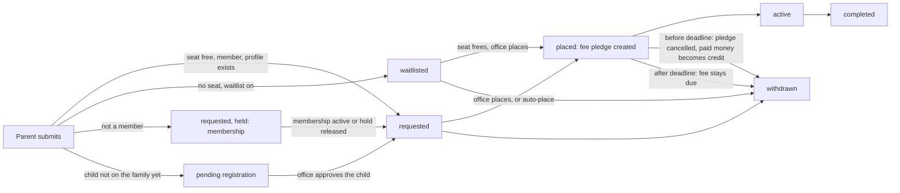

# Pathshala registration with level-based fees: plan

**Status: plan accepted 2026-10-01 — the owner took every recommended default (P1–P14, §4). The build is parked (BACKLOG B41) until the other open work is fixed. Finding F1 is already fixed (migration 0565).** Owner request (BACKLOG B41): *"Parents register kids for Pathshala; it has level-based fees."* The owner first planned to build it right after the learning work, then parked the build until everything else is fixed (2026-10-01). Every claim about today's code names the file it came from.

**Rules already decided (this plan does not reopen them)**

| Rule | Source |
|---|---|
| Term calendar and registration windows; membership required; fees per child billed as pledges; placement by level; class waitlists | DECISIONS "Decisions made by JSH", Pathshala row |
| Money is integer cents; business rules live in database functions, not in the apps | `ARCHITECTURE.md` |
| Money screens are adults only; children never see pledges or payments | `ARCHITECTURE.md` "Tenancy and security"; RLS `pledges_household` (0010) |
| No refunds from the member app; money already paid is held as **credit** for the treasurer, never applied automatically | B23; `0543_rsvp_cancel_credit.sql` |
| Refunds and write-offs need two different people | DECISIONS #6-#8; write-off trigger (0016), `approve_as_second` |
| Payment allocation: earliest open pledge first unless the payer chooses; partial keeps the pledge open | DECISIONS "Payment allocation"; `app.allocate_payment` (0104) |
| QuickBooks posting is cash basis; it posts payments, not pledges | DECISIONS 2026-09-25 second batch; `0233`, `0521` |
| A household is never picked or confirmed by name alone: show `app.household_card` | `CLAUDE.md`, `ARCHITECTURE.md` |
| Online card payments are built but only proven against mocks; Zelle is instructions only | `PAYMENTS_PLAN.md` §0 (B28) |

---

## 0. Summary

1. **The schema already has the shape; the rules are not built.** A term carries one fee per child, a sibling discount percent and a family cap (`0006_pathshala.sql`), but nothing applies the discount or the cap, nothing ever creates a fee pledge (only the demo pack does), and "membership required" is a label. The member app sends a bare request and tells the parent the fee will be "billed to your family as a pledge once your child is placed", which no code does today.
2. **Recommended data design.** Add a fee per level per term (`app.pathshala_level_fees`) with the term's existing fee as the default, and keep one locked fee quote per enrollment (`app.pathshala_enrollment_fees`, adults and staff only) that becomes **one pledge per child** when the child is placed. One database function prices a family, and the preview, the registration and the billing all call it, so the amount shown before submit is the amount billed.
3. **Parent flow:** pick children → level per child (suggested from last term's teacher recommendation, else age) → review the fee with discount, cap and late fee shown line by line → sign the waiver → submit. Each child ends as requested, waitlisted, or held (membership, or a child the office still has to add to the family).
4. **Withdrawal follows B23:** before the term's withdrawal deadline the fee pledge is cancelled and anything paid becomes credit for the treasurer; after it the fee stays due. Nothing is ever refunded from the app.
5. **Seven PRs:** three database PRs, two portal PRs, one member-app PR and one cleanup; five need owner sign-off before merge (money rules, receipt wording, access rules). Fourteen owner decisions (P1-P14, §4), each with a recommended default.

---

## 1. What exists today, and what is missing

### 1.1 The map

| Layer | What it does | Where |
|---|---|---|
| Terms | Name, dates, registration opens/closes, `membership_required`, `fee_per_child_cents`, `fee_per_family_cap_cents`, `sibling_discount_pct`, no-class dates, status `draft / registration / active / closed` | `supabase/migrations/0006_pathshala.sql` |
| Tracks and levels | Tracks (Jainism, Gujarati, Hindi); levels per track with `sort_order`, `min_age`, `max_age`, optional Gyan Path level link | `0006`, `0007` (fk) |
| Classes | Per term and level: room, `capacity`, day and time, `waitlist_enabled` (default true) | `0006` |
| Enrollments | One per child per term (`unique (term_id, student_person_id)`): `requested_level_id`, `class_id`, status `requested / waitlisted / placed / active / withdrawn / completed`, `fee_pledge_id`, `waiver_consent_id`, `registered_by/at`, `placed_at`, notes | `0006` |
| Progress reports | Per enrollment and period, with `recommended_next_level_id` | `0006` |
| Access rules | Members read non-draft terms, classes and teachers; anyone reads tracks and levels; household members (children too) read their enrollments (`enrollments_household`); an adult may insert a `requested` enrollment with no class (`enrollments_household_insert`; tightened in 0565: a current member of that household, an open term and level of the same community, no class, placement, fee pledge or waiver, registered by the caller at the time of the insert); teachers read their class roster; staff `pathshala.view` / `pathshala.manage` | `0010_rls.sql` lines 383-400 |
| Pledges | Source enum includes `pathshala_fee`; adults may insert their own open pledges with that source; staff need `giving.manage` | `0003_giving.sql`, `0010` lines 204-215 |
| Module | Pathshala depends on People only (not Giving); all Pathshala tables are module tables | `docs/MODULES.md`, `0101` |
| Portal: Terms | Create and edit a term, including the three fee fields, any time, by `pathshala.manage` | `src/app/(app)/pathshala/terms/*`, `saveTerm` in `src/app/(app)/pathshala/actions.ts` |
| Portal: Enrollments | Tabs by status; Place (capacity check on placed + active only, "Place even if full"), Waitlist, Withdraw, Reopen, notes; "Enroll a student" for walk-ins | `src/app/(app)/pathshala/enrollments/page.tsx`, `placeEnrollment`, `waitlistEnrollment`, `setEnrollmentStatus`, `enrollStudent` in `actions.ts` |
| Portal: Home | One Pathshala task: sign-offs waiting, waitlist count, expiring background checks | `src/lib/data/home-tasks.ts` (`pathshala`) |
| Member app: request | Adult picks term, one child, any level (all tracks, unfiltered) or "let the office decide", note; direct table insert | `connect-mobile/src/app/(app)/pathshala-enroll.tsx`, `requestEnrollment` and `loadEnrollOptions` in `src/lib/api/gyan.ts` |
| Member app: status | 3L › Learn › Pathshala lists enrollments, attendance and published reports (`loadPathshala`) | `connect-mobile/src/features/three-l/learn.tsx`, `src/lib/api/gyan.ts` |
| Member app: guide | Guide › Registrations shows the next term's window and "membership required" | `connect-mobile/src/app/(app)/guide/registrations.tsx`, `src/lib/api/guide.ts` |
| Demo data | Seeds fee pledges per child (15000, then 13500 for a sibling), source `pathshala_fee`, campaign and fund "pathshala", paid by `demo_pay` | `0312_demo_pack_community.sql` lines 824-854 |
| Money plumbing | `allocate_payment`, credit (`household_credit`, `rsvp_credit_releases`, `resolve_rsvp_credit`), QuickBooks lines by campaign and fund, year-end statement, receipt preview | `0104`, `0543`, `0233`, `0522`, `src/lib/giving.ts` |
| Waiver | Legal document kind `pathshala_waiver`, required by the setup checklist when Pathshala is on; "Remind parents" button is inert | `0001`, `0181`, `src/app/(app)/content/legal/page.tsx` |
| Messaging | `app.enqueue_message` (purposes `notification`, `receipt`), push topic `pathshala` | `0221`, `supabase/seed.sql` |

### 1.2 Need by need

| Need | Today | Gap |
|---|---|---|
| Fee by level per term | One `fee_per_child_cents` per term | No per-level price |
| Guided parent flow per child | One child per request, free level choice | No multi-child flow, no suggestion, levels of every track shown together |
| Level suggestion | Ages on levels and `recommended_next_level_id` on reports exist | Neither is used at registration |
| Fee shown before submit | App shows the term's flat fee as text | No per-child amount, no discount or cap, no total |
| Sibling discount and family cap | Stored on the term, displayed in the portal | Applied nowhere (demo hard-codes 13500) |
| Fee pledge | `fee_pledge_id` column; app copy promises billing at placement | Nothing creates it; Place only sets `class_id` and status. The principal cannot create pledges directly (`giving.manage` needed) |
| Waitlist when full | Office can set "waitlisted" by hand | No automatic waitlist, no position, no "place next"; `waitlist_enabled` is never read; requested children do not count against seats |
| Deadlines and late registration | Opens/closes timestamps | Not enforced in the database (only the app's `registrationOpen`, which also ignores `registration_opens_at` once status is `registration`); no late window, no late fee |
| Withdrawal → credit | Portal Withdraw changes status only | The pledge is untouched; parents cannot withdraw in the app; `rsvp_credit_releases` requires an RSVP |
| Membership check | `membership_required` flag; app shows a sentence | Nothing checks membership; no "what happens if not a member" |
| Children without a profile | Adding a child is a `household_change_requests` row the office approves (`app.request_add_family_member`, 0524) | An enrollment needs a person row, so the parent must wait and come back |
| Consent and waiver | `pathshala_waiver` documents; `waiver_consent_id` column | Not collected or checked |
| Notifications | None for registration | No received / placed / waitlisted / billed / withdrawn messages; office sees only a waitlist count |
| Receipts | Payment receipt numbers; year-end statement | `app.year_end_statement` counts every payment as giving, and the receipt says "No goods or services were provided other than intangible religious benefits" (`src/lib/giving.ts`), which does not fit a tuition fee |
| QuickBooks fund and class | A payment's income account comes from the pledge's campaign (`qbo_income_account_id`, else `income.<campaign kind>`), its class from the fund (`_qbo_payment_lines`, 0233); mapping purpose `income.pathshala` exists (0232) | A fee pledge without a Pathshala campaign posts to General donations (as membership fees do today, 0130) |
| Committee reports | `app.pathshala_term_stats` (counts) | No fee report: billed, discounted, collected, outstanding, credit |

### 1.3 Findings worth fixing on the way

| # | Finding | Evidence | Fixed in |
|---|---|---|---|
| F1 | **A parent can enroll any person under their household.** `enrollments_household_insert` checks the household and status only, not that the student belongs to that household; `fee_pledge_id`, `waiver_consent_id`, `registered_by` and `registered_at` are caller-set. | `0010` line 396 | **Fixed in 0565** (2026-10-01): the student must be a current member of that household; no fee pledge, waiver, other registrant or back-dated time; term and level of the same community. PR 7 (drop) still applies |
| F2 | **Fee amounts cannot live on the enrollment row**: children of the household read it (`enrollments_household` uses `in_my_household`). | `0010` line 394 | PR 1 (separate fee table) |
| F3 | **Members can create `pathshala_fee` pledges of any amount**, and a member pledge to any campaign of kind `pathshala` is recorded as `pathshala_fee` (`pledgeSourceFor` in `connect-mobile/src/lib/api/giving.ts`). Fee reports must key on the enrollment link, not on the source. | `0010` line 210 | PR 7 |
| F4 | The portal shows a household by `display_name` only on Enrollments. | `enrollments/page.tsx` | PR 4 |
| F5 | Term fees can be edited after families registered, with no record of what each family was quoted. | `saveTerm` | PR 1 (lock + quotes) |
| F6 | "Complete enrollment" on a pending request opens the same request form, which only says "already enrolled". | `learn.tsx` | PR 6 |
| F7 | One enrollment per child per term means a child cannot take Jainism and Gujarati in the same term, although the demo schedules them at different times. | `unique (term_id, student_person_id)`, `0312` | PR 2 if P10 says so |

---

## 2. Proposed design

### 2.1 The pricing rule (one function)

`app.pathshala_quote(term, household, lines)` is the only place a fee is calculated. It is `stable`, writes nothing, and returns one line per child plus totals. The preview, the registration, the staff example and the billing all call it.

For each child, with the defaults in §4:

1. **Level fee**: the term's price for that level (`pathshala_level_fees`), else the term's `fee_per_child_cents`.
2. **Sibling discount** (P2): rank the household's children for the term, counting children already registered (not withdrawn) first, then this submission by level fee (highest first), then age (oldest first). The first child pays the full level fee; every later child gets `sibling_discount_pct` off its level fee, rounded to the cent.
3. **Family cap** (P3): if the running tuition total would pass `fee_per_family_cap_cents`, the child that crosses it is reduced so the total equals the cap; any later child's tuition is $0.
4. **Late fee** (P4): after registration closes and before the late window closes, add the term's `late_fee_cents` per child, outside the discount and the cap.
5. **Fee assistance** (P8): subtract an approved amount, never below $0.

**Never re-priced.** A quote is locked when the parent submits. Later registrations, withdrawals or fee changes never change an earlier child's quote or pledge, so nobody is ever billed more after the fact.

**Worked example** (Jainism 1 $150, Jainism 3 $180; sibling discount 10%; cap $400; late fee $25):

| Child | Level | Level fee | Sibling | Cap | Late | Total |
|---|---|---|---|---|---|---|
| Riya (12) | Jainism 3 | $180.00 | none (ranked first) | none | none | $180.00 |
| Dev (9) | Jainism 1 | $150.00 | -$15.00 | none | none | $135.00 |
| Anya (7) | Jainism 1 | $150.00 | -$15.00 | -$50.00 | none | $85.00 |
| **Family** | | | | | | **$400.00** |

Registered in the late window, each line gets +$25.00 (family $475.00). If Riya registers in August and Dev in September, Dev still gets the 10% because Riya is already registered.

### 2.2 Data changes

**Recommendation: a fee per level per term (`app.pathshala_level_fees`), not a fee on `pathshala_classes`.**

| | Fee per term + level (recommended) | Fee per class |
|---|---|---|
| Known before submit | Yes: the parent picks a level | No: the class is chosen by the office after the request |
| Several rooms of one level | One price | Must be kept equal by hand on every class |
| Classes created after registration opens | Fine | No price until the class exists |
| Prices change each year | One row per term and level; levels are not copied | Same, but per class |
| Committee reports | By level, as they plan | Has to be rolled up |
| Special case (a class that genuinely costs more) | Make it its own level | Natural |

| Object | Change | Why |
|---|---|---|
| `app.pathshala_level_fees` (new) | `center_id, term_id, level_id, fee_cents >= 0, non_member_fee_cents` (null = not offered; P6), `set_by, set_at`; `unique (term_id, level_id)` | Level-based fee per term; a level with no row uses the term's `fee_per_child_cents`, so existing terms keep working |
| `app.pathshala_terms` (columns) | `campaign_id`, `fund_id` (QuickBooks, §2.6); `late_registration_closes_at`, `late_fee_cents default 0` (P4); `withdrawal_credit_until date` (P5); `age_cutoff_on date` (P11, default `starts_on`); `fees_locked_at`, `fees_locked_by` (P9); `auto_place boolean default false` (P12) | The rules the term already implies, now enforceable |
| `app.pathshala_enrollment_fees` (new) | One row per enrollment: `level_id, base_fee_cents, sibling_discount_cents, cap_reduction_cents, late_fee_cents, assistance_cents, total_cents` (check `>= 0` and equal to the parts), `family_rank`, `rule_snapshot jsonb` (percent, cap, late fee at quote time), `quoted_at`, `status` (`quoted`, `billed`, `no_fee`, `cancelled`, `not_billed_giving_off`), `pledge_id unique`, `billed_at`; assistance: `assistance_requested`, `assistance_note`, `assistance_proposed_cents/by/at`, `assistance_approved_by/at` (different person, check) | The locked quote; money kept off the row children can read (F2) |
| `app.pathshala_enrollments` (columns) | `hold_reason` (`membership`, `assistance`, null); `suggested_level_id`, `suggestion_reason`; `channel` (`app`, `office`, `import`). If P10 allows several tracks: `track_id` and `unique (term_id, student_person_id, track_id)` in place of the current unique | Holds without a new status (existing code and segments read the six statuses); suggestion kept for the office |
| `app.pathshala_pending_registrations` (new) | A child the parent added who has no person row yet: `term_id, household_id, change_request_id, requested_level_id, note, quote snapshot, registered_at, registered_by, status` (`pending`, `converted`, `cancelled`) | Approving the add-member request (`app.decide_household_change_request`) converts it into a real enrollment keeping the original `registered_at`, so waitlist order is fair; rejecting it cancels and tells the parent |
| `app.rsvp_credit_releases` (columns) | `rsvp_id` nullable, new `enrollment_id`, check exactly one is set | One treasurer credit queue (the existing Home task and `resolve_rsvp_credit`) for RSVP and Pathshala withdrawals |

New migrations take the next free numbers at build time (0565 onward today).

### 2.3 Enrollment life cycle

### 2.4 Database functions

All are `security definer`, `set search_path = app, public, extensions`, call `app.assert_module_enabled(center, 'pathshala')`, re-check rights, set a plain audit reason, and raise plain-English errors the apps show as they are.

| Function | Who | What |
|---|---|---|
| `pathshala_registration_options(p_term, p_household)` | Adult of the household | Window state (open, late with late fee, closed, opens on), membership state, waiver to sign, each child (age at cutoff, missing birth date, existing enrollment and status), suggested level and reason, and every level of the child's track with fee and availability (seats open, waitlist, full) |
| `preview_pathshala_registration(p_term, p_household, p_children jsonb)` | Adult; staff | The quote for the chosen children and what will happen to each (requested, waitlisted, held). Writes nothing |
| `register_pathshala_children(p_term, p_household, p_children jsonb, p_expected_total_cents, p_waiver_document, p_client_key)` | Adult; staff (`pathshala.manage`, may waive the late fee with a reason) | Re-prices; refuses with "The fee changed since you looked; please review the new total" if it differs from `p_expected_total_cents`; checks window, membership, waiver, that each child is in the household, no duplicate; writes enrollments, fee quotes, consents, pending registrations; queues messages. Idempotent on `p_client_key`. Returns `{quote, enrollments[], pending[], pledges[]}` (pledges only for children placed at once under `auto_place`). `p_children`: `[{person_id, level_id, note, assistance_requested}]` or `[{new_child: {first_name, last_name, date_of_birth, relationship}, level_id, ...}]` |
| `place_pathshala_enrollment(p_enrollment, p_class, p_over_capacity, p_reason)` | `pathshala.manage` | Replaces the direct update in `placeEnrollment`; capacity check counts placed + active; bills (below); notifies |
| `place_next_from_waitlist(p_class)` | `pathshala.manage` | The earliest waitlisted child for that class's level, placed and billed |
| `release_pathshala_hold(p_enrollment, p_reason)` | `pathshala.manage` | Lets a held registration go ahead (for example membership being renewed at the desk) |
| `withdraw_pathshala_enrollment(p_enrollment, p_reason)` | Adult of the household; `pathshala.manage` | Applies P5: before the deadline cancels the pledge, releases its allocations and writes one credit row; after it keeps the pledge. Returns what happened so the app can say it |
| `set_pathshala_level_fees(p_term, p_fees jsonb, p_reason)` and `lock_pathshala_fees(p_term)` | `pathshala.manage` while unlocked; `giving.manage` + reason after (P9) | Fee setup; a change after lock applies to new quotes only |
| `pathshala_fee_example(p_term, p_level_ids uuid[])` | `pathshala.view` | "Try a family" on the fee setup screen |
| `propose_pathshala_assistance(p_enrollment, p_cents, p_note)` / `approve_pathshala_assistance(p_enrollment)` | `pathshala.manage` proposes; a different person with `giving.approve` approves, fresh 2FA and reason (P8) | Lowers the quote before billing; after billing the existing two-person write-off is the only path |
| `pathshala_fee_report(p_term)` | `pathshala.view` (totals); `pathshala.manage` or `giving.view` (per family) | §2.8 |
| `_pathshala_bill(p_enrollment)` (internal) | Called by place functions | If the total is above $0 and Giving is on: one pledge (household, pledged by the registering adult, term campaign and fund, source `pathshala_fee`, `source_ref_id` = enrollment, amount = locked total, due date per P7), sets the fee row `billed` and `enrollments.fee_pledge_id`. Never twice. $0 → `no_fee`. Giving off → `not_billed_giving_off` with a note, as the membership fee does (0130) |

### 2.5 Access rules, audit, module

- **Enrollments:** `enrollments_household_insert` was tightened in **0565 (2026-10-01)**: the student must be a current member of that household; the term open and of the same community; no class, placement, `fee_pledge_id` or `waiver_consent_id`; `registered_by = auth.uid()` and `registered_at` the time of the insert. The shipped app keeps working. PR 7 drops it once the app registers through the function.
- **New tables:** no direct writes from any app; reads: level fees like terms (members when the term is not a draft, staff); enrollment fees and pending registrations: adults of the household (`app.adult_of_household`), `pathshala.manage`, `giving.view`/`giving.manage`. Children and teachers never read fees. A restrictive `module_switch` policy and an `app.module_tables` row (module `pathshala`) for each.
- **Audit:** an `audit_<table>` trigger on each new table; every function sets a reason ("Parent registered 2 children for Pathshala 2026-27, quote $315.00"). The assistance note is masked in the audit trail (`app.audit_mask`).
- **Giving switched off:** registration still works; quotes are kept and marked not billed; the fee setup screen warns that fees will not be billed while Pledges & donations is off.
- **Data class and retention:** fee quotes and pledges are financial records (kept 7 years, then anonymized, per the deletion decision); assistance notes are sensitive.

### 2.6 Money: pledges, allocation, receipts, QuickBooks

- **Pledges.** One per child (P1), numbered like every pledge (`JSH-PL-…`), visible to all adults of the household. The member pays it from the existing Pay sheet with that pledge chosen, so allocation goes to it first; any other payment follows the standing rule (earliest open pledge first).
- **Campaign and fund.** Locking a term's fees creates (or reuses) the campaign "Pathshala fees *term*" of kind `pathshala`, status `closed` so it is never offered as a giving opportunity, linked to the center's Pathshala fund (found by key or name, as 0513 does; if there is none the fee setup screen asks the treasurer to pick or create one before fees can be locked). Every fee pledge carries both.
- **QuickBooks.** No new posting type. A fee payment posts through the existing SalesReceipt lines: income account = the campaign's own account, else the approved `income.pathshala` mapping, else General donations; class = the Pathshala fund's QuickBooks class. The QuickBooks mapping screen warns when `income.pathshala` is not mapped ("Pathshala fees will post to General donations").
- **Withdrawal after payment.** Like B23 item 1: releasing allocations of an already posted payment is not re-posted; the credit task tells the treasurer to review the reclass.
- **Receipts and statements** (P13): until the treasurer and accountant decide, fee payments get a payment receipt without the "no goods or services" sentence and are listed separately, outside the tax-deductible total, on the year-end statement.

### 2.7 Notifications

Sent with `app.enqueue_message` (push topic `pathshala`; email only where the person has opted in), from templates each community can edit in Communications.

| Template key | When | To |
|---|---|---|
| `pathshala_registration_received` | After submit | The registering adult: each child, level, status, quote, what happens next |
| `pathshala_placed` | Placed | Household adults: class, day, time, room, fee pledge number, amount, due date, Pay link |
| `pathshala_waitlisted` | Waitlisted | Household adults: position, no charge unless a seat opens |
| `pathshala_held` / `pathshala_hold_released` | Membership hold set or released | Household adults: how to become a member |
| `pathshala_child_added` / `pathshala_child_not_added` | Pending registration converted or cancelled | The registering adult |
| `pathshala_withdrawn` | Withdrawn | Household adults: what happened to the fee and any credit (also covers B23 item 3 for Pathshala) |
| Fee reminder | N days before the due date if unpaid (uses the open "pledge reminders" decision) | Household adults |

Office Home tasks: "N Pathshala registrations to place", "N held for membership", "N fee assistance requests to approve" (`giving.approve`), and the existing **Credit** task, now including Pathshala withdrawals.

### 2.8 Reports for the Pathshala committee

`pathshala_fee_report(term)` and a **Fees** view under Pathshala (CSV export recorded with `app.record_export`):

| By level | By family (staff with `pathshala.manage` or `giving.view` only) |
|---|---|
| Registered, placed, waitlisted, held, withdrawn | Household card, children, levels, quote lines, pledge numbers |
| Fees quoted and billed, sibling discounts, cap reductions, late fees, assistance | Paid, outstanding, credit |
| Collected, outstanding, credit released | Membership and waiver state |

The committee (`pathshala.view`) sees totals by level, not what each family pays.

---

## 3. Flows

### 3.1 Member app (connect-mobile), screen by screen

Entry points: 3L › Learn › Pathshala "Enroll in Pathshala", Guide › Registrations (the Pathshala row opens the flow directly), and the "registration is open" push. The route stays `pathshala-enroll` so existing links and the module map (`src/lib/modules.ts`) keep working. JavaScript only, so it ships over the air.

| # | Screen | What the parent sees and does |
|---|---|---|
| 0 | **Before you start** | Adults only (a child sees "Ask a parent or guardian"). Term picker if more than one. Window: open; late ("Late registration until Sep 14, $25 late fee per child"); closed or opens on a date (stop here). Membership: member (tick); application in progress; not a member (explains the hold, button **Apply for membership** to `guide/membership`, may continue per P6) |
| 1 | **Who is joining** | The family's children with age at the term's cutoff; those already registered show their status. **Add a child who isn't listed** (first, last, birth date, relationship): files `request_add_family_member` and a pending registration, labelled "The office adds Anya to your family first". A child without a birth date is asked for one (used only to suggest a level) |
| 2 | **Level for each child** | One card per child: suggested level preselected with the reason ("Recommended by her teacher last term", "Usual level for age 9"); the other levels of that track, each with fee and **Seats open / Waitlist / Full**; "Not sure, let the office decide" stays. If P10 allows, "Also take Gujarati" |
| 3 | **Review the fee** | One line per child: level fee, sibling discount, cap, late fee, total; the family total. "Nothing is charged now. You are billed for each child when the office places them in a class." Waitlisted lines: "No charge unless a seat opens." Withdrawal rule in one sentence. Optional **Ask about fee assistance** (only the principal and the treasurer see it) |
| 4 | **Waiver** | The community's published Pathshala waiver; **I agree** for each child (consent rows: the child, given by this adult). Required when one is published (P14) |
| 5 | **Done** | Per child: Requested, Waitlisted (position), Waiting for membership, or Waiting for the office to add the child. What happens next; an email or push copy |
| 6 | **Afterwards (3L › Learn)** | Each child's status, class and schedule; for adults only, "Fee $135.00 · billed · **Pay**" (opens the Pay sheet with that pledge chosen) or "Paid"; **Withdraw**, which first says exactly what will happen ("The $135.00 pledge is cancelled; the $135.00 you paid is held as credit for the treasurer") |

Errors follow the house rule: "Could not register Riya: registration closed on Sep 14", with Try again where it helps; a changed total sends the parent back to step 3 with the new amounts. English first; Gujarati and Hindi fall back to English until reviewed translations exist.

### 3.2 Portal (connect-crm)

| Area | Who | What changes |
|---|---|---|
| Pathshala › Terms › term › **Fees** | Principal; treasurer after lock | Table of levels grouped by track: fee, non-member fee if P6 allows, total seats (sum of class capacities). Term rules: sibling %, cap, late window and fee, withdrawal deadline, age cutoff, auto-place. **Try a family** example. **Lock fees and open registration** (sets status `registration`, creates the campaign). After lock: change needs `giving.manage` and a reason, shown as "applies to new registrations only" |
| Pathshala › **Registrations** (today's Enrollments) | Principal | Tabs as today plus **Held**. Columns: student, age at cutoff, household card, level asked / suggested and why, quote, fee status (Not billed, Billed JSH-PL-… $135.00, Part paid, Paid, Cancelled, Credit $X), membership, waiver, registered at, waitlist position. Actions: **Place** (says "This bills the family $135.00"), **Waitlist**, **Release hold** (reason), **Withdraw** (shows the outcome first), **Propose fee assistance**. "Enroll a student" goes through `register_pathshala_children` with a household card picker |
| Pathshala › Classes | Principal | Seats taken, waitlist count, **Place next from waitlist** |
| Approvals | `giving.approve` | Fee assistance second approval, beside write-offs and refunds |
| Home | Principal, treasurer | Tasks listed in §2.7 |
| Pathshala › **Fees** report | Committee (totals), principal and giving staff (by family) | §2.8, CSV |
| Giving › Pledges | Giving staff | Unchanged; fee pledges appear with campaign "Pathshala fees *term*" |

---

## 4. Decisions (accepted 2026-10-01: every recommended default)

| # | Decision | Recommended default |
|---|---|---|
| **P1** | Fee per child or per family | **Per child, priced by level per term**; one pledge per child. A flat family fee can still be expressed with a cap equal to the fee |
| **P2** | Sibling discount: who counts as the first child | **Highest level fee pays full; every other child gets the term's %** (ties: older child full). Children already registered this term count first. Earlier pledges are never re-priced |
| **P3** | Family cap | **Applies to tuition after the sibling discount**, per household per term; late fees and assistance outside it; the child that crosses it is reduced, later children are $0 |
| **P4** | Late registration and late fee | **Optional late window per term after registration closes, flat late fee per child (default $0), outside discount and cap.** After the window only the office enrolls (and may waive the late fee with a reason) |
| **P5** | Withdrawal, refunds | **No refunds from the app (B23).** Before the term's withdrawal deadline (default: first class day + 14 days) the fee pledge is cancelled and anything paid becomes credit for the treasurer; after it the fee stays due and only the two-person write-off can reduce it. A withdrawal never re-prices siblings |
| **P6** | Membership requirement; non-members | **Accept the registration but hold it** (not placed, not billed) until the household has an active yearly or life membership; the app offers **Apply for membership**; the principal can release a hold with a reason. No non-member price unless the owner asks |
| **P7** | Payment timing (given B28) | **Pledge when the child is placed, due on the first class day or 14 days after placement, whichever is later;** pay through the existing Pay sheet (offline and Zelle today, cards once B28 PR 1 is proven). No pay-at-registration until B28 is live; waitlisted children are never billed |
| **P8** | Scholarships and fee waivers | **A parent may ask privately; the principal proposes an amount; a different person with `giving.approve` approves (reason, fresh 2FA) before billing.** After billing only the existing two-person write-off. No automatic teacher-family discount unless decided |
| **P9** | Who sets and changes fees | **The principal sets fees while the term is a draft; opening registration locks them;** a later change needs `giving.manage` and a reason and applies to new registrations only |
| **P10** | Several tracks per child in one term | **Allow one enrollment per child per track** (Jainism and Gujarati), each priced by its level; the sibling discount counts children, not enrollments; the cap covers the family total |
| **P11** | Level suggestion | **Last term's teacher recommendation first, else the level after last term's completed level, else age on the term's cutoff date** (default: first day of term); the parent may choose another level and the office sees both |
| **P12** | Placement and waitlist automation | **The office places (today's practice); "Place next from waitlist" is one click.** Auto-place (when the chosen level has a free seat) is a per-term switch, off by default |
| **P13** | Tax treatment and receipt wording of fees (Treasurer + accountant) | **Until the accountant decides: a payment receipt without "no goods or services were provided", and fees listed separately, outside the tax-deductible total, on the year-end statement** |
| **P14** | Waiver | **Required at registration when the community has published a Pathshala waiver;** one consent per child, re-signed each year (`requires_yearly_resign`) |

---

## 5. Phased PR plan

Sizes: S under 300 changed lines, M 300-800, L over 800. Every database PR runs `supabase/tests/run_local.sh`, regenerates `src/lib/database.types.ts` and copies it to connect-admin and connect-mobile. **Owner sign-off** is required before merge where marked (CLAUDE.md: money rules, permissions and access rules).

| # | Repo | PR | Size | Needs | Owner sign-off |
|---|---|---|---|---|---|
| 1 | connect-crm | **DB 1: fee setup and quotes.** `pathshala_level_fees`, term columns, `pathshala_enrollment_fees`, `pathshala_quote`, options, preview and example functions, fee set and lock (the `enrollments_household_insert` tightening, F1, is already done in 0565). No money moves | M | P1-P3, P9-P11 decided | **Yes**: pricing rules and an access-rule change |
| 2 | connect-crm | **DB 2: register, place and bill.** `register_pathshala_children`, place / place-next / release hold, billing, waitlist, membership hold, pending children (trigger on change-request approval), waiver consents, term campaign and fund, message templates, Home task data | L | PR 1; P6, P7, P12, P14 | **Yes**: creates pledges |
| 3 | connect-crm | **DB 3: withdrawal, late fee, assistance.** Withdraw with credit (generalized credit queue), late window, two-person fee assistance | M | PR 2; P4, P5, P8 | **Yes**: money rules |
| 4 | connect-crm | **Portal: Fees and Registrations.** Terms › Fees, Registrations queue with household card and fee status, Classes "Place next", Approvals, Home tasks; actions return `{ ok, error }` with plain-English errors | L | PR 2 (PR 3 for withdraw and assistance) | No (screens over approved rules) |
| 5 | connect-crm | **Reports, receipts, QuickBooks warning.** Fees report and CSV; receipt wording and year-end statement treatment; unmapped `income.pathshala` warning | M | PR 2; P13 | **Yes**: receipt and tax wording |
| 6 | connect-mobile | **Guided registration.** Screens 0-6, fee preview, waiver, status with Pay, withdraw; types through the new migrations; over-the-air release | L | PRs 2-3 deployed | No |
| 7 | both | **Cleanup.** Drop `enrollments_household_insert` once the app uses the function; member pledges to a Pathshala-kind campaign become `general` in the app, then `pathshala_fee` leaves the member-insertable sources (F3) | S | PR 6 live on phones | **Yes**: access rules |

---

## 6. Test plan

| Layer | Where | What |
|---|---|---|
| Pricing (database) | `supabase/tests/54_pathshala_registration_test.sql` (number at build time) | Table-driven quotes: one child; two siblings on different levels (highest full); three siblings crossing the cap; 0% discount; no cap; a level with no own fee (term default); a $0 level; late fee outside discount and cap; a second batch later in the term gets the discount; ties by age; rounding to the cent |
| Registration rules | same | Before open, after close, late window; not an adult refused; child not in the household refused (function and the tightened policy, F1); duplicate refused or idempotent on the client key; changed total refused; membership hold; waiver required when published; Pathshala module off refused |
| Seats and waitlist | same | Full level → waitlisted; order by `registered_at`; place next takes the earliest; over-capacity needs the flag; a pending child keeps the original time after approval; rejection cancels |
| Billing | same | Placing creates exactly one pledge with campaign, fund, source, `source_ref_id`, amount = locked quote, due date; placing twice never bills twice; $0 creates none; Giving off → not billed with a note; a fee change after lock leaves earlier quotes alone |
| Withdrawal and credit | same | Before the deadline: pledge cancelled, allocations released, one credit row, `household_credit` equals the paid amount; after: pledge kept; no sibling re-pricing; the treasurer's resolve works for Pathshala rows |
| Assistance | same | The same person cannot propose and approve; approval needs `giving.approve`; it lowers the quote before billing; after billing only the write-off path |
| Privacy | same | Children of the household cannot read fee rows or pledges; teachers cannot read fees; the committee sees totals only; audit rows exist and the assistance note is masked |
| QuickBooks and statements | same, plus `12_giving_portal_test.sql` style checks | `qbo_posting_doc` for a fee payment uses `income.pathshala` and the Pathshala class; falls back to General when unmapped; year-end statement treatment per P13 |
| Portal | `tests/pathshala-registration.test.ts` | Quote line formatting, fee status labels, error messages for each refusal; no client-side pricing |
| Portal end to end | extend `e2e/flows/w-learning.cjs` | Principal sets and locks fees → parent registers two children → office places → pledges appear in Giving → offline payment allocates → withdrawal → Credit task |
| Member app | `connect-mobile/src/lib/__tests__/learning.test.ts` and a new `pathshala-registration.test.ts` | Window states, suggestion reasons, review screen states (requested, waitlisted, held, pending child), i18n keys present |
| Live check | JSH sandbox | One family registers, is placed, sees the pledge, pays offline, withdraws; nothing touches real money (sandbox) |

---

## Appendix: files read

- Database: `supabase/migrations/0003_giving.sql`, `0006_pathshala.sql`, `0010_rls.sql`, `0016_handoff_alignment.sql`, `0018_mobile_gaps.sql`, `0025_comms_pathshala_people.sql`, `0104_module_rpc_guards.sql`, `0130_membership_workflow.sql`, `0221_messaging_send.sql`, `0232_qbo_mapping.sql`, `0233_qbo_documents.sql`, `0312_demo_pack_community.sql`, `0422_legal_versions_member_step.sql`, `0513_jsh_giving.sql`, `0522_statements_exclude_opening_balances.sql`, `0524_family_dedupe.sql`, `0543_rsvp_cancel_credit.sql`, `supabase/seed.sql`
- Portal: `src/app/(app)/pathshala/actions.ts`, `terms/*`, `enrollments/page.tsx`, `page.tsx`, `src/lib/pathshala/access.ts`, `src/lib/data/pathshala.ts`, `src/lib/data/home-tasks.ts`, `src/lib/giving.ts`, `src/app/(app)/approvals/actions.ts`, `src/app/(app)/content/legal/page.tsx`
- Member app: `connect-mobile/src/app/(app)/pathshala-enroll.tsx`, `src/lib/api/gyan.ts`, `src/lib/learning.ts`, `src/features/three-l/learn.tsx`, `src/app/(app)/guide/registrations.tsx`, `src/lib/api/guide.ts`, `src/lib/api/giving.ts`, `src/i18n/en.ts`
- Docs: `ARCHITECTURE.md`, `DECISIONS.md`, `BACKLOG.md` (B23, B28), `PAYMENTS_PLAN.md`, `FEATURE_TRACEABILITY.md`, `MODULES.md`, `ROLES.md`
