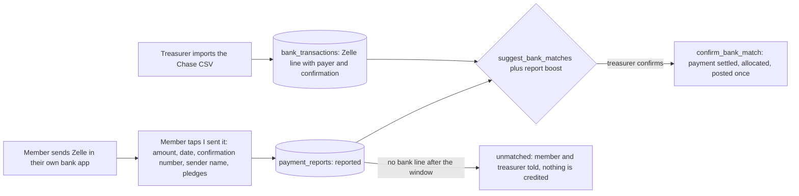

# Payments plan: plugins for cards, Apple Pay, Google Pay, PayPal and Zelle

**Status (2026-10-02): the owner accepted every recommendation of §5 (Q1–Q12)** (`DECISIONS.md`, "Payments and wallet passes, owner decisions 2026-10-02"). PR 2 (plugin registry, per-organization enablement, member discovery) is built in migrations `0580`–`0581` (test `66_payment_plugins_test.sql`); PR 3 (Zelle reported payments and bank matching) is `0582`–`0583` (test `67`); BACKLOG B13 (wallet passes, Apple Wallet and Google Wallet, Google first) is `0584` (test `68`). **The numbers `0550`–`0559` in §3 are void**: they are below migrations already applied (`0560`–`0578`), so the work uses `0580` and up. PR 1 waits for the owner's Stripe and PayPal test apps; until then no PR changes how Stripe or PayPal are called. As built, PR 2 leaves `app.member_payment_options` exactly as it was (installed apps keep its answer) instead of re-expressing it, and adds `app.member_payment_methods` next to it.

*First written as a plan for owner review, 2026-09-30.* Owner request (BACKLOG B28): *"Build payments via Zelle, PayPal, Cards, Apple Pay, Google Pay as plugins that can be enabled from the sandbox with due config."* It was written by reading the code (every claim below names the file it came from) and, for the provider facts, the providers' own documentation on 2026-09-30 (Appendix B).

**Constraints already decided (this plan does not reopen them)**

| Constraint | Source |
|---|---|
| No card details are stored by Community Connect; the provider hosts the card fields | B28; `ARCHITECTURE.md` ("Card data never touches the platform") |
| One connected payment account per organization; money never passes through a shared account | `ONBOARDING_PLAN.md` §1.2 |
| Refunds stay behind the two-person rule; none from the member app (hold the money as credit instead) | DECISIONS #6, #7, #8; B23; `0410`, `0415` |
| Donor-covers-fee is not offered | DECISIONS #5; check constraint in `0410` |
| A sandbox uses the provider's TEST mode only and can never touch real money | `ONBOARDING_PLAN.md` §3; entitlement `payments.mode` (`0160`); `app.payment_api_mode` (`0211`) |
| Credentials live in the vault and are never readable; promotion never copies credentials | `0170`; `ONBOARDING_PLAN.md` §5 |
| Every import and posting is audited; money is integer cents | `app.audit_row` triggers; `ARCHITECTURE.md` |
| QuickBooks posting for payments is cash basis; imported payments are history and never post | `0191`, `0233`, `0521` |
| Card, bank and payment screens are adults-only; children get "Ask a parent" | `ARCHITECTURE.md` "Tenancy and security" |

---

## 0. Summary

1. **Stripe and PayPal are built end to end, but only ever tested against local mock providers.** Stripe Connect, hosted Checkout, signed webhooks, recording, allocation, QuickBooks posting, two-person refunds, payout sync and the $1 test all exist (migrations `0210`-`0213`, `0410`, `0415`; `src/lib/payments/*`; `worker/src/payments/*`). The whole suite runs against `e2e/mocks/payments-mock.cjs`. Nothing in the repository shows a real Stripe test-mode or PayPal sandbox payment. That is the first thing to fix.
2. **Apple Pay and Google Pay already work in principle** because Stripe's hosted Checkout shows them by itself. But the two checkboxes in Settings › Payments change nothing (finding G2), and we record the wallet correctly only because Stripe reports it on the charge.
3. **Zelle is instructions only.** A member is told the organization's Zelle address; the treasurer later matches the bank-statement line by payer name. There is no way for a member to say "I sent it", and a hand-recorded Zelle payment can be counted twice when the bank line arrives (G6).
4. **There is no plugin layer.** The provider list is hard-coded to `('stripe','paypal')` in SQL checks, the member app is offered exactly one processor (G4), and method lists live in three places.
5. **Proposal:** a catalog of payment plugins in code and in the database, a per-organization enablement table layered on top of the existing processor and method rows (no data moves), one member-discovery function, and a sandbox-first lifecycle (off, needs setup, test, live) with two-person control over anything that redirects money (a payee address).

**Recommended first three PRs** (full list in §3)

| # | PR | Why first |
|---|---|---|
| 1 | **Prove cards and PayPal in the providers' real test modes, and make the toggles honest** (small hardening migration; needs the owner's Stripe and PayPal test apps) | Everything else stands on code nobody has run against a real provider. Cheap, and it finds the expensive surprises early. |
| 2 | **Plugin registry, per-organization enablement and member discovery** (migrations `0551`-`0552`, Settings › Payments as plugin cards) | The structure the owner asked for. No money movement changes. Fully verifiable in the sandbox. |
| 3 | **Zelle: member-reported payments matched to the Chase import** (migrations `0553`-`0554`, portal) | The only method with no provider account to wait for. Fully verifiable in the sandbox. Closes the double-count risk (G6). |

---

## 1. What exists today

### 1.1 The map

| Layer | What it does | Where |
|---|---|---|
| Payment methods enum | `card, ach, apple_pay, google_pay, check, cash, stock, daf, matching_gift, zelle, other`, plus `paypal`, `venmo` added in `0210`. Payment status includes `pending_clearing`. | `0003_giving.sql`, `0210` |
| Connections | One `integration_connections` row per (organization, provider); settings carry `mode`, `connect_method` (`oauth`, `partner`, `email`), `charges_enabled`, `livemode`, `paypal_email` | `0009`, `0210` |
| Processor rows | `center_payment_processors`: per organization and processor (`stripe`, `paypal`): status (`not_connected`, `pending_verification`, `test`, `live`, `disabled`), default, online methods, descriptor, `donor_covers_fee_allowed` (forced false) | `0211`, `0410` |
| Offline method rows | `center_payment_methods`: accepted flag plus instructions per method (Zelle needs `recipient`, an email or US phone; optional `name`, `memo_hint`); validated by `app.payment_method_instructions_problem` | `0211` |
| Checkouts | `payment_checkouts`: one row per online checkout (member, staff or the $1 test), with the provider reference and outcome | `0211` |
| Who may | `payments_can_view` (integrations.view/manage, giving.view/manage, owner), `payments_can_configure` (owner, integrations.manage, giving.manage), `payments_can_connect` (owner or integrations.manage, exactly the vault's rule, no platform-admin shortcut) | `0211`, `0170` |
| Connect flows | Stripe Connect Standard OAuth; PayPal partner referral ("Connect with PayPal") or a Business email verified by a 6-digit code | `0211`, `src/app/api/oauth/*`, `worker/src/payments/connect.ts`, `worker/src/handlers/oauth.exchange.ts` |
| Create a checkout | `POST /api/payments/intent` (member's own token) calls `app.create_checkout` (adult of the family, open pledges of that family, organization offline-only off, sandbox forced to test), then asks the provider for a hosted page and `app.attach_checkout` | `src/app/api/payments/intent/route.ts`, `src/lib/payments/checkout.ts`, `server.ts` |
| Webhooks | Stripe: HMAC signature check. PayPal: PayPal verifies its own signature. Both store once through `app.ingest_webhook` (idempotent on provider and event id) and queue a worker job | `src/app/api/webhooks/{stripe,paypal}/route.ts`, `src/lib/payments/signature.ts`, `0210` |
| Recording | `app.worker_record_online_payment`: one `payments` row per provider reference (amount must equal the checkout), then the existing `app.allocate_payment` (chosen pledges first, else earliest open; overpayment rolls on) and `app.enqueue_payment_posting` (skips history and anything before the QuickBooks go-live date) | `0212`, `worker/src/payments/core.ts` |
| Worker handlers | `payments.webhook.stripe`, `payments.webhook.paypal` (captures an approved order), `payments.refund`, `payments.test_charge`, `payments.sync_payouts`, `oauth.exchange` | `worker/src/handlers/` |
| Refunds | Two different approvers, then `app.request_provider_refund` queues `payments.refund`; one refund per payment; refunds made in a provider dashboard become one flagged row needing two approvals; email-only PayPal refunds are recorded by hand | `0211`, `0410`, `0415` |
| Payouts | Stripe payouts synced into `app.payouts` (gross, fee, net) and the payments in them marked; PayPal reports none | `worker/src/handlers/payments.sync_payouts.ts` |
| QuickBooks | Card and PayPal gifts post as a SalesReceipt deposited to `payment_clearing`, plus a fee journal entry; bank (Zelle, ACH) payments post straight to the bank account; offline checks and cash go to undeposited funds | `0233` (`app.qbo_posting_doc`) |
| Platform keys | Community Connect's own Stripe and PayPal apps: entered in Platform › Setup (vault for secrets, settings for ids), read by the portal and worker; the wizard's Test button checks them | `src/lib/platform-setup/{catalog,checks,server-config}.ts`, `0320` |
| Settings screen | Stripe and PayPal cards (connect, mode, default, methods, descriptor, $1 test, payouts), offline methods with instructions, "offline only" | `src/app/(app)/settings/payments/*` |
| Bank reconciliation | Manual CSV import (Chase CSV or generic), Zelle lines parsed to payer name and confirmation number, ranked household suggestions, `confirm_bank_match` records, allocates, queues the posting once and learns the payer name | `src/app/(app)/giving/payments/bank/*`, `0012`, `0013`, `0104` |
| Go-live | Readiness check 6 `payments_live`: a default processor with a passing $1 test in the mode it charges in (test in a sandbox, live in production) or "offline only"; two different Community Connect admins approve the go-live | `0213`, `0301`, `0202` |
| Member app | `app.member_payment_options`, `POST /api/payments/intent`, hosted page in an in-app browser, poll `app.checkout_status`; offline methods as "How to give" | `connect-mobile/src/features/pay/*`, `src/lib/api/payments.ts` |

### 1.2 Per method

| Method | Works (proven only against local mocks) | Stubbed or inert | Missing |
|---|---|---|---|
| **Cards (Stripe)** | Connect, hosted Checkout (`payment_method_types: card`, optionally `us_bank_account`), signed webhook, recording with the real fee and method, allocation, posting, refund, payout sync, $1 test | Nothing proven against a real Stripe test account | Saved cards and recurring charges (B16; `recurring_gifts.status = pending_payment_method` is never charged); disputes; payout-to-bank reconciliation |
| **ACH bank debit (Stripe)** | Checkout with `us_bank_account`; the async success and failure events are handled | Same as cards | Same as cards |
| **PayPal** | Partner connect or verified email; order with `intent CAPTURE`; worker captures on `CHECKOUT.ORDER.APPROVED`; `PAYMENT.CAPTURE.COMPLETED` is idempotent; fee read from the capture; refunds; flagged dashboard refunds; hand-recorded refund for email-only accounts | The "Venmo" and "Cards through PayPal" checkboxes do nothing (G3). Email-only orders are unproven against real PayPal (G14). | Payouts (PayPal has none to sync); disputes |
| **Apple Pay** | Appears on Stripe's hosted page; recorded as `apple_pay` when the charge says so (`stripeMethod` in `worker/src/payments/providers.ts`) | The checkbox is cosmetic (G2) | A way to know whether the organization's Stripe account has it enabled; any device test |
| **Google Pay** | Same as Apple Pay | Same | Same |
| **Zelle** | The organization's address shown in "How to give"; the treasurer can record it by hand; Chase "Zelle Payment From ..." lines parse to payer name and confirmation number and match households | Nothing links a member's "I sent it" to a bank line | Member-reported payments, matching by confirmation number or amount, a safe pending state, the double-count guard (G6) |

### 1.3 Findings

Things found while reading. Each is either fixed by a named PR in §3 or recorded as an open decision in §5.

| # | Finding | Evidence | Fix |
|---|---|---|---|
| G1 | **Nothing has touched a real provider.** All tests use mocks: `supabase/tests/24_payments_test.sql`, `worker/test/payments.test.ts`, `tests/payments.test.ts`, `e2e/flows/o-payments.cjs` with `e2e/mocks/payments-mock.cjs`. Whether Community Connect's own Stripe and PayPal apps exist (Platform › Setup › Payments) is not evidenced in the repository. | files named | PR 1 |
| G2 | **The Apple Pay and Google Pay checkboxes change nothing.** `stripePaymentMethodTypes` maps both to `card` (`src/lib/payments/view.ts`); Stripe decides what to show. Stripe documents that hosted Checkout shows Apple Pay with no configuration and that Google Pay is enabled in the account's payment-method settings. | `view.ts`, Appendix B | PR 1 (honest wording), PR 6 |
| G3 | **The PayPal "Venmo" and "Cards through PayPal" checkboxes are ignored.** `paypalCheckout` sends only `payment_source.paypal` and never reads the method list. | `src/lib/payments/server.ts` | PR 1 |
| G4 | **The member app is offered one processor.** `app.member_payment_options` returns the default (or first live) processor; the app registers one charger. A member cannot choose PayPal when Stripe is the default, although `/api/payments/intent` accepts `processor`. | `0211`, `connect-mobile/src/features/pay/online.ts` | PR 2, PR 4 |
| G5 | **Zelle is display-only** (see §1.2). | `OFFLINE_METHODS` in `src/lib/payments/view.ts`, `connect-mobile/src/features/pay/how-to-give.tsx` | PR 3, PR 4 |
| G6 | **A Zelle payment can be counted twice.** Recorded by hand (`record_offline_payment`, provider `offline`, posts to QuickBooks through `on_offline_payment`) and later found on the bank statement, `confirm_bank_match` creates a second payment (provider `bank`). `match_deposit` and `suggest_deposit_payments` only attach check, cash, stock and other. Only a sentence in the form ("record here only if it is not on a statement") guards it. | `0104`, `0013`, `record-payment-form.tsx` | PR 3 |
| G7 | **Payouts are never reconciled.** `app.payouts` is filled and bank lines are classed `payout`, but no function matches them, sets `payouts.matched`, or posts money from `payment_clearing` to the bank. Card and PayPal gifts post into `payment_clearing` (`0233`) and that account never clears in QuickBooks. The Accounting screen says "matched line for line" but nothing writes `matched = true`; the month-end close only has a manual "payouts matched" confirmation (`src/lib/giving.ts`, `automatic: false`). | `grep` of migrations, worker and portal; `src/app/(app)/accounting/qbo/page.tsx` | PR 7 |
| G8 | **Disputes and chargebacks are ignored.** `payments.webhook.stripe` and `.paypal` fall through to "ignored" for dispute events. A chargeback takes money out of the organization's balance while our payment stays captured. | `worker/src/handlers/payments.webhook.*.ts` | PR 8 |
| G9 | **Switching to live does not check the authorization is live.** `app.set_payment_mode` checks `charges_enabled` only. The Stripe exchange stores `livemode` in the connection settings (`worker/src/payments/connect.ts`) but nothing compares it. This matters for JSH, which goes live in place (`0500`, `0503`): its connection was made in test mode and stays. | `0211`, `0500` | PR 1 |
| G10 | **A webhook's mode is not compared with the checkout's mode** (a live event for a test checkout is recorded if the ids match). Defense in depth only; checkouts are created with the matching key. | `0212` | PR 1 |
| G11 | `/api/payments/intent` has no per-user rate limit (CORS is open by design, no cookies). Each call can create a provider checkout. | `src/app/api/payments/intent/route.ts` | PR 1 |
| G12 | Stripe's OAuth tokens are stored in the vault but never read back for Stripe; every call uses the platform key plus the `Stripe-Account` header. Not a bug, but it means there are no per-organization payment secrets to manage today. | `worker/src/payments/providers.ts` | none |
| G13 | `payments.received_on` for online payments is the day the worker processed the event, not the provider's charge time; near midnight or month end they can differ. | `0212` | PR 7 (minor) |
| G14 | Email-only PayPal: orders name the organization's email as `payee` using Community Connect's own PayPal app and no auth assertion (`merchantOf` in `worker/src/payments/core.ts`). Not verified against real PayPal. Refunds through it are impossible by decision #7. | files named | PR 1 verifies; Q7 |
| G15 | Community Connect takes no fee on payments: the Checkout Session carries no `application_fee_amount`. Noted as a business question, not a defect. | `src/lib/payments/server.ts` | Q9 |

### 1.4 What the sandbox rules enforce today

| Rule | Enforced by |
|---|---|
| A sandbox (or an organization held to test) always runs provider test mode | `app.payment_api_mode` (`0211`); `app.create_checkout` records every checkout with that mode, and the provider key used is chosen from it |
| Live cannot be switched on in a sandbox (SQLSTATE `CCENT`, plain message) | `app.set_payment_mode` calls `assert_entitlement('payments.mode', 'live')` (`0160`, `0211`) |
| Live needs the owner or integrations.manage, a fresh 2FA check and a reason; connect and disconnect the same | `app.assert_step_up` in `0211` |
| A live key can never run in test mode and the reverse (by key prefix) | `stripeKey` in `src/lib/payments/server.ts` and `worker/src/payments/providers.ts`; PayPal uses separate sandbox and live client pairs |
| Members of a test-mode processor in production see "online payment is still in test mode", not a checkout | `app.member_payment_options`, `app.create_checkout` |
| The $1 test is never a gift | `app.worker_record_online_payment` (`processor_test` context) |
| Platform admins do not handle an organization's credentials | `app.can_manage_integration_secrets` (`0170`) |
| Promotion copies configuration, not connections or secrets; JSH is promoted in place and keeps its rows | `ONBOARDING_PLAN.md` §5, `0500` |

### 1.5 Go-live readiness today

- **Check 6** (`payments_live`, `0213`, made honest in `0301`, names flagged refunds in `0410`): production needs a default processor in live mode with a passing live $1 test; a sandbox needs a passing test-mode $1 test; "offline only" passes; Giving switched off passes.
- **Setup steps** `svc.payments` and `data.payment_methods` (`0213`).
- The go-live request needs every check to pass and two different Community Connect admins to approve (`0202`).
- **Gaps:** the check looks only at the default processor, so a second processor or any future method is never checked; Zelle has no readiness rule at all.

### 1.6 How the member app pays today

1. `loadPaymentOptions` calls `app.member_payment_options` and, if an online processor is offered, registers a single card charger.
2. The Pay sheet shows the provider name (Stripe or PayPal) and the offline "How to give" list; the member never chooses between methods.
3. Confirming calls `POST {portal}/api/payments/intent`, opens the provider page with `expo-web-browser` (a new tab on web), and polls `app.checkout_status` every 2 seconds for up to 10 minutes.
4. The app never marks anything paid; the provider's webhook does. On timeout it says honestly that the payment will appear later and that the member will not be charged twice.
5. Giving totals count `captured`, `settled`, `pending_clearing` and `partially_refunded` payments (`connect-mobile/src/lib/api/giving.ts`). This matters for how Zelle "pending" is modelled (§2.9).

---

## 2. The plugin model

### 2.1 Design rules

1. **Layer, do not rewrite.** The processor rows, offline method rows, checkouts, webhook inbox and refund rules stay exactly as they are. The plugin layer adds a catalog, an enablement row per organization and one discovery function. Old installed apps keep calling `app.member_payment_options`, which is re-expressed on top without changing its answer.
2. **Three families.** Every method is one of:
   - `provider_checkout`: the provider hosts the page (Stripe, PayPal). Create checkout, webhook confirms, worker records.
   - `reported_transfer`: money moves bank to bank outside our control (Zelle). The member reports it, the bank import confirms it, the treasurer matches it.
   - `instructions`: today's offline methods (check, cash, ACH and wire, stock, DAF, matching gift). No new behavior; they join the catalog so discovery is uniform.
3. **A plugin never touches money rules.** All plugins finish through the same database functions (`allocate_payment`, `enqueue_payment_posting`, the two-person refund path). A plugin only decides how an intent is created and how a confirmation is recognized.
4. **Sandbox first, test mode only.** A plugin's mode is `test` or `live`; a sandbox is forced to `test` by the existing entitlement. A plugin with no provider test mode (Zelle) has a `rehearsal` behavior in a sandbox (§2.4).
5. **Secrets stay in the vault.** Plugin configuration fields are of three kinds, the same split as `src/lib/platform-setup/catalog.ts`: `setting` (stored in `config`, validated), `secret` (only ever through `app.set_integration_secret`, never in `config`), `connect` (an OAuth or partner flow that creates the connection). None of the five plugins in v1 has an organization secret (G12).

### 2.2 The catalog (code plus database)

A database table `app.payment_plugins` (platform-owned, readable by signed-in users, like `app.modules`) and a TypeScript registry `src/lib/payments/plugins/` that share the same keys. A unit test fails if a key exists on one side only (the same guard `src/lib/modules.ts` uses for modules). The worker has a matching small registry for webhook and refund behavior, because `worker/` is a separate package.

Catalog columns: `key`, `label`, `family`, `provider` (null for Zelle), `methods` (the `app.payment_method` values it can record), `depends_on`, `config_fields` (jsonb: key, label, kind, required, member_visible, sensitive), `sandbox_behavior` (`test_mode` or `rehearsal` or `none`), `status` (`available`, `beta`, `suspended`).

| Plugin key | Member label | Family | Needs | Depends on | Records as |
|---|---|---|---|---|---|
| `card` | Card | provider_checkout | Stripe connection (Connect) | none | `card` |
| `apple_pay` | Apple Pay | provider_checkout (a wallet on Stripe's page) | none of its own | `card` | `apple_pay` |
| `google_pay` | Google Pay | provider_checkout (a wallet on Stripe's page) | none of its own | `card` | `google_pay` |
| `paypal` | PayPal (Venmo and cards when PayPal offers them) | provider_checkout | PayPal connection (partner or email) | none | `paypal`, `venmo`, `card` |
| `zelle` | Zelle | reported_transfer | a linked bank account and the organization's Zelle address | none | `zelle` |
| `bank_debit` | Bank account (ACH) | provider_checkout | Stripe connection | `card` | `ach` (off by default; exists today as a Stripe method) |
| `check`, `cash`, `ach_wire`, `stock`, `daf`, `matching_gift` | as today | instructions | instructions only | none | as today |

### 2.3 Per-organization enablement

New table `app.center_payment_plugins` (one row per organization and plugin):

| Column | Meaning |
|---|---|
| `center_id`, `plugin_key` | primary key |
| `enabled` | the owner's switch |
| `mode` | `test` or `live`; always `test` in a sandbox |
| `status` | `off`, `needs_setup`, `ready`, `test_passed`, `live`, `suspended` (derived and stored so screens stay fast; recomputed by the readiness function) |
| `config` | validated non-secret settings for new-style plugins |
| `label_override`, `sort` | what members see and in which order |
| `changed_by`, `changed_at`, `live_approved_by`, `live_approved_at` | who, when; the second person for sensitive changes (§2.5) |

- **Where configuration lives.** For Stripe and PayPal it stays in `center_payment_processors` and the connection row; for Zelle it stays in `center_payment_methods.instructions` (recipient, name, memo hint) plus new fields in `config` (bank account, report window). `app.payment_plugin_config(center, key)` hides the difference, so nothing is migrated and nothing can drift. A later cleanup can consolidate.
- **Backfill.** A migration creates rows so today's behavior is unchanged: a connected Stripe processor turns `card` on (and `apple_pay` or `google_pay` when they are in its methods list); PayPal likewise; an accepted Zelle method turns `zelle` on.
- **Validation.** One function, `app.payment_plugin_config_problem(plugin_key, config, mode)`, generalizes `app.payment_method_instructions_problem` and `app.statement_descriptor_problem`. It returns plain English and is mirrored in TypeScript so the screen can say it before saving (as `statementDescriptorProblem` does today).
- **Every table gets** the standard pieces: `app.module_tables` entry (module `giving`), `audit_row` trigger, RLS read-only over the API with writes through functions, the restrictive module switch policy, and a decision about the demo lists: `app.demo_keep_tables` (last defined in `0390`) must name `center_payment_plugins` (it is configuration, kept with `center_payment_processors`), while `payment_reports` is left out so a demo clear removes it with the other transactions. Note that `center_payment_methods` is not on the keep list today, so a demo reset clears the accepted offline methods and the demo pack puts them back (`0312`).
- **Promotion** copies `enabled`, `label_override`, `sort` and non-secret `config`, and resets `status` to `needs_setup` for plugins that need a connection; connections are never copied (existing rule).

### 2.4 The sandbox test-mode switch

| Plugin | In a sandbox | In production |
|---|---|---|
| `card`, `apple_pay`, `google_pay`, `bank_debit` | Stripe test keys, test cards; live refused with `CCENT` | Test until the owner switches to live (2FA, reason, live $1 test) |
| `paypal` | PayPal sandbox app and buyer accounts; live refused | Same as Stripe |
| `zelle` | **Rehearsal.** The real Zelle address is stored but **not shown to members**; they see "Sandbox: no real money moves" and a "Report a test payment" flow. Reports are marked test, match only against the sandbox's own imported test lines, and post only to a sandbox QuickBooks company (entitlement `qbo.mode`). | Live |

Rehearsal exists because Zelle has no test mode: without it a tester in a sandbox could send real money to the real address. The switch is the existing entitlement; no new rule is invented.

### 2.5 Who may enable what

| Action | Who | Extra safeguards |
|---|---|---|
| Turn a plugin on or off, rename it, reorder, edit instructions | owner, `integrations.manage` or `giving.manage` (`payments_can_configure`) | reason kept in the audit log |
| Connect or disconnect a provider account | owner or `integrations.manage` (`payments_can_connect`) | fresh 2FA, reason (existing) |
| Switch a plugin to live | owner or `integrations.manage` | fresh 2FA, reason, refused in a sandbox, a passing live test, and (PR 1) a live authorization (G9) |
| **Change a payee** (the Zelle address or display name, the PayPal email, the linked bank account) | first person as above | **a second, different person with `giving.approve`**, fresh 2FA and a reason each, the same shape as `approve_flagged_refund`; members see a dated notice. A payee field is the classic way to redirect donations, so one person alone cannot change it. |
| Go live as an organization | owner requests; **two different Community Connect admins approve** (existing, `0202`) | readiness checks, now including every enabled plugin (§2.6) |
| Suspend a plugin | Community Connect, for one organization or platform-wide, with a reason | the only platform-admin power over payments; it disables, it never reads a credential |

Platform-admin approval is **not** required for each plugin after go-live: the go-live review already covers the organization, and approving every toggle would not scale. The suspend switch is the safety valve.

### 2.6 Readiness

Check 6 is generalized to walk every enabled plugin instead of only the default processor. Existing rules are kept (offline only still passes).

| Plugin | Ready when |
|---|---|
| `card`, `bank_debit` | connection connected and `charges_enabled`; a passing $1 test in the mode it charges in; in production a live authorization (G9) |
| `apple_pay`, `google_pay` | `card` is ready; the organization's Stripe account shows the wallet enabled (PR 6), or the owner has recorded that they enabled it in Stripe (fallback) |
| `paypal` | connection connected; a passing $1 test; email-only connections flagged as "no refunds from Community Connect" |
| `zelle` | address valid (existing rule); display name set; a bank account linked with a statement format that parses Zelle lines; the treasurer has approved the Zelle instructions and matching process (a go-live approval with an evidence hash, like check 8, so a later change stops the pass until re-approved); in a sandbox, at least one rehearsal report matched end to end |

`golive_approvals.key` (currently constrained to two values in `0300`) gains `zelle_instructions`.

### 2.7 How the member app discovers what to offer

One function, `app.member_payment_methods(p_center)`, replaces the single-processor answer. It returns only what a member may see: no ids of other tenants, no secrets, and for `rehearsal` plugins no real address.

```json
{
  "environment": "sandbox",
  "currency": "usd",
  "online_unavailable": null,
  "methods": [
    { "key": "card", "family": "provider_checkout", "label": "Card",
      "provider": "stripe", "mode": "test", "wallets": ["apple_pay", "google_pay"], "sort": 1 },
    { "key": "paypal", "family": "provider_checkout", "label": "PayPal",
      "provider": "paypal", "mode": "test", "also": ["venmo"], "sort": 2 },
    { "key": "zelle", "family": "reported_transfer", "label": "Zelle", "mode": "rehearsal",
      "instructions": { "name": "Sandbox: no real money moves" }, "report": { "confirmation": "ask" }, "sort": 3 },
    { "key": "check", "family": "instructions", "label": "Check",
      "instructions": { "payee": "...", "address": "..." }, "sort": 4 }
  ]
}
```

- **Client keys.** With hosted Checkout (today, and recommended) **no key is needed in the app**. If an embedded or native wallet path is ever built (§2.10), the public values it needs (Stripe publishable key for the mode plus the connected account id; PayPal client id plus merchant id) come from a portal endpoint `GET /api/payments/methods`, which adds them from platform settings (`kind: "setting"` in `catalog.ts`, never a secret) and only the key matching the plugin's mode.
- **Compatibility.** `app.member_payment_options` keeps answering in its current shape for installed app versions. The app calls the new function when it exists and falls back to the old one.
- **Adults only.** Non-adults get the same refusal as `create_checkout` ("Only an adult of the family can pay for it").

### 2.8 Per plugin: intent, confirmation, recording, allocation, QuickBooks

| | Intent | Confirmation | Recording | Allocation | QuickBooks (cash basis) |
|---|---|---|---|---|---|
| **Card** (Stripe) | `POST /api/payments/intent` calls `create_checkout`, then a Checkout Session on the connected account (idempotency key per checkout) | `checkout.session.completed`; `async_payment_succeeded` for ACH | `worker_record_online_payment`: provider `stripe`, method from the charge, fee from the balance transaction | `allocate_payment` (donor's pledges first, else earliest open; overpayment rolls on) | `donation_card` SalesReceipt to `payment_clearing`; fee journal entry; payout to bank is G7 |
| **Apple Pay, Google Pay** | The same Checkout Session; the wallet button appears on Stripe's page when the device and the account allow | Same event; `charge.payment_method_details.card.wallet.type` | Method `apple_pay` or `google_pay` | Same | Same as card |
| **PayPal** | Order with `intent CAPTURE`, payee merchant id (partner) or email | `CHECKOUT.ORDER.APPROVED`, worker captures; `PAYMENT.CAPTURE.COMPLETED` is the duplicate-safe second path | Provider `paypal`, method `paypal`, `venmo` or `card` from the order's payment source; fee from `seller_receivable_breakdown` | Same | Same as card; PayPal has no payout objects (G7) |
| **Zelle** | Member report (§2.9); no provider call | A bank-statement line, matched by the treasurer | `confirm_bank_match`: provider `bank`, method `zelle`, status `settled`, received on the bank's posting date | Uses the report's chosen pledges (`chosen_by_donor`); else earliest open | `bank_receipt` SalesReceipt deposited straight to the bank account; nothing posts before the bank line exists |

### 2.9 Zelle in detail

**Facts that shape the design.** Zelle has no public merchant API or webhook for organizations: money goes bank to bank, the bank is the only source of truth, payments are final (no chargeback), and whether a business or nonprofit account can receive depends on the bank (Appendix B). The payer's name on the bank line is the bank account holder, which may not be the member.

**Configuration (the `zelle` plugin).** Zelle address (email or US phone, existing validation), **display name** shown in the payer's Zelle app (new, required for live; lets members check they are paying the right payee), memo hint ("your member number"), optional QR image uploaded from the organization's own bank app (we never generate one), the linked bank account (`app.bank_accounts`, which already carries `statement_format` and `parse_rules`), and the reporting window in days (default 10).

**Flow**



**Why a separate report table and not a `pending_clearing` payment** (the owner's suggestion was a `pending_clearing` payment; here is why it is not recommended as the first choice):

| A `pending_clearing` payment | A separate report (recommended) |
|---|---|
| Already counted as given by the member app (`COUNTED_PAYMENT`), the home KPIs, year-end statements and household credit (`0522`, `0543`, `src/lib/data/home-kpis.ts`) | Counted nowhere until money exists; shown as a "reported" chip |
| Allocation would close pledges before any money arrived | No allocation until the bank line is matched |
| Needs posting suppression and a second record when the bank line arrives | One payment, created at match time; one posting |
| A false or mistaken report leaves a wrong payment to unwind | A false report can only expire; nobody is credited |

If the owner prefers pledges to show "paid, pending" at once, the alternative is `pending_clearing` with allocation held; it touches four already-shipped surfaces and is not advised.

**Data.** `app.payment_reports`: household, reporting person, method, amount in cents, date sent, confirmation reference (normalized, unique per organization when present, so the same Zelle confirmation can never be reported twice), sender name, chosen pledges, status (`reported`, `matched`, `unmatched`, `rejected`, `withdrawn`), the bank line and payment once matched, test flag. Adults of the household only; staff with `giving.view` read; writes only through functions; audited.

**Functions (sketch):** `report_payment`, `withdraw_payment_report`, `my_payment_reports`, `payment_report_queue`, `reject_payment_report` (reason), an extra candidate source in `suggest_bank_matches`, and an optional `p_report` argument on `confirm_bank_match`. A daily worker job `payments.reports_sweep` marks reports past their window `unmatched`, tells the member plainly ("we have not seen it at the bank yet; check the confirmation number"), and raises a Home task for the treasurer. Nothing expires silently and nothing is ever credited by the sweep.

**Matching signals, strongest first:** the report's confirmation number equals the bank line's parsed `reference` (Chase lines carry it: `Zelle Payment From Rahul Shah Jpm99bxk2q1v`, see `parse_bank_description` in `0013`); amount equal and date within the window; sender name equals the line's payer name or a learned payer name; the household's open pledge equals the amount (the existing +0.04). Every candidate carries the household card, and an ambiguous match is never applied automatically (existing rule). A treasurer click is always required; a "confirm every exact match" bulk button is the only shortcut (Q2).

**The double-count guard (G6).** When a bank line is about to be confirmed and the household already has a hand-recorded `zelle` offline payment of the same amount within a few days, the treasurer is asked to attach the line to that payment instead of creating a second one. This needs a small "attach bank line to an existing payment" function, the Zelle counterpart of `match_deposit`.

**Refunds of Zelle gifts** happen outside the system (the organization sends money back from its bank) and are recorded by hand through the existing two-person refund record; no change.

**Receipts** are issued only after the match, as today's `confirm_bank_match` does.

**Bank feed.** Today the statement is a manual CSV upload (`src/lib/csv.ts`, `bank-import.tsx`); `ofx` appears as a format name but has no parser. An automatic bank feed is out of scope here; matching is built so a feed would only change how lines arrive.

### 2.10 Apple Pay and Google Pay: two approaches

| | **A. Hosted Checkout (today, recommended first)** | **B. Embedded fields or native sheet (only if wanted)** |
|---|---|---|
| Apple Pay setup | None (Stripe: "hosted Checkout ... works with no additional configuration") | Register every web domain that shows the button, for **each connected account**, through the API with the `Stripe-Account` header (direct charges). Native in-app: Apple Merchant ID, `@stripe/stripe-react-native`, a native build |
| Google Pay setup | Enable it in the organization's Stripe payment-method settings | HTTPS with a domain-validated certificate and per-connected-account domain registration; native Android needs Google's production access |
| Control from our screen | Advertise only; a per-organization on/off needs a Stripe Payment Method Configuration per connected account, tested in the PR 6 spike (Stripe says Apple Pay, Google Pay and Link cannot be excluded per transaction) | Full |
| PCI scope | Redirect: SAQ A, none of the new script criteria | SAQ A plus the 2025 iframe criterion that the page is not open to script attacks |
| Member app delivery | JavaScript only, reaches phones over the air | New native module means a new store build (`connect-mobile/AGENTS.md`) |
| App Store fit | Wallet visible on Stripe's page in the in-app browser; whether App Review accepts that as "offer Apple Pay support" must be confirmed (Q1) | The native Apple Pay sheet is unambiguous |

The registry treats the two wallets as plugins that depend on `card` so the owner sees and controls them separately in the UI, exactly as requested, and the discovery payload tells the app which wallets to advertise. What each switch does to Stripe's page is decided in the PR 6 spike.

---

## 3. Phased build plan

Migration numbers: the latest on `main` is `0544`; this plan reserves `0550`-`0559`. **Void (2026-10-02):** migrations `0560`-`0578` were applied first, so the work uses `0580` and up (see the status line). Every PR follows the project rules: a migration is never edited once applied, `supabase/tests/run_local.sh` passes, types regenerate with `supabase/scripts/gen-types.mjs` and are copied to connect-admin and connect-mobile, errors are shown in plain English with a retry, and money is integer cents.

| # | PR | Size | Needs | Migrations |
|---|---|---|---|---|
| 1 | Prove cards and PayPal in real test modes; honest toggles; mode guards | S-M | Owner's Stripe and PayPal test apps (§4) | `0550` |
| 2 | Plugin registry, per-organization enablement, member discovery | L | none (PR 1 is independent) | `0551`, `0552` |
| 3 | Zelle: reported payments and bank matching | L | PR 2 for the catalog row (can ship first on the existing Zelle method row) | `0553`, `0554` |
| 4 | Member app: method list, choose a provider, "I sent it" (connect-mobile) | M | PR 2, PR 3 deployed | none |
| 5 | Change control, platform suspend, generalized readiness | M | PR 2 | `0555` |
| 6 | Wallets: capability check, honest status, approach decision | S-M | PR 1, PR 2 | maybe `0556` |
| 7 | Payout reconciliation and QuickBooks clearing | L | PR 1 | `0557` |
| 8 | Disputes and chargebacks | M | PR 1 | `0558` |
| 9 | Recurring gifts and saved methods (B16) | L | Owner decision Q10 | `0559` |
| 10 | Per-organization live rehearsal and go-live | S | PRs 1-6 | none |

### PR 1. Prove it against the real providers; make the toggles honest

- **Scope.** After the owner creates Community Connect's Stripe test app and PayPal sandbox app and enters the keys in Platform › Setup (§4), run on the JSH sandbox, in order: connect Stripe (test mode) and PayPal (sandbox, partner and email routes), the $1 test on each, a member paying a pledge with a Stripe test card, a 3-D Secure test card, a declined card, a PayPal sandbox buyer, a refund through two approvers, a refund made in each provider's dashboard (flagged), and a payout sync. Record every result in the verification log (Appendix C). Fix what breaks.
- **Code.** (a) Replace the wallet, Venmo and "cards through PayPal" checkboxes with honest wording: they appear on the provider's page when the provider offers them (G2, G3). (b) `app.set_payment_mode(..., 'live')` also requires the connection's stored `livemode` to be true for Stripe (and `provider_env` to be `live` for PayPal), with a plain message telling the owner to connect again in live mode (G9). (c) The webhook handlers refuse an event whose `livemode` differs from the checkout's mode (G10). (d) A per-user rate limit on `/api/payments/intent` (G11). (e) `docs/DEPLOY.md` gains a Payments section: every endpoint URL, every event to subscribe to, which key goes where.
- **Tests.** Extend `worker/test/payments.test.ts`, `tests/payments.test.ts`, `supabase/tests/24_payments_test.sql`; update the mocks for the new guards.
- **Sandbox vs live.** Everything above is sandbox. Nothing here needs live mode.
- **Owner-only.** Provider apps, keys, webhook endpoints (§4).

### PR 2. Plugin registry, enablement, discovery

- **Scope.** Catalog, `center_payment_plugins`, backfill, `payment_plugin_settings`, `set_payment_plugin`, `payment_plugin_config_problem`, `member_payment_methods`, `member_payment_options` re-expressed, `GET /api/payments/methods`, TypeScript registry with the sync test, Settings › Payments restructured as one card per plugin with a status chip (Off, Needs setup, Test, Live) that contains today's Stripe and PayPal panels and the offline methods card. No provider behavior changes.
- **Tests.** New `supabase/tests/25_payment_plugins_test.sql`: backfill preserves behavior, sandbox refuses live, dependencies (`apple_pay` needs `card`), validation messages, RLS (a member reads only the member function), audit rows, demo clear keeps or clears as listed. Unit tests for the registry sync. Extend `e2e/flows/o-payments.cjs`.
- **Sandbox vs live.** Fully verifiable in the sandbox.

### PR 3. Zelle reported payments

- **Scope.** §2.9: `payment_reports` and its functions, the `suggest_bank_matches` boost, `confirm_bank_match` with a report, the attach-to-existing-payment function and the G6 guard, a "Zelle reports" panel in Giving › Payments › Bank (waiting for the bank, lines that match a report, unmatched), a Home task, the sweep job, member notice templates. New display-name field and rehearsal behavior for the `zelle` plugin.
- **Tests.** DB tests: report, import a CSV line, suggestion ranks the report first, confirm records one `bank` payment with the donor's pledges, one QuickBooks posting, a repeated confirmation number is refused, a hand-recorded Zelle payment triggers the guard, a report never changes any total until matched, rehearsal hides the real address, non-adults refused. `e2e` with a fixture CSV under `e2e/fixtures/`.
- **Sandbox vs live.** Everything in our system is sandbox-verifiable. Only the live bank's real line format (is the confirmation number always present, is the memo?) needs a real Chase export to confirm: parse tests use samples from `parse_bank_description`'s own comments until then.
- **Owner-only.** The organization confirms its bank offers Zelle on the organization account and gives the treasurer import access.

### PR 4. Member app (connect-mobile)

- **Scope.** Use `member_payment_methods`; the Pay sheet lists the accepted methods (Card with its wallets, PayPal) so a member can choose; Zelle shows the address, the display name and a copy button, then "I sent it" (amount, date, confirmation number, name as shown at their bank, pledges); Giving shows "Reported" chips and never counts a report as given; adults only, children get "Ask a parent". Strings in `src/i18n/en.ts` (other languages fall back). Falls back to `member_payment_options` against an older portal.
- **Tests.** Unit tests for the method-list logic and the report form's validation; the existing `pnpm typecheck`, `lint`, `test` and web export.
- **Delivery.** JavaScript only, over the air.

### PR 5. Change control and readiness

- **Scope.** Second-approver flow for payee-type changes (§2.5), dated member notice, platform suspend (platform-wide and per organization), check 6 generalized (§2.6), `golive_approvals` key `zelle_instructions`, promotion copies plugin config, a plugin change history in the audit screen.
- **Tests.** DB tests for each rule above, including that a platform admin can suspend but cannot read a credential.

### PR 6. Wallets

- **Scope.** A spike in the JSH sandbox with real devices: does Stripe's Payment Method Configuration API let us turn Apple Pay and Google Pay off per connected account for hosted Checkout, and does the account expose whether they are on? Then build the capability check (a worker job reading the account's payment-method settings), show honest status on the `apple_pay` and `google_pay` cards ("On in your Stripe account" or "Off: turn it on in Stripe"), and decide approach A or B (Q1).
- **Sandbox vs live.** Stripe test mode with a **real card in the device's wallet** (Stripe: test keys return a test token and the card is not charged); Safari on iOS and Chrome on Android; the in-app browser path needs a real-device pass. Live wallets, and the live domain eligibility, are live-only.
- **Only if B is chosen:** per-connected-account domain registration job, the publishable-key setting and endpoint, a content-security policy for the page, and (native) the store build.

### PR 7. Payout reconciliation and QuickBooks clearing (G7, G13)

- **Scope.** Match `payouts` to `bank_transactions` of status `payout` (amount, date, provider reference), record variance, set `matched`, post the clearing-to-bank transfer to QuickBooks (a new posting type, constraint extended), treat PayPal transfers (no payout objects) by matching the transfer line to the sum of captured payments in the period or by treasurer action (Q8), and set `received_on` from the provider's time.
- **Tests.** DB and worker tests; QuickBooks sandbox company for the document shape.
- **Sandbox vs live.** Stripe test-mode payouts occur in test mode; real bank deposits are live-only.

### PR 8. Disputes (G8)

- **Scope.** `charge.dispute.created/closed` (Stripe) and PayPal dispute events become one flagged row per provider reference (the `payment_refunds` pattern), listed for the treasurer, named in readiness, never auto-applied; the evidence step stays in the provider's dashboard.
- **Sandbox vs live.** Stripe has test cards that create disputes; PayPal sandbox disputes need manual creation.

### PR 9. Recurring gifts and saved methods (B16)

- **Scope (after Q10).** Stripe Customer and a saved payment method created through Checkout in setup mode, so card details stay at Stripe (we keep only the `cus_` id in `external_ids` kind `payment_provider` and provider references); the missing scheduler that calls `app.run_recurring_gift_cycle`; off-session charges with failure handling and a plain message to the member. Consistent with "no card details stored".

### PR 10. Live rehearsal per organization

For each organization, in production: connect in live mode, run the live $1 test on each enabled plugin, import a real Chase statement and match a real Zelle, then request go-live. Owner and Community Connect steps only; no code.

---

## 4. Owner-only steps

Nothing here can be done from code. Secrets are entered only in Platform › Setup (vault), never pasted into chat, a pull request or a document.

| # | Step | Who | Where | Needed for |
|---|---|---|---|---|
| S1 | Community Connect's own Stripe account with Connect enabled; in Connect settings copy the OAuth **client id** (test and live differ) and add the redirect `https://<portal>/api/oauth/stripe/callback` | Owner | Stripe Dashboard | PR 1 |
| S2 | Stripe **test** secret key (restricted key is fine), later the live one | Owner | Stripe › Developers › API keys, then Platform › Setup › Payments | PR 1 (test), PR 10 (live) |
| S3 | Stripe **Connect webhook** endpoint `https://<portal>/api/webhooks/stripe` listening to connected accounts; events: `checkout.session.completed`, `checkout.session.async_payment_succeeded`, `checkout.session.async_payment_failed`, `checkout.session.expired`, `payment_intent.payment_failed`, `charge.refunded`, `payout.created`, `payout.updated`, `payout.paid`, `account.updated`, `account.application.deauthorized` (PR 8 adds dispute events); signing secret for test and live, comma separated | Owner | Stripe › Developers › Webhooks, then Platform › Setup | PR 1 |
| S4 | Each organization opens its **own** Stripe account (nonprofit verification, EIN, bank), applies for nonprofit pricing, and turns **Apple Pay and Google Pay on** in its payment-method settings | Organization owner and treasurer | Stripe | PR 1, PR 6 |
| S5 | PayPal **sandbox** and **live** REST apps for Community Connect; apply for PayPal's partner (multiparty) access to get the partner id (and BN code) that "Connect with PayPal" needs; approval time is PayPal's | Owner | PayPal Developer | PR 1 (sandbox), PR 10 (live) |
| S6 | PayPal webhook `https://<portal>/api/webhooks/paypal` on each app; events: `CHECKOUT.ORDER.APPROVED`, `CHECKOUT.ORDER.COMPLETED`, `PAYMENT.CAPTURE.COMPLETED`, `PAYMENT.CAPTURE.DENIED`, `PAYMENT.CAPTURE.DECLINED`, `PAYMENT.CAPTURE.REFUNDED`, `CHECKOUT.PAYMENT-APPROVAL.REVERSED`, `MERCHANT.ONBOARDING.COMPLETED`, `MERCHANT.PARTNER-CONSENT.REVOKED`; copy each webhook **id** | Owner | PayPal Developer, then Platform › Setup | PR 1 |
| S7 | Each organization's PayPal Business account (nonprofit status, the charity rate) | Organization | PayPal | PR 1, PR 10 |
| S8 | Confirm the organization's bank enables Zelle on the **organization** account, its receiving limits, and that the treasurer can export the CSV (Chase) | Organization treasurer | Bank | PR 3, PR 10 |
| S9 | **Apple Pay**: hosted Checkout needs nothing. Only if approach B: register domains per connected account (done by Community Connect through the API, no owner action) and, for a native sheet, an Apple Developer Merchant ID and a store build | Owner | Apple Developer | PR 6, only if B |
| S10 | **Google Pay**: hosted Checkout needs only the wallet switched on in Stripe (S4). Native Android only: Google's production access for the merchant | Owner | Google Pay and Wallet Console | PR 6, only if B |
| S11 | Ask Apple App Review whether Stripe's hosted page in the in-app browser satisfies guideline 3.2.1(vi) ("offer Apple Pay support") for the shared app, and who the approved nonprofit is (Q1) | Owner | App Store Connect | before App Store release of PR 4 |

---

## 5. Risks and open decisions

### Risks

| # | Risk | Notes | Mitigation |
|---|---|---|---|
| R1 | **PCI scope.** Hosted Checkout redirect keeps each organization at **SAQ A** with none of the 2025 script-protection criteria, which apply only to pages that embed the provider's fields. Embedding (approach B) is still SAQ A but adds the requirement that the page is not open to script attacks. | Stripe is the merchant's processor; each organization is the merchant of record on its own account | Stay on hosted pages; ask counsel or Stripe to confirm the platform's own obligations as the page builder before choosing B |
| R2 | **Apple Pay is a store requirement, not just a nicety.** App Store guideline 3.2.1(vi): approved nonprofits may fundraise in their apps "provided those fundraising campaigns ... offer Apple Pay support", disclose use of funds and make tax receipts available. Non-approved parties may only collect "outside of the app, such as via Safari". | The shared app collects for many organizations; who is the "approved nonprofit" is open (the platform entity is undecided, `DECISIONS.md` open questions) | Q1, S11 |
| R3 | **Google Pay and Apple Pay do not show everywhere.** They need a supporting device, browser and a card in the wallet; in-app browsers differ | Stripe hides them when requirements are not met | Real-device pass in PR 6 |
| R4 | **JSH's connection was made in test mode and stays after the in-place promotion.** Live needs a fresh live authorization (G9) | Nothing compares them today | PR 1 guard; PR 10 checklist |
| R5 | **PayPal: email-only accounts cannot be refunded by Community Connect** (decision #7) and are unproven (G14). Partner access depends on PayPal's approval. | Refund for email-only is hand-recorded after two approvals | PR 1 verifies; Q7, Q8 |
| R6 | **Zelle risks.** Final payments (no chargeback); bank-dependent availability and limits; no API; the payer's bank name may differ from the member; the statement is a manual upload so matching lags; a wrong or malicious report must never credit anyone. | The report table credits nobody until a bank line is matched by a person | §2.9, PR 3 |
| R7 | **A payee change is a fraud vector** (Zelle address, PayPal email, linked bank account) | One person alone could redirect donations | Second approver and member notice (PR 5) |
| R8 | **Sandbox leakage.** A tester could send real money to a real Zelle address shown in a sandbox | Zelle has no test mode | Rehearsal hides the real address (§2.4) |
| R9 | **Card and PayPal money never clears in QuickBooks** (G7) and **disputes are invisible** (G8) | Both can make the books wrong without any error | PR 7, PR 8; the treasurer is told in the meantime |
| R10 | **Fees.** Donor-covers-fee is not offered, so the organization absorbs them. Third-party sources give nonprofit rates (Stripe about 2.2% plus 30 cents for approved 501(c)(3) with mostly donation volume; PayPal's charity rate about 1.99% plus 49 cents); each organization applies itself and rates change. | Fees are recorded per payment and posted as a fee journal entry | Show fees in treasurer views; check current rates before telling organizations |
| R11 | **A provider outage or delayed webhook** leaves a checkout pending; the member app says so honestly and never double charges (idempotency keys, one payment per provider reference) | Unprocessed webhooks are visible on the event row | Keep |

### Open decisions for the owner

**Decided 2026-10-02:** the owner accepted every recommendation below (Q1-Q12); `DECISIONS.md` records them.

| # | Decision | Recommendation |
|---|---|---|
| Q1 | Wallets: approach A (hosted, advertised) or B (embedded or native)? And does Stripe's hosted page in the in-app browser satisfy App Review's "offer Apple Pay support"? | Build A first; ask Apple (S11); choose B only if Apple says A is not enough or the owner wants wallet buttons inside the app |
| Q2 | Zelle matches: always a treasurer click, or auto-confirm an exact confirmation-number match? | Always a click, with a bulk "confirm every exact match" button |
| Q3 | Reporting window before a Zelle report is flagged unmatched, and who is told | 10 days; the member and the treasurer |
| Q4 | Require the Zelle confirmation number on a report? | Ask for it, do not require it; matching still works by amount, date and name |
| Q5 | Should a pending report show on the pledge and in the member's giving screen? | As a "Reported" chip, never in totals or statements |
| Q6 | Who is the second approver for payee changes | A different person with `giving.approve`, each with a fresh 2FA check and a reason (the refund rule) |
| Q7 | Keep the email-only PayPal route? | Keep only if PR 1 proves it on a real PayPal sandbox; otherwise remove it and require partner connect |
| Q8 | PayPal payout handling (PayPal has no payout objects) | Match the transfer line to the period's captures; treasurer confirms |
| Q9 | Should Community Connect take a fee on payments (none is taken today, G15)? | Business decision; the code can add `application_fee_amount` later without changing the model |
| Q10 | Recurring gifts and saved methods: scope, and whether members may save a card at Stripe | After PR 6; detail stays at Stripe |
| Q11 | Disputes: who responds and with what evidence | The treasurer, in the provider's dashboard; we show and track |
| Q12 | Offer ACH bank debit (`bank_debit`) to members? | Off by default; enable per organization after PR 1 tests it |

---

## Appendix A: file index

**connect-crm**

- Migrations: `0003_giving.sql`, `0009_integrations.sql`, `0012_identifiers_and_bank.sql`, `0013_chase_and_org_ids.sql`, `0016_handoff_alignment.sql`, `0104_module_rpc_guards.sql`, `0160_environment_entitlements.sql`, `0170_vault_secrets.sql`, `0191_historical_payments.sql`, `0202_golive_support.sql`, `0210`-`0213` (payments), `0233_qbo_documents.sql`, `0300`/`0301` (go-live), `0310`/`0390` (demo tables), `0410`/`0415` (refunds), `0500`/`0503` (sandbox with real data, JSH), `0521_qbo_basis_first.sql`.
- Portal: `src/lib/payments/{checkout,connect-callback,server,signature,view}.ts`, `src/app/api/payments/{intent,return}/route.ts`, `src/app/api/webhooks/{stripe,paypal}/route.ts`, `src/app/api/oauth/{stripe,paypal}/callback/route.ts`, `src/app/(app)/settings/payments/*`, `src/app/(app)/giving/payments/**` (record form, bank import and matching), `src/lib/platform-setup/*`, `src/lib/onboarding/donations.ts`, `src/lib/labels.ts`.
- Worker: `worker/src/payments/{core,providers,connect,webhook}.ts`, `worker/src/handlers/{oauth.exchange,payments.refund,payments.test_charge,payments.sync_payouts,payments.webhook.stripe,payments.webhook.paypal,platform.promote,platform.test_provider}.ts`.
- Tests: `supabase/tests/24_payments_test.sql`, `worker/test/payments.test.ts`, `tests/payments.test.ts`, `e2e/flows/o-payments.cjs`, `e2e/flows/e-money.cjs`, `e2e/mocks/payments-mock.cjs`.

**connect-mobile** (read only for this plan): `src/features/pay/{controller,host,online,online-wait,offline,how-to-give}.ts(x)`, `src/lib/api/payments.ts`, `src/lib/api/giving.ts`, `src/i18n/en.ts`.

## Appendix B: provider facts checked on 2026-09-30

These can change; re-check before acting on them.

- Stripe, Apple Pay: hosted Checkout and Payment Links need no extra configuration; Elements and embedded Checkout need domain registration; with direct charges under Connect the domain is registered per connected account through the API with the `Stripe-Account` header; Stripe does the Apple merchant validation. https://docs.stripe.com/apple-pay and https://docs.stripe.com/payments/payment-methods/pmd-registration
- Stripe, Google Pay: Checkout needs no code but Google Pay is enabled in the account's payment-method settings; web needs HTTPS with a domain-validated certificate; domains registered per connected account for direct charges. https://docs.stripe.com/google-pay
- Stripe, payment method configurations: Checkout accepts a `payment_method_configuration`; Apple Pay, Google Pay and Link cannot be excluded per transaction with `excluded_payment_method_types`. https://docs.stripe.com/payments/payment-method-configurations
- Stripe testing: Apple Pay tests need a real card in the wallet with test keys; nothing is charged. https://docs.stripe.com/apple-pay
- Apple App Store Review Guidelines 3.2.1(vi) and 3.2.2(iv) (nonprofit fundraising in apps and Apple Pay support). https://developer.apple.com/app-store/review/guidelines/
- PCI DSS 4.0 SAQ A: the new script-attack criterion applies to merchant pages that embed the provider's payment form, not to full redirects. Summarized by https://hyperproof.io/resource/pci-dss-4-0-update-new-saq-a-eligibility-criteria/ and https://cside.com/blog/can-you-use-stripe-for-pci-dss
- Zelle for nonprofits: no API or integration to a donor database; availability depends on the bank for business accounts. https://www.givebutter.com/blog/zelle-for-nonprofits and https://www.charitycharge.com/nonprofit-resources/zelle-for-nonprofits/
- Nonprofit pricing (third-party summaries, rates change): https://givebutter.com/blog/stripe-for-nonprofits and https://www.zeffy.com/blog/paypal-donation-fees-for-nonprofits
- PayPal Orders: `payee` names the receiver, PayPal-Auth-Assertion acts for a merchant who granted consent. https://developer.paypal.com/docs/api/orders/v2/

## Appendix C: verification log

To be filled by PR 1 and PR 10. One row per real-provider check, with the date, who ran it, the environment and the result; never a key or a full card or account number.

| Date | Check | Provider and mode | Result | Notes |
|---|---|---|---|---|
| | | | | |
