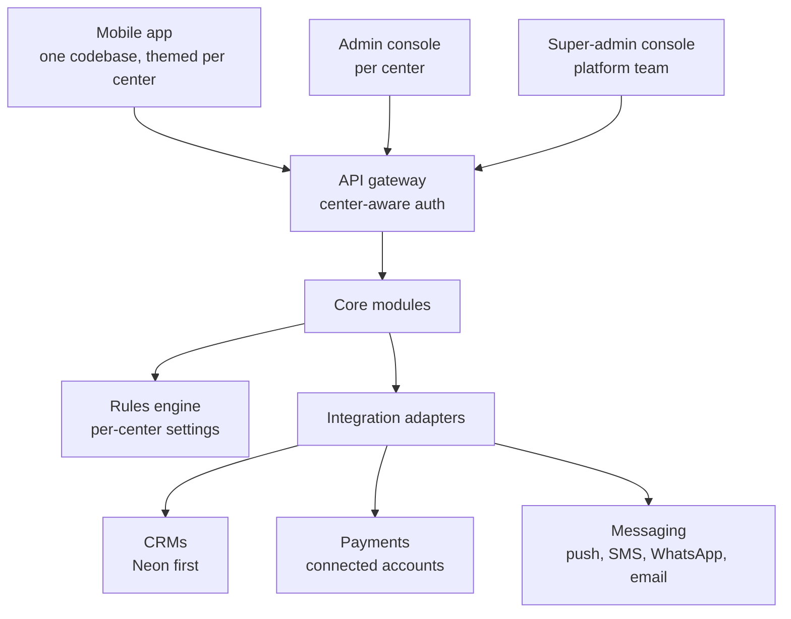

> Exported from the JSH Platform · Recommendations and Roadmap doc (claude.ai artifact 338356dc…) on 2026-09-23. Source of truth for decisions made before the build; later decisions live in ../DECISIONS.md.

# JSH Platform · Recommendations and Roadmap

Sep 23, 2026 · @Malav Sanghvi

## Purpose

Build the new app as a multi-tenant platform where JSH is tenant #1, so any Jain center can adopt it with configuration, not development. This doc keeps the recommendations and build notes from the prototyping sessions (Sep 2026) in one editable place. Decisions already made by JSH live in the prototype and project memory; this doc holds the advice and open design questions that go with them.

## Foundational decisions

Five decisions set the cost of onboarding every future center, so settle them before any build starts.

| Decision | Recommendation | Why |
| --- | --- | --- |
| Tenancy | One shared multi-tenant backend; every record carries a center ID; database-enforced isolation (row-level security) | Cheapest to run and upgrade; dedicated deployments only if a large center insists |
| CRM | Platform keeps its own core data model and syncs through pluggable CRM adapters; Neon is adapter #1; centers without a CRM use the platform as system of record | Other centers use Bloomerang, Salesforce Nonprofit, Little Green Light or spreadsheets |
| Payments | Connected accounts per center (e.g. Stripe Connect); money never passes through a shared account | Clean receipts, accounting and liability per center |
| App stores | Launch one shared app where members pick their center; offer branded builds only to centers that own their Apple and Google accounts | Apple generally rejects template-built apps not published by the content owner |
| Religious content | Shared, curated library organized by tradition (Shvetambar Murtipujak, Sthanakvasi, Terapanthi, Digambar); centers adopt a pack and override | Sutras, pachchakhan, Gyan Path levels and panchang differ by tradition |

## Target architecture

Everything JSH-specific in the prototype becomes configuration: logo, colors, zones, school districts, fees, boli rules, lunch-slot rules, voting rules and tithi tradition.

The app, both consoles and every module read the same per-center configuration.

- **Mobile app:** one cross-platform codebase (React Native or Flutter), themed at runtime, with feature flags per center.
- **Core modules:** identity and families; tenant config; events, RSVP, check-in and lunch slots; giving (pledges, recurring gifts, bolis); store and orders; calendar (panchang, school and event feeds); learning and gamification (Gyan Path, My Jain Way, Saathi, points); notifications; messaging (zone leads, questions); Niva, answering from each center's approved content.
- **Rules engine:** lunch-slot rules, voting eligibility, membership types and fees, boli floors and cutoffs, child permissions, all editable per center.
- **Admin console per center:** events, bolis, store menu, content, zones, rules and reports.
- **Super-admin console:** create, configure and support centers.
- **Self-service onboarding wizard:** branding, CRM connection or member import, payments, tradition pack, zones and school districts, admin invites. Goal: a new center live in days without developers.

## Non-negotiables

These are far cheaper to design in on day one than to retrofit.

- **Children's data:** US law (COPPA) covers children under 13, and the app holds a lot of it. Parent-managed profiles and consent records from the start.
- **Payments scope:** card data only ever handled by the payment provider, keeping the platform out of card-security (PCI) scope.
- **Security:** per-center access roles, audit logs, encryption, backups.
- **App store rules:** in-app account deletion; the prototype deletes the app login but keeps CRM membership and donation records, which the EC and treasurer must confirm.
- **Accessibility and language:** large text for seniors; English, Gujarati and Hindi built into the core.
- **Certification:** plan for SOC 2 once several centers depend on the platform.

## Ownership and funding

A platform serving many centers needs a home beyond JSH's tech team. Decide early who owns the code and data agreements, how it is governed, and how costs are shared, for example tiered pricing by center size.

JAINA, with its network of member centers, is a natural partner to explore for distribution and governance. Even 3–4 founding centers would spread cost and prove the product is not JSH-shaped.

## Roadmap

About 15 months from discovery to a second and third center live; every phase is multi-tenant from the first commit. Durations are rough planning estimates.

| Phase | Duration | Scope |
| --- | --- | --- |
| 0 · Discovery and foundations | 6–8 weeks | Product spec and user stories from the prototype; catalog every configurable rule; core data model and tenant config; tech stack and build partner; 2–3 design-partner centers validate the prototype |
| 1 · Platform core, JSH as tenant #1 | \~4 months | Identity and families; events, RSVP, check-in, lunch slots; pledges and payments; notifications; Neon adapter; connected payments; basic admin console. Retire JSH Connect, NamoCRM and JSH Events |
| 2 · Engagement | \~3 months | My Jain Way, Gyan Path, Saathi, calendar, special days, recurring giving, Satvik Store, Niva |
| 3 · Second and third centers | \~2 months | Onboard design partners with the self-service wizard; second CRM adapter; security and support hardening |
| 4 · Scale | Ongoing | Content marketplace across traditions, cross-center analytics, SOC 2, branded app builds |

## Team shape

Keep product ownership in-house and use a professional build team; volunteer-only builds rarely sustain an enterprise platform.

| Role | Count |
| --- | --- |
| Product owner (JSH technology officer or successor) | 1 |
| Tech lead / architect | 1 |
| App developers | 2–3 |
| Backend developers | 2 |
| Designer | 1 |
| QA | 1 |
| DevOps | Part-time |

Volunteers are best used for content, testing and onboarding new centers.

## Build-spec notes from prototyping

Each note is a recommendation or open question raised while building the prototype, grouped by feature area.

| Area | Recommendation or open question |
| --- | --- |
| Identity | Settle one permanent member ID first: RSVP tickets encode Neon contact IDs that differ from the member IDs JSH Connect shows |
| Member QR | Replace the plain `contact_id_` payload with signed, rotating tokens that work offline; Apple and Google Wallet passes |
| RSVP | Guests without the app get tickets, reminders and lunch times by SMS or WhatsApp; decide whether unconfirmed RSVPs count toward headcount and capacity |
| Lunch slots | Slot calculation lives in the event module, not the app; one reminder per slot; open question: does a senior in a family without a child under 12 keep the family together? |
| Giving | Decide if a Pay-now RSVP gift is a pledge paid at once or a straight donation; tax year follows payment date, not pledge date; allow check, ACH and stock for large pledges to avoid card fees |
| Pledge visibility | All adults currently see and can pay every family pledge; confirm whether some families need view-only |
| Bolis | Rules for ties, withdrawals, anti-sniping extensions near cutoff, and payment deadlines; boli explainer text and videos from the religious committee |
| Satvik Store | Record sales as sales income, never donations; confirm Texas sales tax on prepared food; kitchen needs a daily order summary at cutoff |
| Recurring giving | Neon supports recurring gifts natively; "on family special days" becomes a yearly gift per special day |
| Calendar and special days | Tithis come from the panchang the religious committee follows (differs by gachchh); tithi-based days recalculated yearly; ISD calendars synced from published feeds; gentler, optional punyatithi reminders |
| Gyan Path | Level order, sutra text and audio from Pathshala by tradition; start with teacher-reviewed recordings before automated pronunciation checks; teacher sign-off ties to Pathshala levels |
| My Jain Way and Saathi | Standings private by default; streak rest days; cap anumodana points per day; ask anumodana senders first, then family; never share "behind" status outside family; members can opt out |
| Profiles | "Verified" means an approved membership in Neon, not an app sign-up; consider light review of expertise listings; confirm the age for a child's own login (prototype uses 13) |
| New to JSH | WhatsApp joins go to an admin queue; messages to zone leads and questions land in a shared inbox, not personal phones; zones, leads and admin names from the office |
| Photos | Decide link-out versus hosted albums; member uploads need moderation, especially photos of children |
| Niva | Answers only from JSH-approved content with sources; someone owns the knowledge base; doctrinal questions go to Pathshala teachers |

## Immediate next steps

These six steps cover the next 2–4 weeks and set up Phase 0.

- [ ] Write the handover and product spec: current state, prototype walkthrough, feature list and every rule decision
- [ ] Draft the tenant configuration schema: everything JSH-specific today that would differ at another center
- [ ] Draw the target multi-tenant architecture next to the current-state diagram
- [ ] Share the prototype with 2–3 other Jain centers and JAINA contacts
- [ ] Get build estimates from 2–3 development partners using the spec
- [ ] Present prototype, roadmap and funding proposal to the EC and Board
