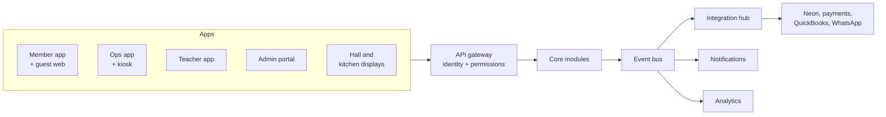

> Exported from the JSH Platform · Recommendations and Roadmap doc (claude.ai artifact 338356dc…) on 2026-09-23. Source of truth for decisions made before the build; later decisions live in ../DECISIONS.md.

# Platform components

## Component catalog

Beyond the member app, the platform needs 14 components: 5 staff-facing apps, 3 on-site displays and 6 shared services. All of them read the same per-center configuration and permissions.

| # | Component | Used by | What it does |
| --- | --- | --- | --- |
| 1 | Member app (iOS, Android) | Members, families, guests | Everything in the prototype; role-aware, so a volunteer or teacher sees extra tools in the same app |
| 2 | Guest web pages | Non-members, visiting relatives | RSVP, giving and event pages opened from WhatsApp links, phone OTP only, no install |
| 3 | Admin portal (web) | Office staff, EC, coordinators | Configure and run the center: members, events, giving, bolis, store, content, calendar, communications, rules, reports |
| 4 | Ops mobile app | Volunteers, event leads, kitchen, store pickup | Check-in scanning, walk-ins, food and gift stations, lunch-slot queue, store pickup, offline sync (separate volunteer prototype) |
| 5 | Teacher app (web + mobile) | Pathshala teachers, principal | Class rosters, QR attendance, Gyan Path sign-offs, parent announcements, level promotions |
| 6 | Super-admin console | Platform team | Create and configure centers, tradition packs, feature flags, support access, billing, incident tools |
| 7 | Check-in kiosk mode | Event entrance | Self-service QR scan on a pinned tablet; runs on the ops app |
| 8 | Now-serving and boli hall displays | Dining hall, main hall | Current lunch slot, live boli amounts and sponsor recognition on a TV |
| 9 | Kitchen display | Kitchen volunteers | Headcount by slot, store orders to prepare, cutoff summaries |
| 10 | Identity and access service | All apps | OTP, passkeys and biometrics, center and role claims, family links, sessions |
| 11 | Integration hub | All modules | CRM adapters (Neon first), payments, accounting, calendars, WhatsApp, SMS, email; retries and sync logs |
| 12 | Notification and messaging service | All modules | Push, SMS, WhatsApp, email and in-app; templates, quiet hours, preferences, delivery tracking |
| 13 | Content management | Content editors, Pathshala | Tradition packs, sutras, audio, Gyan Path levels, explainer videos, guide pages, Niva knowledge base; review and publish |
| 14 | Analytics and reporting | EC, treasurer, coordinators, platform team | Dashboards, scheduled reports, exports, a warehouse separated by center |

## How the components connect

Every app talks to one center-aware API; modules publish events that the integration hub, notifications and analytics subscribe to, so no module calls a CRM or payment provider directly.

Example: a volunteer scans a family at check-in. The events module records attendance and assigns lunch slots, then publishes an event. Notifications schedules the 5-minute reminders, the kitchen display updates headcount, analytics counts attendance, and the hub writes attendance to Neon.

## Reporting catalog

Reports are built once on the warehouse and filtered by each viewer's permissions, so a zone lead sees only their zone and a treasurer sees money but not children's details.

| Report or dashboard | Audience | Contents | Cadence |
| --- | --- | --- | --- |
| Center health | EC, Board | Active families, app adoption, attendance trend, giving vs. last year, open pledges, renewals due | Live + monthly PDF |
| Giving and pledges | Treasurer, Finance | Pledged vs. paid by campaign, aging of open pledges, recurring gifts, refunds, CRM and accounting sync status | Live + month-end close |
| Boli results | Religious coordinator, Treasurer | Winners, amounts vs. floor, unpaid bolis, in-person entries | Per event |
| Event operations | Event leads, Kitchen | RSVPs vs. confirmed vs. checked in, lunch slots and served counts, no-shows, walk-ins | Live on event day |
| Store sales | Store lead, Treasurer | Orders by item and pickup slot, gift packs, sales tax collected | Per cutoff + monthly |
| Membership | Membership coordinator | New, renewing, lapsed, life vs. yearly, kids turning 18, voting eligibility | Monthly |
| Pathshala and learning | Principal, Teachers | Enrollment by level, attendance, Gyan Path progress, sign-offs pending | Weekly |
| Engagement | EC, Religious coordinator | My Jain Way participation, streaks, Saathi activity, calendar subscriptions (totals only, no individual ranking) | Monthly |
| Zone | Zone leads | Families in zone, new families, open messages, unanswered questions | Weekly |
| Communications | Office | Delivery and open rates by channel, opt-outs, WhatsApp join queue | Weekly |
| Platform | Platform team | Centers live, usage, errors, integration failures, support tickets | Live |
